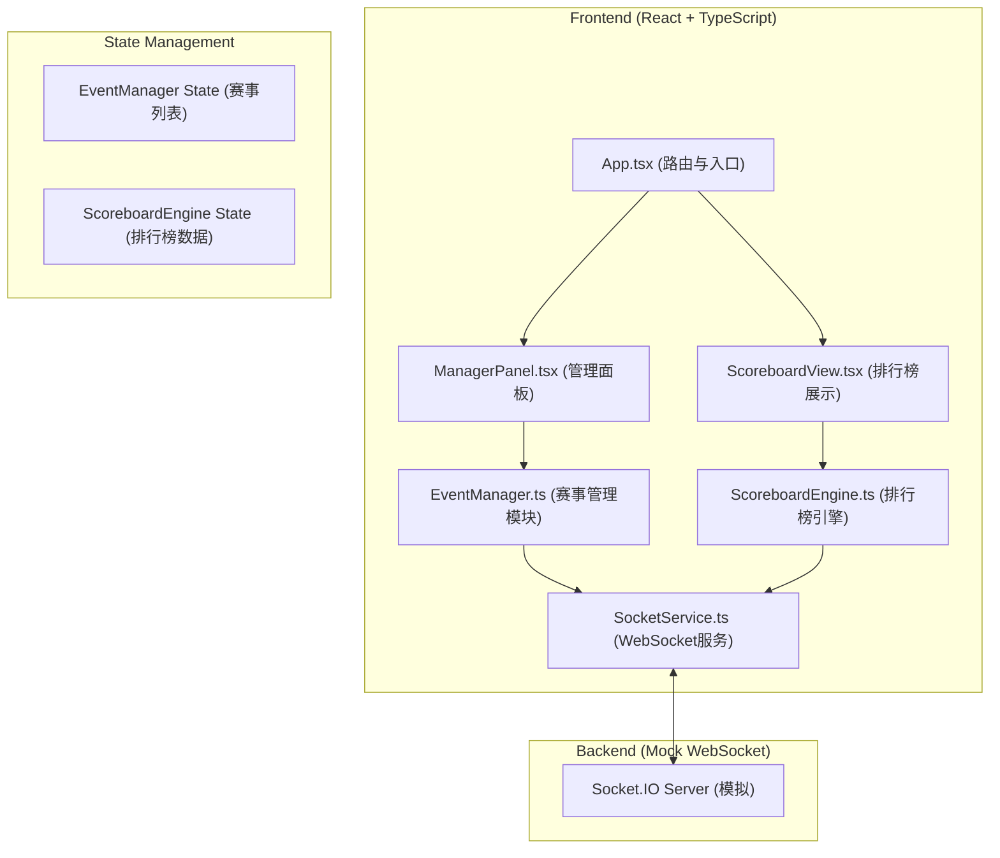

## 1. 架构设计


## 2. 技术描述
- **前端框架**：React@18 + TypeScript + Vite
- **路由**：react-router-dom@6
- **WebSocket**：socket.io-client
- **工具库**：uuid（生成唯一ID）
- **样式方案**：CSS Modules + CSS Variables（主题配色）
- **动画方案**：CSS Transitions + Animations（0.3s-0.5s过渡）
- **后端**：Node.js + Socket.IO（模拟实时通信，无持久化数据库）

## 3. 路由定义
| 路由 | 页面 | 功能描述 |
|------|------|----------|
| `/` | 主控制台 | 左侧管理面板 + 右侧排行榜预览 |
| `/scoreboard` | 排行榜大屏 | 全屏展示实时排行榜，适合大屏展示 |

## 4. 数据模型

### 4.1 核心类型定义
```typescript
// 运动会
interface Event {
  id: string;
  name: string;
  date: string;
  projects: Project[];
}

// 比赛项目
interface Project {
  id: string;
  name: string;
  maxParticipants: number;
  type: 'timed' | 'scored'; // 计时类 / 分数类
  participants: Participant[];
}

// 参赛者
interface Participant {
  id: string;
  name: string;
  unit: string; // 所属小区单元
  number: string; // 参赛编号
  projects: string[]; // 参赛项目ID列表
  scores: Record<string, number>; // 项目ID -> 成绩
}

// 成绩记录
interface ScoreRecord {
  projectId: string;
  participantId: string;
  score: number;
  timestamp: number;
}

// 排行榜项
interface RankItem {
  participant: Participant;
  score: number;
  rank: number;
}
```

### 4.2 模块职责划分

**SocketService.ts**
- 建立与后端的WebSocket连接
- 暴露 `on(event, handler)` 订阅接口
- 暴露 `emit(event, data)` 发送接口
- 管理连接状态与重连逻辑

**EventManager.ts**
- 维护赛事列表 `events: Event[]` 状态
- 提供 `createEvent()`, `addProject()`, `addParticipant()`, `recordScore()` 方法
- 调用 SocketService 发送 `event:update`, `score:update` 事件
- 本地状态与远端状态同步

**ScoreboardEngine.ts**
- 订阅 SocketService 的 `score:update` 事件
- 按项目分组，对参赛者成绩进行排序
- 计时类：升序排列（时间越短越好）
- 分数类：降序排列（分数越高越好）
- 维护 `rankings: Record<string, RankItem[]>` 状态
- 排序耗时 < 50ms 性能约束

**ManagerPanel.tsx**
- 表单：创建运动会、添加项目、添加参赛者、录入成绩
- 表格：展示参赛者列表（头像、姓名、单元、参赛编号）
- 调用 EventManager 的方法
- 输入框聚焦动画、列表悬停效果

**ScoreboardView.tsx**
- 项目选项卡（下划线滑动动画 0.3s）
- 前三名卡片（金/银/铜渐变背景）
- 横向柱状条动画（高度过渡 0.5s ease-out）
- 响应式布局适配

## 5. 性能约束实现方案

### 5.1 排行榜更新延迟 < 500ms
- WebSocket 消息采用二进制或压缩传输（模拟环境直接JSON）
- ScoreboardEngine 使用高效排序算法（Array.sort，O(n log n)）
- React 使用 memo 优化排行榜组件重渲染
- 状态更新采用批量处理，避免频繁 setState

### 5.2 排序耗时 < 50ms
- 预计算排名，避免每次渲染时排序
- 仅在成绩更新时重新排序，而非每次渲染
- 使用 useMemo 缓存排序结果
- 参赛者数量预期 < 1000，排序开销可忽略

## 6. WebSocket 事件定义
| 事件名 | 方向 | 数据类型 | 描述 |
|--------|------|----------|------|
| `event:update` | Client → Server | Event | 赛事数据更新 |
| `score:update` | Client → Server | ScoreRecord | 成绩录入 |
| `event:sync` | Server → Client | Event[] | 全量同步赛事数据 |
| `score:sync` | Server → Client | ScoreRecord | 广播成绩更新 |
| `connect` | Server → Client | - | 连接成功 |
| `disconnect` | Server → Client | - | 连接断开 |

