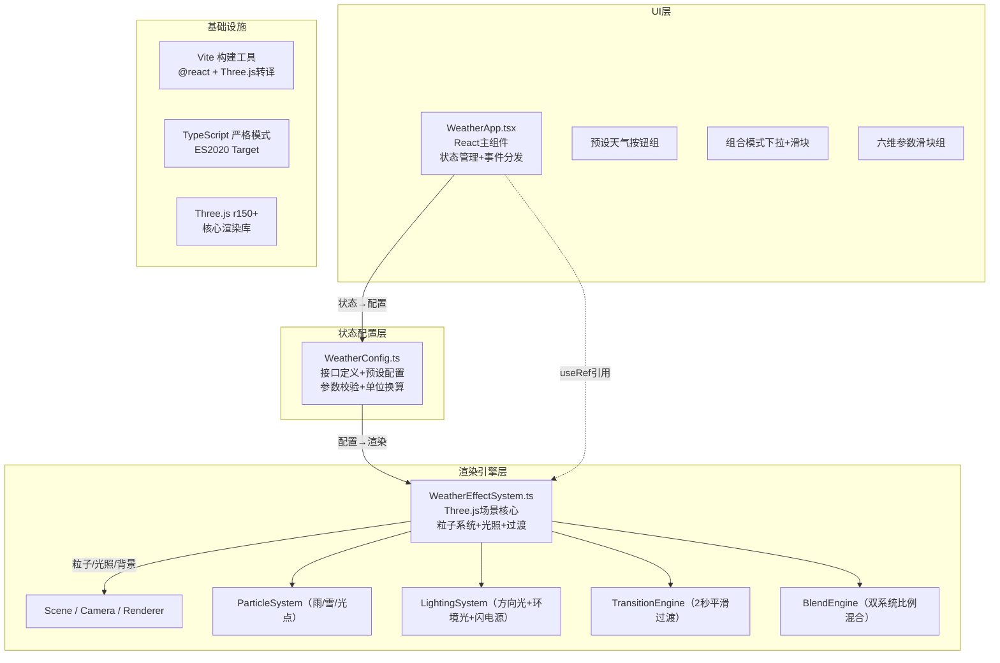

## 1. 架构设计



## 2. 技术描述
- **前端框架**：React@18 + TypeScript@5（strict模式）+ Vite@5
- **3D渲染**：Three.js@0.160，原生API直接操作（不使用react-three-fiber，保证性能）
- **初始化方式**：Vite脚手架 `npm create vite@latest`，手动配置Three.js转译优化
- **状态管理**：React useState/useRef，WeatherApp负责UI状态，WeatherEffectSystem内部使用可变对象管理渲染状态以避免GC
- **无后端**：纯前端应用，所有配置本地化，数据mock于WeatherConfig

## 3. 目录结构定义

```
auto245/
├── package.json              # 依赖声明与脚本
├── vite.config.js            # Vite构建配置（含Three.js优化）
├── tsconfig.json             # TS严格模式配置
├── index.html                # 入口HTML（全屏canvas容器）
└── src/
    ├── main.tsx              # React入口，挂载WeatherApp
    ├── WeatherApp.tsx        # UI主组件（控制面板+状态管理）
    ├── WeatherEffectSystem.ts # 3D渲染核心（Three.js场景与粒子系统）
    └── WeatherConfig.ts      # 天气参数接口与预设配置
```

## 4. 核心模块与接口定义

### 4.1 WeatherConfig.ts 核心接口
```typescript
// 天气类型枚举
export type WeatherType = 'clear' | 'rain' | 'snow' | 'fog' | 'thunder';

// 粒子系统参数
export interface ParticleConfig {
  count: number;           // 粒子数量
  size: [number, number];  // 尺寸范围 [min, max]
  speedY: [number, number];// Y轴下落/上升速度
  speedX: [number, number];// X轴风力偏移
  speedZ: [number, number];// Z轴风力偏移
  color: string;           // 主颜色（HEX）
  opacity: number;         // 透明度
  geometry: 'cylinder' | 'point' | 'sphere';
}

// 场景光照参数
export interface LightingConfig {
  ambientColor: string;
  ambientIntensity: number;
  directionalColor: string;
  directionalIntensity: number;
  directionalPosition: [number, number, number];
}

// 背景参数
export interface BackgroundConfig {
  topColor: string;        // 顶部渐变颜色
  bottomColor: string;     // 底部渐变颜色
  fogColor: string;
  fogDensity: number;
}

// 完整天气配置
export interface WeatherPreset {
  id: WeatherType;
  name: string;
  particles: ParticleConfig;
  lighting: LightingConfig;
  background: BackgroundConfig;
  hasThunder: boolean;     // 是否包含闪电效果
}

// 运行时可调参数
export interface RuntimeParams {
  densityMultiplier: number;     // 密度倍率 100-5000 → 映射到0.05-5.0
  speedMultiplier: number;       // 速度倍率 0.5-3.0
  windAngle: number;             // 风力角度 -90°~90°
  sizeMultiplier: number;        // 尺寸倍率 0.05-0.5（归一化到0.5-5.0）
  brightnessMultiplier: number;  // 亮度倍率 0.2-1.5
}

// 组合模式配置
export interface BlendConfig {
  enabled: boolean;
  weatherA: WeatherType;
  weatherB: WeatherType;
  ratio: number;  // 0.0 ~ 1.0，0=全A，1=全B
}

// 预设数据
export const WEATHER_PRESETS: Record<WeatherType, WeatherPreset> = { ... };
```

### 4.2 WeatherEffectSystem.ts 核心类
```typescript
export class WeatherEffectSystem {
  constructor(container: HTMLElement, onFpsUpdate?: (fps: number) => void);
  
  // 天气控制API
  setWeather(type: WeatherType, smooth: boolean = true): void;
  setBlendConfig(config: BlendConfig): void;
  setRuntimeParams(params: Partial<RuntimeParams>): void;
  
  // 生命周期
  dispose(): void;
  
  // 内部核心方法
  private initScene(): void;
  private createParticleSystem(preset: WeatherPreset, count: number): THREE.Object3D;
  private updateParticles(delta: number): void;
  private updateLighting(target: LightingConfig, t: number): void;
  private updateBackground(target: BackgroundConfig, t: number): void;
  private triggerThunderFlash(): void;
  private animateLoop(): void; // requestAnimationFrame驱动
}
```

### 4.3 WeatherApp.tsx 组件接口
```typescript
// 组件状态
interface WeatherAppState {
  currentWeather: WeatherType;
  blendConfig: BlendConfig;
  runtimeParams: RuntimeParams;
  fps: number;
}

// 渲染结构
<div className="app-root">
  <aside className="control-panel"> {/* 280px 毛玻璃面板 */}
    <section className="preset-group"> {/* 5个天气按钮 */}
    <div className="divider" />        {/* 20px分割线 */}
    <section className="blend-group">  {/* 双下拉+混合滑块 */}
    <section className="params-group"> {/* 6个参数滑块 */}
  </aside>
  <main className="scene-container" ref={sceneRef}> {/* Three.js挂载点 */}
</div>
```

## 5. 关键技术实现方案

### 5.1 粒子系统性能优化
- **Geometry复用**：同种天气粒子共享BufferGeometry，通过InstancedMesh减少Draw Call
- **TypedArray直接操作**：粒子位置存储于Float32Array，每帧直接更新数组buffer，避免创建对象
- **视锥体剔除**：粒子超出Y∈[0,50]范围时，循环重置到顶部，避免粒子无限累积
- **材质合并**：同色粒子共享材质实例，通过uniform传递全局参数（风速/大小/速度）

### 5.2 2秒平滑过渡实现
- 使用线性插值 `lerp(current, target, t)`，t从0→1，步长=deltaTime/2.0
- 过渡维度：粒子数量（渐进式创建/销毁）、颜色RGB插值、背景色插值、光照强度插值
- 粒子数量过渡：每帧调整粒子可见性（scale=0不可见），避免频繁创建销毁Geometry

### 5.3 双天气混合引擎
- 组合模式下并行维护两个ParticleSystem实例
- 粒子密度按比例分配：`countA = total * (1-ratio)`, `countB = total * ratio`
- 颜色/光照/背景按比例做RGB插值，实现视觉连续过渡

### 5.4 Three.js构建优化
- vite.config.js中配置 `optimizeDeps.include: ['three']` 预构建
- 使用ES Module导入，Tree-shaking未使用的Three.js模块
- production模式下开启minify和sourcemap分离

## 6. Vite/TS配置要点

### 6.1 vite.config.js
```javascript
import { defineConfig } from 'vite';
import react from '@vitejs/plugin-react';

export default defineConfig({
  plugins: [react()],
  optimizeDeps: {
    include: ['three'],
  },
  server: {
    port: 5173,
    open: true,
  },
  build: {
    target: 'es2020',
    minify: 'esbuild',
    sourcemap: false,
  },
});
```

### 6.2 tsconfig.json 关键字段
```json
{
  "compilerOptions": {
    "target": "ES2020",
    "module": "ESNext",
    "strict": true,
    "jsx": "react-jsx",
    "moduleResolution": "bundler",
    "esModuleInterop": true,
    "skipLibCheck": true,
    "forceConsistentCasingInFileNames": true
  }
}
```
