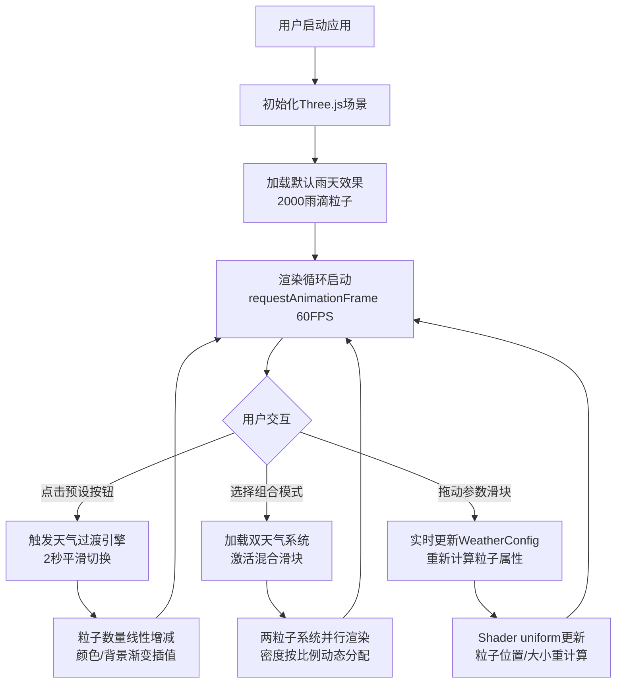

## 1. 产品概述
三维风格化天气效果展示与交互应用，基于WebGL实时渲染的沉浸式天气模拟系统。用户可在浏览器中自由切换、混合五种天气系统（晴空、雨、雪、雾、雷暴），通过参数化控件精确调节效果强度，创造丰富的视觉体验。
- 核心目标：打造一个高性能、可视化、可交互的3D天气实验室，为设计师、开发者、教育者提供直观的天气效果演示工具
- 市场价值：填补浏览器端高质量3D天气模拟工具的空白，支持创意展示、教学演示、游戏预演等多场景应用

## 2. 核心功能

### 2.1 功能模块
1. **3D场景渲染模块**：Three.js驱动的实时3D场景，包含虚拟地面网格、可操控相机、动态光照系统
2. **天气粒子系统模块**：五种预设天气效果（雨/雪/雾/雷暴/晴空），每种配备独立粒子渲染管线
3. **天气混合引擎**：双天气叠加系统，支持0%-100%连续比例混合，产生平滑过渡效果（如小雨转雪）
4. **参数控制面板**：六维参数滑块（密度/速度/风力/大小/亮度/混合比），实时映射到渲染管线
5. **过渡动画系统**：天气切换2秒平滑过渡，粒子数量线性增减、颜色渐变、背景色淡入淡出

### 2.2 页面详情
| 页面名称 | 模块名称 | 功能描述 |
|-----------|-------------|---------------------|
| 主界面 | 左侧控制面板 | 5个预设天气按钮、组合模式双下拉菜单、6个参数滑块、数值实时显示 |
| 主界面 | 右侧3D场景区 | Three.js全屏渲染、鼠标拖拽旋转视角、滚轮缩放（0.5x-5x）、FPS自动优化 |
| 主界面 | 状态指示区 | 当前天气类型显示、混合比例可视化条、实时FPS监视器（开发模式） |

## 3. 核心流程

## 4. 用户界面设计

### 4.1 设计风格
- **主色调**：深空蓝紫渐变主题，主色#0F0F1A（90%半透明）、强调色#FFD700（金色滑块拇指）、粒子色采用天气专属色系
- **视觉风格**：毛玻璃拟态（backdrop-filter: blur(10px)）+ 暗色科技感 + 微交互动效
- **按钮风格**：圆角10px矩形，尺寸200×44px，默认色#2D2D44、悬停色#3D3D55、点击缩放0.95（0.1s过渡）
- **滑块风格**：宽度180px，轨道高6px（半透明深色#1A1A2E80），拇指圆形10px金色#FFD700
- **字体方案**：主字体使用现代无衬线字体，数字参数显示使用等宽字体增强科技感
- **布局模式**：左侧固定280px控制面板 + 右侧自适应3D渲染区的经典双栏布局

### 4.2 页面设计概述
| 页面名称 | 模块名称 | UI元素 |
|-----------|-------------|-------------|
| 主界面 | 天气预设组 | 5个等距按钮（晴空☀️/雨🌧️/雪❄️/雾🌫️/雷暴⛈️），悬停高亮，当前选中态金色边框 |
| 主界面 | 分割区 | 20px浅色半透明分割线，视觉区分预设组与组合组 |
| 主界面 | 组合模式区 | 双下拉选择器（天气A/天气B）+ 混合比例滑块（带百分比标签） |
| 主界面 | 参数滑块组 | 6个垂直排列滑块（密度/速度/风力/大小/亮度/混合），右侧实时数值 |
| 主界面 | 3D场景区 | 全屏WebGL画布，鼠标悬停显示可旋转光标，相机30度俯角初始视角 |

### 4.3 响应式设计
- **设计策略**：Desktop-first，最小支持宽度1280px
- **平板适配**：宽度<1024px时，控制面板改为顶部悬浮条，参数滑块横向排列
- **触控优化**：移动端支持单指拖拽旋转、双指捏合缩放
- **性能降级**：检测到低性能设备时自动将粒子上限降至2000，关闭阴影效果

### 4.4 3D场景指引
- **环境氛围**：程序生成渐变背景（垂直方向从顶色到底色插值），无HDRI依赖
- **光照配置**：
  - 主光源：DirectionalLight模拟太阳/月光，随天气切换颜色和强度
  - 环境光：AmbientLight提供基础照明，亮度滑块全局控制
  - 雷暴：额外添加点光源模拟闪电，随机触发0.1秒全屏闪白
- **相机设置**：
  - 初始位置：俯角30度，看向原点
  - 控制器：OrbitControls，支持拖拽旋转、滚轮缩放（0.5x-5x），禁用平移
  - FOV：60度，近裁面0.1，远裁面1000
- **粒子方案**：
  - 雨滴：CylinderGeometry（r=0.01, h=0.2），半透明蓝色，沿Y轴下落+风力偏移
  - 雪花：Points + Circle纹理，白色，螺旋下落+水平飘移
  - 晴空：Points + Glow纹理，金色，上下浮动缓动
  - 雾：FogExp2指数雾，颜色随天气变化，密度独立控制
  - 雷暴：雨粒子基础上叠加Flash效果（场景覆盖白色半透明平面）
- **性能预算**：单天气粒子上限5000，组合模式双系统合计不超过6000，目标FPS≥50（单）/≥40（组合）
