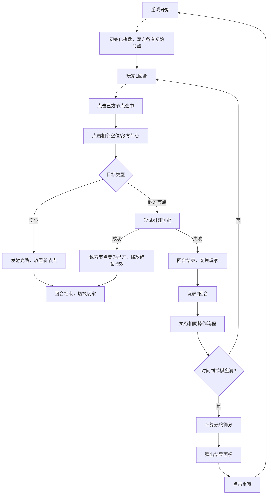

## 1. 产品概述

"量子纠缠光路对决"是一款双人回合制策略游戏，玩家在8x8网格棋盘上部署量子比特节点，通过发射光路纠缠对手节点来争夺控制权，最终拥有最多节点的玩家获胜。

- **核心玩法**：回合制策略对战，通过节点连接和纠缠机制争夺棋盘控制权
- **目标用户**：休闲策略游戏玩家，双人本地对战
- **产品价值**：融合量子物理概念的创新策略游戏，提供紧张刺激的90秒限时对战体验

## 2. 核心功能

### 2.1 用户角色
| 角色 | 参与方式 | 核心权限 |
|------|----------|----------|
| 玩家1（蓝方） | 本地双人对战 | 部署节点、发射光路、撤回操作 |
| 玩家2（红方） | 本地双人对战 | 部署节点、发射光路、撤回操作 |

### 2.2 功能模块
1. **游戏主界面**：8x8网格棋盘、节点渲染、光路动画、纠缠特效
2. **对战系统**：回合切换、节点纠缠判定、得分计算、90秒倒计时
3. **交互系统**：节点选中、光路发射、撤回操作、重赛功能
4. **结果展示**：游戏结束弹窗、获胜方展示、最终比分、重赛按钮

### 2.3 页面详情
| 页面名称 | 模块名称 | 功能描述 |
|----------|----------|----------|
| 游戏主界面 | 棋盘区域 | 8x8网格渲染，节点显示，光路动画，纠缠特效 |
| 游戏主界面 | 信息面板 | 倒计时显示、双方分数、撤回次数、当前回合提示 |
| 游戏主界面 | 结果弹窗 | 游戏结束展示、获胜方信息、最终比分、重赛按钮 |

## 3. 核心流程

## 4. 用户界面设计

### 4.1 设计风格
- **主题**：科幻暗色太空主题
- **主色调**：太空黑 `#0A0A1A`，深紫 `#1E1135`，浅紫 `#4A3B6B`
- **玩家颜色**：蓝方 `#00BFFF`（亮蓝），红方 `#FF4500`（橙红）
- **强调色**：金黄 `#FFD700`（选中光环），亮紫 `#9932CC`（光路终点）
- **字体**：使用 Orbitron 或类似科技感字体作为标题，搭配清晰的无衬线正文字体
- **按钮风格**：圆角设计，悬停缩放1.05倍，背景色变化过渡0.2秒

### 4.2 页面设计概述
| 页面名称 | 模块名称 | UI元素 |
|----------|----------|---------|
| 游戏主界面 | 棋盘区域 | 8x8网格（每格60px），节点发光圆球（半径18px，呼吸动画0.3秒），选中脉冲光环，光路渐变色动画，纠缠碎裂粒子特效，棋盘暗光晕 |
| 游戏主界面 | 信息面板 | 左上角红色大字Bold倒计时，右上角双方分数和撤回次数，底部当前回合提示 |
| 游戏主界面 | 结果弹窗 | 居中半透明背景 `#00000080`，圆角16px，白色内框，获胜方文字，最终比分，重赛按钮 |

### 4.3 响应式设计
- **桌面端**：单元格60x60px，完整显示所有信息
- **移动端**：单元格缩小至40x40px，隐藏撤回次数显示，优化触摸交互
- **所有动画**：0.2-0.5秒过渡，确保60fps流畅运行

### 4.4 动画与特效
- **节点呼吸动画**：0.3秒周期，缩放1.0-1.1倍
- **选中光环**：金黄 `#FFD700` 脉冲，持续0.2秒
- **光路动画**：渐变色线段（亮蓝→亮紫），0.5秒动画
- **纠缠特效**：粒子向四周扩散0.3秒后重组为己方颜色
- **按钮悬停**：背景变化 + 缩放1.05倍，0.2秒过渡
