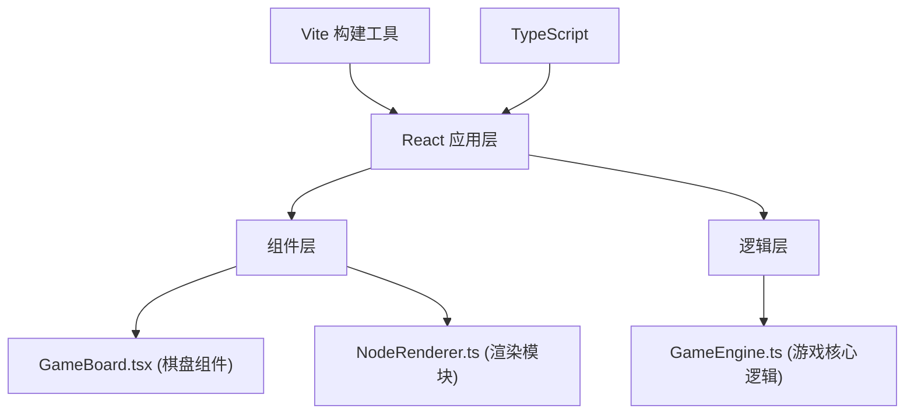

## 1. 架构设计



## 2. 技术描述

- **前端框架**：React 18 + TypeScript
- **构建工具**：Vite 5.x
- **状态管理**：React useState/useReducer（轻量级，游戏状态集中管理）
- **渲染方式**：Canvas 2D API（高性能节点和光路渲染，确保60fps）
- **依赖库**：react, react-dom, typescript, vite, @vitejs/plugin-react, uuid
- **动画实现**：requestAnimationFrame + CSS transitions 结合

## 3. 文件结构定义

| 文件路径 | 职责描述 |
|----------|----------|
| `package.json` | 项目依赖和脚本配置 |
| `vite.config.js` | Vite 构建配置 |
| `tsconfig.json` | TypeScript 严格模式配置 |
| `index.html` | 应用入口页面 |
| `src/GameBoard.tsx` | 棋盘React组件，管理网格渲染、节点状态、用户点击交互 |
| `src/GameEngine.ts` | 游戏核心逻辑，节点纠缠判定、光路验证、回合切换、得分计算 |
| `src/NodeRenderer.ts` | 节点与光路渲染模块，Canvas绘制发光圆球、光路动画、纠缠粒子特效 |
| `src/App.tsx` | 应用主组件，组装GameBoard和UI面板 |
| `src/main.tsx` | React 应用入口 |
| `src/types.ts` | TypeScript 类型定义 |
| `src/index.css` | 全局样式 |

## 4. 数据模型

### 4.1 核心类型定义

```typescript
// 玩家标识
type Player = 'player1' | 'player2';

// 棋盘节点
interface GridNode {
  id: string;
  row: number;
  col: number;
  owner: Player | null;
  rotation: number; // 节点旋转角度 0-360
}

// 光路连接
interface LightPath {
  id: string;
  fromRow: number;
  fromCol: number;
  toRow: number;
  toCol: number;
  owner: Player;
  progress: number; // 动画进度 0-1
  createdAt: number;
}

// 纠缠特效
interface EntangleEffect {
  id: string;
  row: number;
  col: number;
  progress: number; // 特效进度 0-1
  particles: Particle[];
}

// 粒子
interface Particle {
  x: number;
  y: number;
  vx: number;
  vy: number;
  life: number;
}

// 游戏状态
interface GameState {
  grid: (GridNode | null)[][]; // 8x8 网格
  currentPlayer: Player;
  scores: Record<Player, number>;
  timeRemaining: number; // 秒
  undoCount: Record<Player, number>;
  selectedNode: { row: number; col: number } | null;
  lightPaths: LightPath[];
  entangleEffects: EntangleEffect[];
  gameOver: boolean;
  winner: Player | 'draw' | null;
  history: GameStateSnapshot[]; // 用于撤回
}

// 游戏状态快照（撤回用）
interface GameStateSnapshot {
  grid: (GridNode | null)[][];
  currentPlayer: Player;
  scores: Record<Player, number>;
}
```

### 4.2 游戏常量定义

```typescript
const GRID_SIZE = 8;
const CELL_SIZE = 60; // 桌面端
const CELL_SIZE_MOBILE = 40; // 移动端
const NODE_RADIUS = 18;
const GAME_DURATION = 90; // 秒
const MAX_UNDO = 5;
const INITIAL_NODES_PER_PLAYER = 3;

// 颜色定义
const COLORS = {
  background: '#0A0A1A',
  boardBg: '#1E1135',
  gridBorder: '#4A3B6B',
  player1: '#00BFFF',
  player2: '#FF4500',
  selected: '#FFD700',
  pathStart: '#00BFFF',
  pathEnd: '#9932CC',
  text: '#FFFFFF',
  countdown: '#FF0000',
  overlay: '#00000080',
};
```

## 5. 核心算法

### 5.1 纠缠判定算法
- 检查发射节点与目标节点是否相邻（上下左右及对角线）
- 判定纠缠成功率（可基于距离、节点旋转角度等因素）
- 纠缠成功则转换节点所有权，更新分数

### 5.2 光路连接验证
- 验证起点为己方节点
- 验证终点为相邻空位或敌方节点
- 检查是否有足够的操作权限

### 5.3 性能优化策略
- 使用 Canvas 2D 进行批量渲染，避免频繁DOM操作
- 动画使用 requestAnimationFrame，与浏览器刷新率同步
- 仅在状态变化时重绘，使用脏矩形优化
- 粒子系统使用对象池复用，减少GC开销
