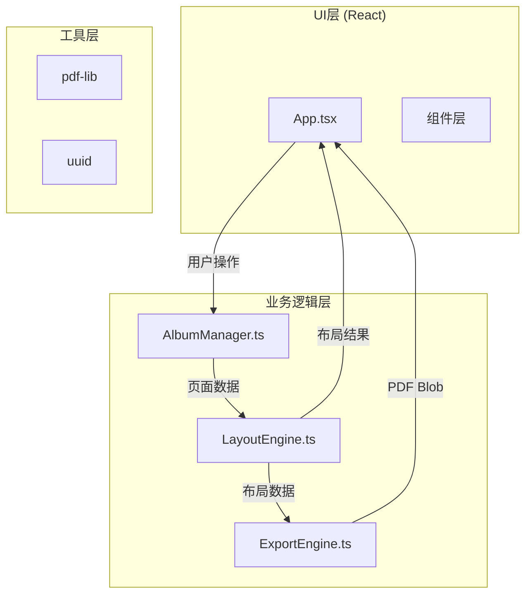
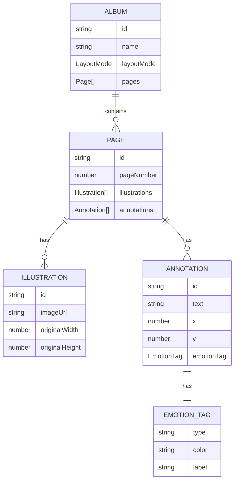

## 1. 架构设计

本项目采用模块化前端架构，将数据管理、布局计算和导出功能分离为独立模块，通过React组件层进行协调和UI渲染。



## 2. 技术描述

- **前端框架**：React@18 + TypeScript@5
- **构建工具**：Vite@5 + @vitejs/plugin-react@4
- **PDF生成**：pdf-lib@1.17
- **唯一ID**：uuid@9
- **状态管理**：React useState/useRef + 自定义事件通知
- **动画方案**：CSS3 Transform + requestAnimationFrame
- **样式方案**：原生CSS + CSS变量

## 3. 模块定义

### 3.1 AlbumManager 模块

**职责**：管理画册项目数据、拖拽排序逻辑

**数据流向**：接收用户拖拽事件 → 更新画册页面数组 → 通知LayoutEngine重新计算排版

**核心方法**：
- `addIllustration(url: string)`: 添加插画
- `reorderPages(fromIndex: number, toIndex: number)`: 拖拽排序
- `addAnnotation(pageIndex: number, annotation: Annotation)`: 添加批注
- `updateAnnotation(pageIndex: number, annotationId: string, updates: Partial<Annotation>)`: 更新批注
- `deleteAnnotation(pageIndex: number, annotationId: string)`: 删除批注
- `setLayoutMode(mode: LayoutMode)`: 设置布局模式
- `getPages(): Page[]`: 获取页面数据
- `subscribe(callback: () => void): () => void`: 订阅数据变更

### 3.2 LayoutEngine 模块

**职责**：根据页面数组计算每张插画的布局坐标和大小

**支持模式**：
- `single`: 单页满版（90%宽度，居中）
- `double`: 双页并排（各45%宽度，中间留白5%）
- `triple`: 三页拼版（各30%宽度，左中右排列）

**数据流向**：从AlbumManager获取页面数组 → 输出各元素位置对象

**核心方法**：
- `calculateLayout(pages: Page[], mode: LayoutMode, containerWidth: number): LayoutResult`
- `A4_WIDTH_PX`: A4宽度像素等效值（基于屏幕dpi计算）
- `A4_HEIGHT_PX`: A4高度像素等效值

### 3.3 ExportEngine 模块

**职责**：将当前画册页面渲染到canvas，再使用pdf-lib生成PDF

**数据流向**：从LayoutEngine获取布局数据 → 逐页渲染 → 生成PDF Blob供用户下载

**核心方法**：
- `exportToPDF(pages: Page[], layout: LayoutResult, onProgress?: (progress: number) => void): Promise<Blob>`
- `renderPageToCanvas(page: Page, layout: PageLayout, canvas: HTMLCanvasElement): Promise<void>`

## 4. 数据模型

### 4.1 数据结构定义



### 4.2 TypeScript 类型定义

```typescript
type LayoutMode = 'single' | 'double' | 'triple';

interface EmotionTag {
  type: 'joy' | 'sadness' | 'anger' | 'calm' | 'dream';
  color: string;
  label: string;
}

interface Annotation {
  id: string;
  text: string;
  x: number;
  y: number;
  emotionTag?: EmotionTag;
}

interface Illustration {
  id: string;
  imageUrl: string;
  originalWidth: number;
  originalHeight: number;
}

interface Page {
  id: string;
  pageNumber: number;
  illustrations: Illustration[];
  annotations: Annotation[];
}

interface IllustrationLayout {
  id: string;
  x: number;
  y: number;
  width: number;
  height: number;
}

interface PageLayout {
  pageNumber: number;
  illustrations: IllustrationLayout[];
  width: number;
  height: number;
}

interface LayoutResult {
  pages: PageLayout[];
  pageWidth: number;
  pageHeight: number;
}
```

## 5. 性能优化策略

### 5.1 动画性能
- 所有动画使用 CSS `transform` 和 `opacity` 触发 GPU 加速
- 翻页动画使用 `requestAnimationFrame` 手动驱动，确保 60fps
- 使用 `will-change` 预声明动画属性

### 5.2 拖拽性能
- 鼠标移动事件通过 `requestAnimationFrame` 节流，每秒不超过 60 次
- 拖拽浮层使用 `position: fixed` 避免重排

### 5.3 PDF 导出性能
- Canvas 渲染采用逐页异步处理，避免阻塞主线程
- 使用 `OffscreenCanvas` 如浏览器支持
- 图片预加载和缓存机制
- 20 页文档目标导出时间 ≤ 8 秒

## 6. 项目文件结构

```
├── package.json
├── vite.config.js
├── tsconfig.json
├── index.html
└── src/
    ├── main.tsx          (React 入口)
    ├── App.tsx           (主界面组件)
    ├── AlbumManager.ts   (数据管理模块)
    ├── LayoutEngine.ts   (布局引擎模块)
    ├── ExportEngine.ts   (导出引擎模块)
    ├── types.ts          (类型定义)
    └── index.css         (全局样式)
```
