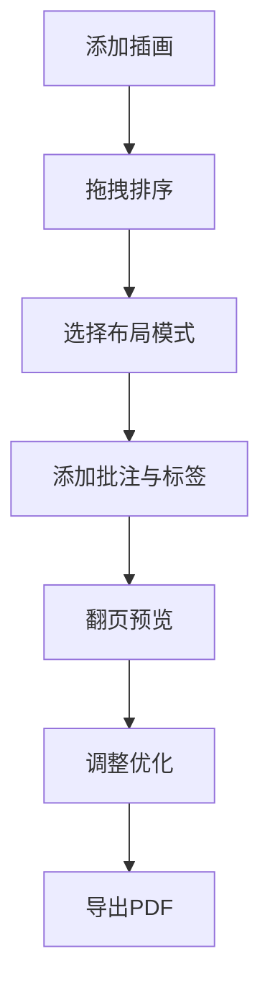

## 1. 产品概述

插画叙事画册排版工具是一款专为插画师设计的个人画册创作工具，解决现有工具无法直观排列插画叙事顺序并添加手写批注的痛点。目标用户为独立插画师、绘本创作者和艺术爱好者，帮助他们以叙事化的方式编排个人作品集。

产品价值在于提供沉浸式的画册编辑体验，将插画管理、叙事排序、批注标记和PDF导出整合在统一的复古风格界面中，让创作过程本身成为一种艺术享受。

## 2. 核心功能

### 2.1 用户角色

| 角色 | 注册方式 | 核心权限 |
|------|----------|----------|
| 插画师 | 无需注册，本地工具 | 上传插画、拖拽排序、添加批注、导出PDF |

### 2.2 功能模块

1. **画册管理面板**：插画缩略图滚动条、拖拽排序、添加插画
2. **页面预览区**：3D翻页预览、布局模式切换、页码导航
3. **批注编辑系统**：气泡批注、情绪标签、位置微调
4. **导出引擎**：PDF渲染、进度显示、自动下载

### 2.3 页面详情

| 页面名称 | 模块名称 | 功能描述 |
|-----------|-------------|---------------------|
| 主编辑页 | 顶部工具栏 | 项目名称显示、布局模式切换、添加插画、导出PDF |
| 主编辑页 | 缩略图滚动条 | 横向滚动展示所有插画缩略图、支持拖拽排序 |
| 主编辑页 | 画册预览区 | A4比例页面展示、3D翻页动画、左右翻页按钮 |
| 主编辑页 | 批注编辑器 | 点击添加气泡、文字输入、情绪标签选择、拖拽微调 |
| 主编辑页 | 导出进度条 | 显示PDF生成进度、完成后自动下载 |

## 3. 核心流程

用户首先添加最多20张插画（占位图模拟），通过拖拽顶部缩略图调整叙事顺序，选择合适的页面布局模式（单页/双页/三页），点击插画添加批注气泡和情绪标签，使用翻页功能预览整体效果，最后导出为高清PDF文件。

## 4. 用户界面设计

### 4.1 设计风格

- **主色调**：浅米色#FDFBF7（背景）、米白#F7F3E8（页面）、复古棕#2D2B26（文字）
- **点缀色**：驼色#D4A373（边框/选中）、蓝色#3B82F6（导出按钮）
- **情绪标签色**：喜悦#F6E05E、忧伤#A0AEC0、愤怒#FC8181、宁静#68D391、梦幻#B794F4
- **字体**：衬线体（Georgia/宋体风格）用于标题和页码，Georgia用于批注文字
- **按钮风格**：胶囊型布局切换按钮、圆角导出按钮、圆形翻页箭头
- **动效**：0.2-0.6秒平滑过渡、3D卷页翻转动画、卡片飞入重排动画
- **整体风格**：复古杂志风，温暖优雅，富有艺术气息

### 4.2 页面设计概述

| 页面名称 | 模块名称 | UI元素 |
|-----------|-------------|-------------|
| 主编辑页 | 顶部工具栏 | 衬线粗体标题带下划线、胶囊切换按钮组、蓝色导出按钮 |
| 主编辑页 | 缩略图条 | 横向滚动、圆角缩略图、半透明拖拽浮层、0.3秒平滑重排 |
| 主编辑页 | 预览区 | 圆角24px卡片阴影、A4比例米白页面、半透明圆形翻页按钮 |
| 主编辑页 | 批注系统 | 白色气泡+虚线边框+小三角、情绪圆角色条、可拖拽微调 |
| 主编辑页 | 进度条 | 蓝色#3B82F6进度线、圆角4px、高度8px |

### 4.3 响应式设计

- 桌面端（≥768px）：翻页区域宽80%最大1200px，布局按钮组横向排列
- 移动端（<768px）：翻页区域宽95%，布局按钮改为下拉菜单，项目名称缩小至20px
- 触控优化：按钮最小点击区域48px，拖拽手势支持

### 4.4 3D翻页动画

- 旋转轴：Y轴
- 持续时间：0.6秒
- 背面透明度：50%
- 新页面：从中心淡入
- 驱动方式：requestAnimationFrame确保60fps
