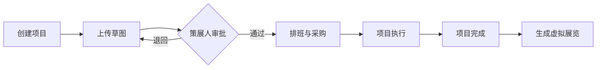

## 1. 产品概述

街头艺术策展管理平台，专为策展人设计，用于高效管理壁画项目全生命周期，解决多项目并行时信息分散、协作混乱的痛点。

- 核心目标：统一管理壁画项目审批、创作、执行、展示全流程
- 目标用户：街头艺术策展人、协作艺术家、志愿者团队
- 产品价值：将分散在微信聊天和表格中的信息整合到一个平台，提升协作效率和项目透明度

## 2. 核心功能

### 2.1 用户角色
| 角色 | 登录方式 | 核心权限 |
|------|----------|----------|
| 策展人 | 系统登录 | 项目CRUD、草图审批、排班管理、材料采购、虚拟展览生成 |
| 艺术家 | 受邀访问 | 上传草图版本、查看批注 |
| 志愿者 | 受邀访问 | 查看排班表 |

### 2.2 功能模块
1. **项目管理面板**：项目卡片瀑布流展示、项目创建与编辑
2. **草图迭代审批**：多版本草图管理、批注气泡、审批流程
3. **志愿者排班**：志愿者管理、周视图排班时间线
4. **材料追踪**：采购清单表格、状态标签
5. **虚拟展览**：3D画廊展示、草图交互浏览

### 2.3 页面详情
| 页面名称 | 模块名称 | 功能描述 |
|----------|----------|----------|
| 项目面板首页 | 瀑布流卡片 | 三列布局展示项目卡片，状态色条标识，悬浮动效 |
| 项目面板首页 | 新建项目表单 | 弹窗表单，包含名称、位置、尺寸、主题、预算、截止日期 |
| 项目详情页 | 草图时间线 | 版本列表、SVG预览、批注气泡、审批操作按钮 |
| 项目详情页 | 排班时间线 | 周视图表格、志愿者分配、日期高亮 |
| 项目详情页 | 材料清单 | 采购表格、状态颜色标签 |
| 虚拟展览页 | 3D画廊 | U型混凝土墙面、鼠标拖拽旋转、点击详情遮罩 |

## 3. 核心流程

策展人创建项目 → 艺术家上传草图 → 策展人审批（通过/退回+批注）→ 志愿者排班与材料采购 → 项目执行 → 项目完成 → 生成虚拟展览

## 4. 用户界面设计

### 4.1 设计风格
- **主色调**：暖色调自然风格，背景 #F5F0E8，卡片背景 #FAF5EE
- **状态色**：审批中 #F59E0B（橙）、创作中 #3B82F6（蓝）、完成 #10B981（绿）
- **按钮风格**：圆角、点击波浪扩散动画
- **字体**：系统无衬线字体，4-5档字号层级
- **布局**：卡片式瀑布流，响应式自适应
- **图标**：使用 lucide-react 图标库

### 4.2 页面设计概览
| 页面名称 | 模块名称 | UI元素 |
|----------|----------|--------|
| 项目面板首页 | 瀑布流卡片 | 300px宽卡片，16px圆角，顶部4px状态色条，悬浮上升6px+阴影 |
| 项目面板首页 | 新建按钮 | 浮动按钮，波浪点击动效 |
| 项目详情页 | 草图时间线 | 纵向版本列表，SVG预览图，黄色批注气泡（#FEF3C7）带引线 |
| 项目详情页 | 排班时间线 | 周视图网格，每格60px高，当前日期浅蓝#E0F2FE高亮，排班项绿色#6EE7B7 |
| 项目详情页 | 材料清单 | 简洁表格，状态彩色标签 |
| 虚拟展览页 | 3D画廊 | 混凝土灰#78716C墙面，U型25度夹角，全屏半透明遮罩过渡0.3s |

### 4.3 响应式设计
- Desktop（>768px）：三列瀑布流
- Tablet（550-768px）：两列布局
- Mobile（<550px）：单列布局
- 所有卡片间距自适应

### 4.4 3D场景设计
- **环境**：混凝土灰墙面纹理，柔和室内光线
- **光照**：环境光 + 方向光，营造画廊氛围
- **相机**：OrbitControls 拖拽旋转，初始视角正对U型画廊中心
- **交互**：点击草图像弹出详情遮罩，过渡动画0.3s ease
- **性能**：目标帧率45fps+，使用instanced rendering优化
