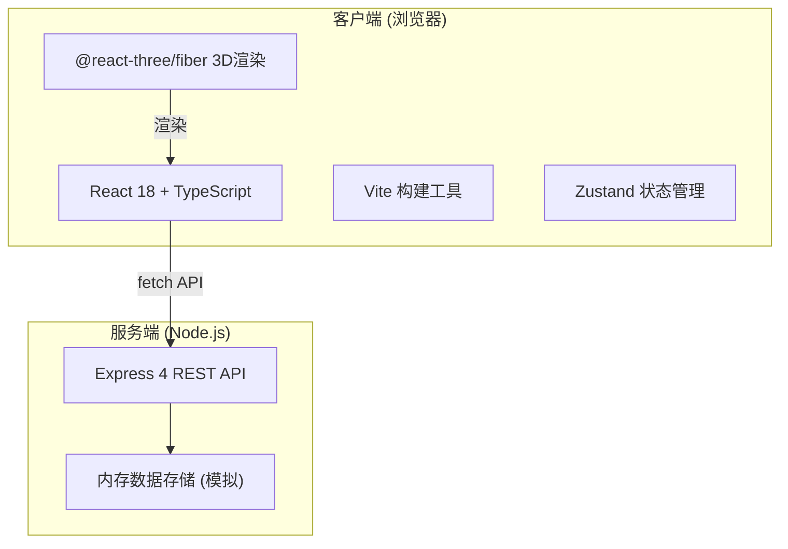
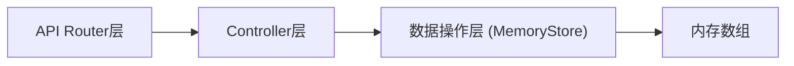
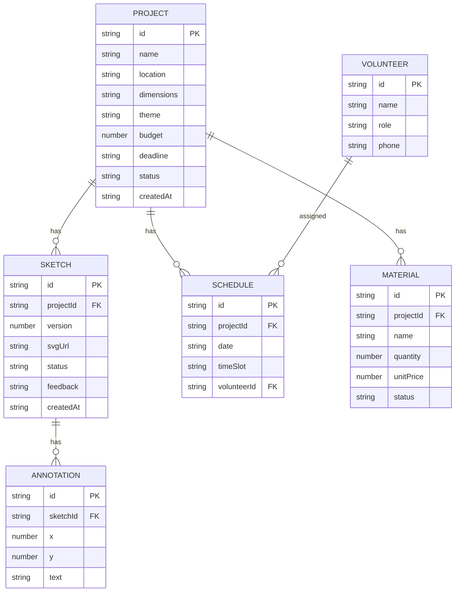

## 1. 架构设计



## 2. 技术描述
- **前端**：React@18 + TypeScript + Vite + @react-three/fiber + @react-three/drei + three + zustand
- **后端**：Express@4 + TypeScript + uuid
- **跨域**：cors 中间件
- **数据**：内存数组模拟（Mock Data）
- **初始化工具**：vite-init（react-express-ts 模板）

## 3. 路由定义
| 前端路由 | 页面组件 | 用途 |
|----------|----------|------|
| / | Dashboard | 项目面板首页（瀑布流卡片） |
| /project/:id | ProjectDetail | 项目详情页（草图、排班、材料） |
| /gallery/:id | VirtualGalleryPage | 3D虚拟展览页 |

## 4. API 定义

### 4.1 项目接口
```typescript
interface Project {
  id: string;
  name: string;
  location: string; // 经纬度字符串 "lat,lng"
  dimensions: string; // "12m x 8m"
  theme: string;
  budget: number;
  deadline: string; // ISO date
  status: 'pending' | 'creating' | 'completed';
  createdAt: string;
}

// GET /api/projects → Project[]
// POST /api/projects → Project
// PUT /api/projects/:id → Project
// DELETE /api/projects/:id → void
```

### 4.2 草图接口
```typescript
interface Sketch {
  id: string;
  projectId: string;
  version: number;
  svgUrl: string;
  status: 'pending' | 'approved' | 'rejected';
  feedback?: string;
  annotations: Annotation[];
  createdAt: string;
}

interface Annotation {
  id: string;
  x: number; // 百分比位置
  y: number;
  text: string;
}

// GET /api/projects/:id/sketches → Sketch[]
// POST /api/projects/:id/sketches → Sketch
// PUT /api/projects/:id/sketches/:sketchId → Sketch
```

### 4.3 排班接口
```typescript
interface Volunteer {
  id: string;
  name: string;
  role: string;
  phone: string;
}

interface ScheduleItem {
  id: string;
  projectId: string;
  date: string; // YYYY-MM-DD
  timeSlot: string; // "09:00-12:00"
  volunteerId: string;
}

// GET /api/projects/:id/schedule → ScheduleItem[]
// POST /api/projects/:id/schedule → ScheduleItem
// DELETE /api/projects/:id/schedule/:itemId → void
// GET /api/volunteers → Volunteer[]
// POST /api/volunteers → Volunteer
```

### 4.4 材料接口
```typescript
interface Material {
  id: string;
  projectId: string;
  name: string;
  quantity: number;
  unitPrice: number;
  status: 'pending' | 'ordered' | 'received';
}

// GET /api/projects/:id/materials → Material[]
// POST /api/projects/:id/materials → Material
// PUT /api/projects/:id/materials/:materialId → Material
```

## 5. 服务端架构



- server/index.ts：Express 入口，注册所有路由和中间件
- 内存存储：使用 Map/Array 存储数据，服务重启清空

## 6. 数据模型

### 6.1 ER图


## 7. 项目文件结构
```
.
├── package.json
├── vite.config.ts
├── tsconfig.json
├── index.html
├── server/
│   └── index.ts          # Express后端
├── src/
│   ├── App.tsx           # 主入口，路由+全局状态
│   ├── components/
│   │   ├── ProjectCard.tsx
│   │   ├── SketchTimeline.tsx
│   │   ├── VirtualGallery.tsx
│   │   ├── ScheduleTimeline.tsx
│   │   ├── MaterialTable.tsx
│   │   └── ...
│   ├── hooks/
│   │   └── useProjectData.ts
│   ├── pages/
│   │   ├── Dashboard.tsx
│   │   ├── ProjectDetail.tsx
│   │   └── GalleryPage.tsx
│   ├── store/
│   │   └── index.ts      # Zustand store
│   └── types/
│       └── index.ts      # 类型定义
```
