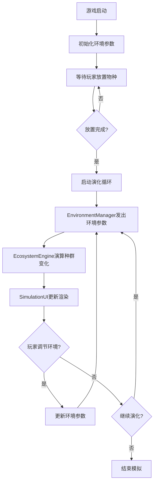

## 1. 产品概述

生物群落动态演化生存模拟游戏 - 玩家在2D网格地图上放置植物、草食动物、肉食动物，通过调节环境参数（温度、湿度、光照）观察种群繁衍与食物链平衡的动态变化过程。

- 目标用户：对生态系统、演化生物学感兴趣的教育工作者、学生和爱好者
- 产品价值：通过可视化交互方式直观展示生态系统的复杂性和平衡性原理

## 2. 核心功能

### 2.1 功能模块
1. **地图交互模块**：2D网格地图、物种放置与移除、格子悬停提示
2. **演化引擎模块**：基于Lotka-Volterra模型的种群动态演算、世代更新、空间扩散
3. **环境管理模块**：温度/湿度/光照滑块调节、环境参数事件分发
4. **统计可视化模块**：实时种群数据面板、折线图趋势展示
5. **动画反馈模块**：种群数量变化抖动动画、物种灭绝过渡动画

### 2.2 功能详情
| 页面/模块 | 子模块 | 功能描述 |
|-----------|--------|----------|
| 地图区域 | 网格渲染 | 28x28px格子，半透明白色网格线，Canvas优化渲染 |
| 地图区域 | 物种放置 | 点击放置植物（绿色方块）、草食动物（蓝色圆点）、肉食动物（红色圆点），每物种初始不超过10个 |
| 地图区域 | 悬停提示 | 鼠标悬停显示该格温度、湿度参数标签 |
| 控制面板 | 环境滑块 | 温度（-10~50°C红色）、湿度（0~100%蓝色）、光照（0~2000lux黄色） |
| 控制面板 | 统计图表 | 三种群数量折线图，X轴代次Y轴数量，每10代刷新 |
| 演化引擎 | 世代演算 | 50ms/帧，简化Lotka-Volterra模型，灭绝检测 |
| 动画系统 | 数量变化动画 | 变化超过20%时0.3秒缩放抖动 |
| 动画系统 | 灭绝动画 | 半透明灰色过渡0.5秒后消失 |

## 3. 核心流程

玩家选择物种 → 点击网格放置个体 → 系统自动开始世代演化 → 玩家调节环境参数 → 观察种群数量动态变化 → 通过折线图跟踪演化趋势

## 4. 用户界面设计

### 4.1 设计风格
- 暗色科技风主题
- 主背景：#0F172A
- 面板背景：#1E293B
- 文字颜色：#E2E8F0
- 强调色：#3B82F6

### 4.2 页面布局
| 区域 | 模块名称 | UI元素 |
|------|----------|--------|
| 左侧 | 地图画布 | Canvas网格、物种图标、数量标签、悬停提示 |
| 右侧顶部 | 控制面板 | 三个彩色滑块（温度红、湿度蓝、光照黄） |
| 右侧底部 | 统计面板 | 当前代次标注、三种群折线图、面积填充 |

### 4.3 响应式设计
- 桌面端：左侧地图自适应宽度，右侧面板固定300px
- 移动端（<800px）：面板折叠为可展开抽屉，地图占满宽度

### 4.4 动画设计
- 物种数量变化>20%：scale 1→1.1→1，0.3秒弹性动画
- 物种灭绝：opacity 1→0.3，颜色变灰#9CA3AF，0.5秒过渡后移除
- 滑块交互：hover时滑块放大1.2倍，过渡0.2秒
