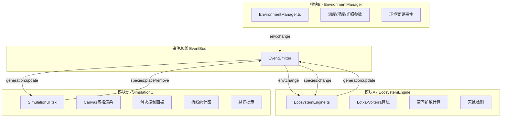

## 1. 架构设计



## 2. 技术栈

- 前端框架：React 18 + TypeScript
- 构建工具：Vite
- 渲染方式：Canvas 2D（地图网格）+ React DOM（控制面板）
- 事件系统：自定义EventEmitter实现发布订阅模式
- 包管理：npm
- 依赖库：uuid（唯一ID生成）

## 3. 核心数据结构

### 3.1 物种定义
```typescript
enum SpeciesType {
  PLANT = 'plant',
  HERBIVORE = 'herbivore',
  CARNIVORE = 'carnivore'
}

interface Species {
  id: string;
  type: SpeciesType;
  x: number;
  y: number;
  population: number;
  isExtinct: boolean;
  extinctionTimer: number;
  lastPopulation: number;
  animationState: AnimationState;
}
```

### 3.2 环境参数
```typescript
interface EnvironmentParams {
  temperature: number;  // -10 ~ 50 °C
  humidity: number;     // 0 ~ 100 %
  light: number;        // 0 ~ 2000 lux
}
```

### 3.3 演化状态
```typescript
interface GenerationState {
  generation: number;
  species: Species[];
  environment: EnvironmentParams;
  populationHistory: PopulationHistory[];
}
```

## 4. 模块接口定义

### 4.1 EnvironmentManager
```typescript
class EnvironmentManager {
  constructor(initialParams?: Partial<EnvironmentParams>);
  getParams(): EnvironmentParams;
  setParams(params: Partial<EnvironmentParams>): void;
  on(event: 'env:change', handler: (params: EnvironmentParams) => void): void;
  off(event: string, handler: Function): void;
}
```

### 4.2 EcosystemEngine
```typescript
class EcosystemEngine {
  constructor(eventBus: EventBus);
  start(): void;
  stop(): void;
  placeSpecies(type: SpeciesType, x: number, y: number): void;
  removeSpecies(id: string): void;
  getState(): GenerationState;
  on(event: 'generation:update', handler: (state: GenerationState) => void): void;
}
```

### 4.3 事件类型
| 事件名 | 触发模块 | 携带数据 | 说明 |
|--------|----------|----------|------|
| env:change | EnvironmentManager | EnvironmentParams | 环境参数变更 |
| species:place | SimulationUI | PlaceSpeciesEvent | 玩家放置物种 |
| species:remove | SimulationUI | RemoveSpeciesEvent | 玩家移除物种 |
| generation:update | EcosystemEngine | GenerationState | 每代演算结果 |

## 5. Lotka-Volterra 简化模型

### 5.1 植物增长
```
dP/dt = P * (r_light * light + r_temp * tempFactor - mortality)
```
- 受光照强度正影响
- 温度在20-30°C区间最优，过高过低均抑制

### 5.2 草食动物增长
```
dH/dt = H * (efficiency * P - mortality - tempStress)
```
- 消耗植物获得能量
- 温度过高(>40°C)或过低(<0°C)时额外衰减

### 5.3 肉食动物增长
```
dC/dt = C * (efficiency * H - mortality)
```
- 消耗草食动物获得能量
- 顶级捕食者，死亡率较高

## 6. 性能优化策略

1. Canvas批量渲染：物种图标在单帧内统一绘制，避免频繁重绘
2. 帧率控制：requestAnimationFrame + 50ms间隔控制
3. 历史数据节流：每10代记录一次统计数据，避免数据量过大
4. 种群计算优化：使用数组遍历代替对象映射，单帧计算<10ms
5. 图表重绘节流：使用requestAnimationFrame调度图表更新
