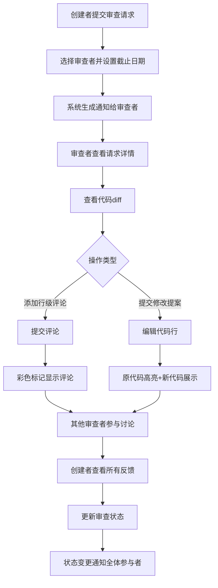

## 1. 产品概述
CodeReview Hub 是一个面向分布式开发团队的在线代码审查协作平台，解决团队在代码合并前难以高效协作审查、标注和讨论代码变更的痛点。
- 核心目标：提升代码审查效率，降低沟通成本，确保代码质量
- 目标用户：软件开发团队、代码审查者、项目管理者
- 市场价值：填补轻量级、专注于代码审查协作的在线工具空白

## 2. 核心功能

### 2.1 用户角色
| 角色 | 注册方式 | 核心权限 |
|------|----------|----------|
| 请求创建者 | 系统内置用户 | 创建审查请求、上传代码、管理状态、查看评论 |
| 审查者 | 系统内置用户 | 查看请求、添加行级评论、提交代码修改提案、参与讨论 |
| 管理员 | 系统内置用户 | 全部权限、用户管理 |

### 2.2 功能模块
1. **仪表盘首页**：待处理审查统计、最近活动时间线、个人评论柱状图统计
2. **审查请求列表**：卡片式列表展示所有审查请求、状态筛选
3. **创建审查请求**：表单提交、代码上传/粘贴、审查者选择、截止日期设置
4. **审查详情页**：并排代码diff展示、行级评论、代码修改提案、线程式讨论、状态变更

### 2.3 页面详情
| 页面名称 | 模块名称 | 功能描述 |
|---------|----------|----------|
| 仪表盘首页 | 统计卡片 | 展示待处理审查数量、通过数量、需修改数量 |
| 仪表盘首页 | 活动列表 | 按时间倒序展示最近活动，鼠标悬停显示绝对时间 |
| 仪表盘首页 | 评论统计 | 柱状图展示个人评论按项目分组的数据 |
| 创建请求页 | 表单模块 | 标题、描述、代码上传/粘贴、审查者选择、截止日期选择 |
| 审查详情页 | 代码展示 | 行号并排diff展示，等宽字体，隔行条纹背景 |
| 审查详情页 | 行级评论 | 点击行号展开评论框，彩色标记图标，气泡预览 |
| 审查详情页 | 修改提案 | 原代码黄色背景删除线，新代码绿色背景，支持线程讨论 |
| 审查详情页 | 状态管理 | 标记为待处理/通过/需修改，渐变横幅提醒 |
| 全局导航 | 通知中心 | 未读通知徽章跳动，通知列表 |

## 3. 核心流程

## 4. 用户界面设计

### 4.1 设计风格
- 主色调：深灰色背景 (#1e1e1e)，编辑器风格深色主题
- 强调色：蓝色 (#007acc) 用于主要操作和选中状态，绿色 (#4ec9b0) 用于通过状态和代码高亮
- 按钮风格：圆角4px，悬停状态微提亮，点击反馈
- 字体：代码区域使用 JetBrains Mono 等宽字体，界面使用系统无衬线字体
- 布局：卡片式布局，固定底部导航栏，桌面端左右分栏代码diff
- 图标：线性简约风格，状态使用彩色圆点标记
- 动效：卡片渐入、悬停上浮、滑动指示条、平滑展开/收起

### 4.2 页面设计概述
| 页面名称 | 模块名称 | UI元素 |
|---------|----------|--------|
| 仪表盘 | 统计卡片 | 深灰卡片，渐变数据数字，骨架屏加载动画 |
| 仪表盘 | 活动列表 | 时间线布局，相对时间戳，悬停气泡显示绝对时间 |
| 仪表盘 | 统计图表 | SVG柱状图，按项目分组，渐变色柱子 |
| 创建请求 | 表单 | 深色输入框，蓝色边框聚焦，文件拖拽区域 |
| 创建请求 | 提交按钮 | 加载动画spinner，禁用状态样式 |
| 审查详情 | 代码区域 | 行号隔行条纹，点击高亮，评论标记图标 |
| 审查详情 | 评论框 | 平滑下滑展开，头像+用户名，提交按钮 |
| 审查详情 | 状态横幅 | 顶部渐变背景，滑入动画，自动淡出 |
| 全局导航 | 底部栏 | 固定定位，激活项蓝色底部指示条平滑滑动 |
| 全局导航 | 通知徽章 | 右上角红色圆点，跳动动画 |

### 4.3 响应式设计
- 桌面端（≥768px）：代码并排diff展示，左侧导航可折叠
- 移动端（<768px）：代码垂直堆叠展示，底部标签栏导航
- 触摸优化：增大点击区域至44x44px，消除hover状态依赖
- 性能目标：首屏加载≤2秒，列表渲染≤100ms

### 4.4 动画细节
- 页面加载：骨架屏→渐入真实内容
- 卡片创建：从顶部滑入+渐显
- 评论展开：高度从0平滑过渡到auto
- 状态变更：顶部横幅滑入→停留3秒→滑出
- 通知徽章：新通知时上下跳动3次
- 导航切换：底部指示条平滑滑动到新位置
- 卡片悬停：上浮2px，阴影加深
