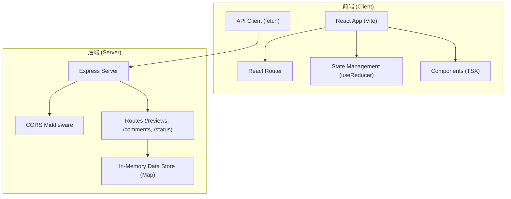
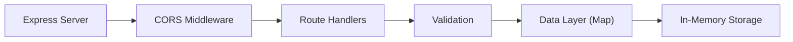
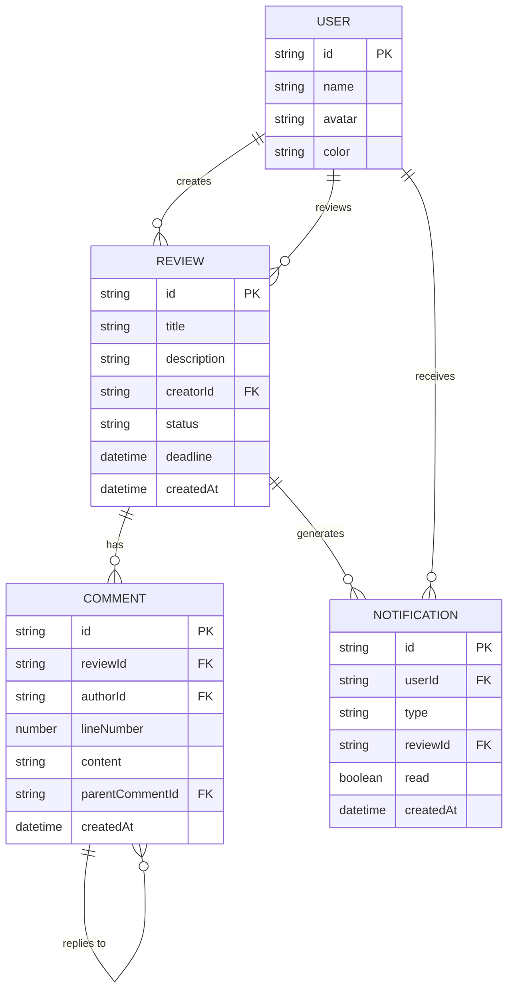

## 1. 架构设计



## 2. 技术描述

### 2.1 技术栈
- **前端框架**: React 18 + TypeScript
- **构建工具**: Vite 5
- **路由**: react-router-dom 6
- **状态管理**: React useReducer (内置)
- **HTTP客户端**: 原生 fetch API
- **ID生成**: uuid
- **后端**: Express 4
- **跨域**: cors
- **代码字体**: JetBrains Mono (Google Fonts CDN)
- **图标**: 内联SVG图标

### 2.2 项目初始化
- 使用 `npm create vite@latest` 初始化 React + TypeScript 项目
- 路径别名: `@` 指向 `src/` 目录
- 严格模式: TypeScript `strict: true`

### 2.3 后端架构


## 3. 路由定义

### 前端路由
| 路由 | 页面 | 说明 |
|------|------|------|
| `/` | Dashboard | 仪表盘首页 |
| `/reviews` | ReviewList | 审查请求列表 |
| `/create` | CreateReview | 创建审查请求 |
| `/reviews/:id` | ReviewDetail | 审查详情页 |
| `/notifications` | Notifications | 通知中心 |

### API 路由
| 方法 | 路由 | 说明 |
|------|------|------|
| GET | `/api/reviews` | 获取审查请求列表 |
| GET | `/api/reviews/:id` | 获取单个审查请求详情 |
| POST | `/api/reviews` | 创建新的审查请求 |
| PUT | `/api/reviews/:id/status` | 更新审查状态 |
| GET | `/api/reviews/:id/comments` | 获取请求的所有评论 |
| POST | `/api/reviews/:id/comments` | 添加评论 |
| PUT | `/api/comments/:id` | 更新评论（支持修改提案） |
| POST | `/api/comments/:id/reply` | 回复评论（线程讨论） |

## 4. API 定义

### 4.1 TypeScript 类型定义

```typescript
// 审查状态
type ReviewStatus = 'pending' | 'approved' | 'changes_required';

// 审查请求
interface Review {
  id: string;
  title: string;
  description: string;
  creator: User;
  reviewers: User[];
  codeSnippet: CodeDiff;
  status: ReviewStatus;
  deadline: string;
  createdAt: string;
  updatedAt: string;
}

// 用户
interface User {
  id: string;
  name: string;
  avatar: string;
  color: string;
}

// 代码diff
interface CodeDiff {
  filename: string;
  oldCode: string[];
  newCode: string[];
  language: string;
}

// 评论
interface Comment {
  id: string;
  reviewId: string;
  lineNumber: number;
  author: User;
  content: string;
  createdAt: string;
  replies?: Comment[];
  proposedChange?: {
    oldLine: string;
    newLine: string;
  };
}

// 通知
interface Notification {
  id: string;
  userId: string;
  type: 'status_change' | 'new_comment' | 'new_review' | 'reply';
  title: string;
  message: string;
  reviewId: string;
  read: boolean;
  createdAt: string;
}

// 活动记录
interface Activity {
  id: string;
  type: 'comment' | 'status_change' | 'review_created' | 'proposal';
  user: User;
  reviewId: string;
  reviewTitle: string;
  timestamp: string;
  description: string;
}
```

### 4.2 请求/响应示例

#### GET /api/reviews
**响应**:
```json
{
  "success": true,
  "data": [
    {
      "id": "uuid-1",
      "title": "用户认证模块重构",
      "status": "pending",
      "creator": { "id": "u1", "name": "张三" },
      "deadline": "2026-06-30T00:00:00Z"
    }
  ]
}
```

#### POST /api/reviews
**请求体**:
```json
{
  "title": "用户认证模块重构",
  "description": "重构JWT验证逻辑，支持多设备登录",
  "reviewerIds": ["u2", "u3"],
  "code": {
    "filename": "auth.ts",
    "oldCode": "function verifyToken() { ... }",
    "newCode": "function verifyToken() { ... }",
    "language": "typescript"
  },
  "deadline": "2026-06-30T00:00:00Z"
}
```

## 5. 数据模型

### 5.1 ER 图



### 5.2 内存存储结构

```typescript
// server/index.ts 中的数据存储
const stores = {
  users: new Map<string, User>(),
  reviews: new Map<string, Review>(),
  comments: new Map<string, Comment>(),
  notifications: new Map<string, Notification>(),
  activities: new Map<string, Activity>(),
};

// 初始化Mock数据
function initMockData() {
  // 预设用户
  const users: User[] = [
    { id: 'u1', name: '张三', avatar: '👨‍💻', color: '#ff6b6b' },
    { id: 'u2', name: '李四', avatar: '👩‍💻', color: '#4ec9b0' },
    { id: 'u3', name: '王五', avatar: '🧑‍💻', color: '#007acc' },
  ];
  
  // 预设审查请求
  // 预设评论和活动记录
}
```

## 6. 性能优化策略

### 6.1 前端性能
- **代码分割**: React.lazy 动态导入页面组件
- **虚拟列表**: 长列表使用虚拟滚动（评论超过100条时）
- **请求防抖**: 搜索和筛选使用 debounce
- **缓存策略**: SWR-style 缓存，stale-while-revalidate
- **骨架屏**: 数据加载期间显示骨架屏提升感知速度
- **CSS动画**: 优先使用 transform 和 opacity 动画

### 6.2 性能指标
- 首屏加载时间: ≤ 2秒
- 列表切换渲染: ≤ 100ms
- 评论展开动画: ≤ 300ms
- 接口响应时间: ≤ 200ms（内存存储）

## 7. 动画实现策略

### 7.1 CSS 动画类
```css
/* 渐入动画 */
@keyframes fadeIn {
  from { opacity: 0; transform: translateY(10px); }
  to { opacity: 1; transform: translateY(0); }
}

/* 滑入动画 */
@keyframes slideIn {
  from { opacity: 0; transform: translateX(-20px); }
  to { opacity: 1; transform: translateX(0); }
}

/* 顶部滑入 */
@keyframes slideDown {
  from { opacity: 0; transform: translateY(-100%); }
  to { opacity: 1; transform: translateY(0); }
}

/* 跳动动画 */
@keyframes bounce {
  0%, 100% { transform: translateY(0); }
  50% { transform: translateY(-5px); }
}

/* 骨架屏闪光 */
@keyframes shimmer {
  0% { background-position: -200% 0; }
  100% { background-position: 200% 0; }
}
```

### 7.2 React Transition
- 评论展开: max-height + overflow 过渡
- 导航指示条: transform: translateX 过渡
- 卡片悬停: transform: translateY(-2px) + box-shadow 过渡
