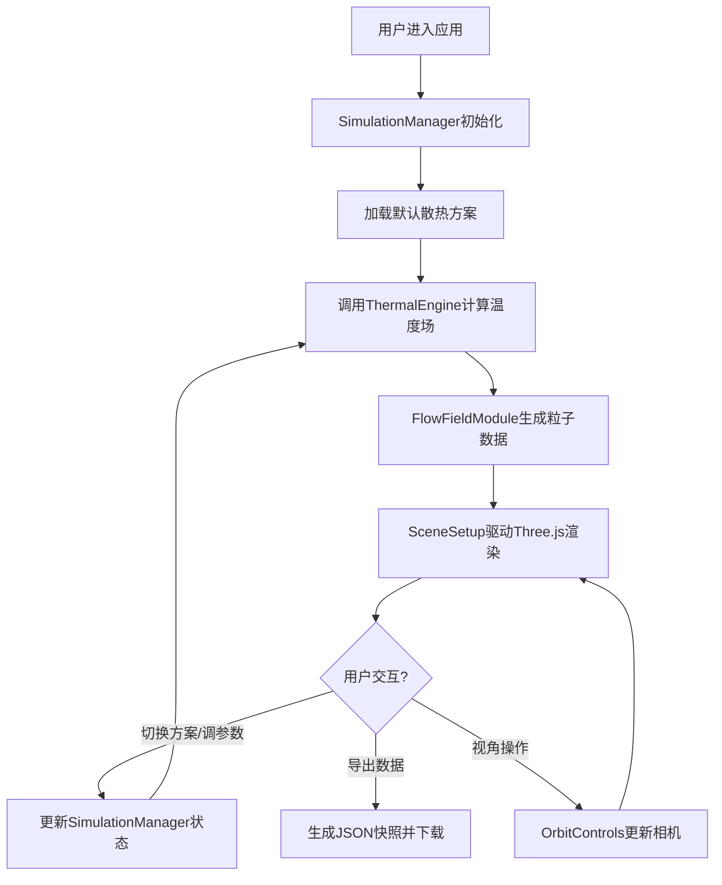

## 1. 产品概述

三维芯片封装热流模拟与可视化交互平台，面向芯片封装工程师，提供直观的散热方案评估工具。通过实时热力学计算与三维可视化技术，帮助用户快速对比不同散热方案对芯片结温的影响，观测热流传导路径与温度场分布。

- 核心目标：降低散热方案评估周期，提升热设计决策效率
- 目标用户：芯片封装工程师、热设计工程师、微电子研发人员
- 市场价值：填补轻量级热仿真快速迭代工具的空白

## 2. 核心特性

### 2.2 功能模块

1. **三维封装模型展示**：芯片-基板-散热器三层结构模型，支持视角旋转与缩放
2. **散热方案切换系统**：五种预设方案（铜散热片、铝散热片、导热膏+散热片、微通道液冷、热电制冷）
3. **参数调节面板**：芯片功耗滑块（5W-50W）、环境温度滑块（20°C-60°C）
4. **实时温度场热力图**：模型表面逐顶点颜色渐变映射，最高温区域闪烁标记
5. **热流粒子流线系统**：半透明粒子动态显示热流方向与密度
6. **数据监测面板**：最高温、平均温、热阻值、散热效率实时显示
7. **数据导出功能**：一键导出热场快照JSON

### 2.3 页面详情

| 页面名称 | 模块名称 | 功能描述 |
|-----------|-------------|---------------------|
| 主工作台 | 左侧参数面板 | 散热方案选择按钮组、功耗/环境温度滑块、方案说明卡片 |
| 主工作台 | 中央三维画布 | Three.js渲染场景、封装模型、热力图、粒子流线 |
| 主工作台 | 右下数据面板 | 四项关键指标实时显示、导出按钮 |
| 主工作台 | 顶部工具栏（窄屏）| 折叠式参数控制面板 |

## 3. 核心流程

用户进入主工作台 → 默认加载铜散热片方案与初始参数 → 系统启动热力学计算 → 实时渲染三维模型热力图与粒子流 → 用户切换方案或拖动滑块 → 状态更新触发重算 → 平滑过渡动画 → 用户可随时导出当前数据快照

## 4. 用户界面设计

### 4.1 设计风格

- **主色调**：深空黑背景(#0A0A0F) + 科技蓝(#3B82F6) + 冷青色(#1E90FF) → 热力红(#FF4500)
- **辅色调**：数据绿(#00FF00)用于指标显示，橙色(#FFA500)用于粒子流线
- **按钮风格**：圆角矩形，悬停放大1.05倍+内发光效果，0.15秒过渡
- **字体**：UI使用现代无衬线字体，数据面板使用等宽字体(monospace)
- **布局风格**：左右分栏深色控制台风格，左侧320px固定面板，右侧自适应画布
- **视觉效果**：面板边框微发光、模型半透明灰材质、热力图平滑色阶过渡

### 4.2 页面设计概览

| 页面名称 | 模块名称 | UI元素 |
|-----------|-------------|-------------|
| 主工作台 | 左侧参数面板 | 标题、方案按钮矩阵(2-3列)、滑块组(带数值显示)、当前方案标签 |
| 主工作台 | 三维画布区域 | 全屏深色背景、模型居中、坐标轴参考线(可选)、右下角数据面板浮层 |
| 主工作台 | 数据面板 | 半透明深色卡片、绿色等宽数字、指标标签、导出按钮 |
| 主工作台 | 窄屏工具栏 | 顶部水平展开条、方案下拉菜单、紧凑滑块组 |

### 4.3 响应式设计

- **宽屏模式(≥1440px)**：左侧320px固定面板展开，右侧Three.js画布占满剩余空间，数据面板悬浮右下角
- **标准屏(1024px-1439px)**：左侧面板压缩至280px，画布自适应
- **窄屏模式(<1024px)**：左侧面板折叠为顶部60px工具栏，点击展开下拉参数面板，画布占满全屏

### 4.4 三维场景指引

- **环境**：纯深色背景(#0A0A0F)，微弱环境光+方向性主光+底部补光
- **光照设置**：AmbientLight(0xffffff, 0.4) + DirectionalLight(0xffffff, 0.8, 从右上方45度) + PointLight辅助
- **相机设置**：PerspectiveCamera，初始位置(50, 50, 50)，lookAt(0, 0, 0)，45度俯视视角
- **构图**：三层结构垂直堆叠，芯片居中于基板上方，散热器覆盖基板，整体居中于场景原点
- **交互**：OrbitControls启用拖拽旋转、滚轮缩放、右键平移，禁用翻转，最小距离30，最大距离200
- **动画**：方案切换时模型材质0.5秒渐变过渡，最高温区域0.3秒周期透明度闪烁(0.6-1.0)
- **后处理**：轻微FXAA抗锯齿，确保热力图颜色平滑无锯齿
- **性能预算**：单帧渲染<20ms，粒子数≤5000，热场更新≥10fps
