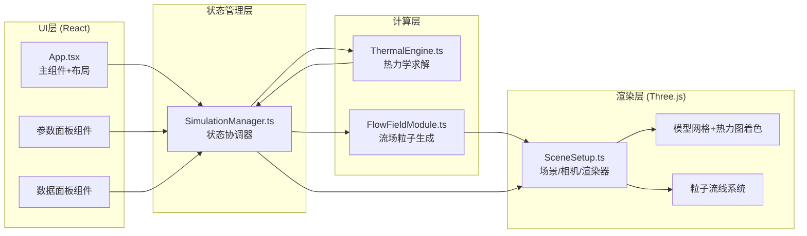

## 1. 架构设计



## 2. 技术描述

- **前端框架**：React 18 + TypeScript 5（严格模式）
- **构建工具**：Vite 5 + @vitejs/plugin-react
- **三维渲染**：Three.js 0.160（原生，不使用R3F以最大化性能控制）
- **状态管理**：自定义SimulationManager类 + React hooks订阅模式
- **辅助库**：uuid（唯一标识），无额外UI库（纯CSS实现深色科技风）
- **初始化方式**：npm create vite@latest + 手动配置依赖

## 3. 文件结构定义

```
auto250/
├── package.json
├── vite.config.js
├── tsconfig.json
├── index.html
└── src/
    ├── App.tsx              # React主组件：布局+hooks+事件绑定
    ├── main.tsx             # React入口
    ├── index.css            # 全局样式：深色主题+滑块定制+响应式
    ├── types.ts             # 全局TypeScript类型定义
    ├── ThermalEngine.ts     # 热力学计算模块
    ├── FlowFieldModule.ts   # 粒子流线生成模块
    ├── SimulationManager.ts # 状态管理与模块协调器
    └── SceneSetup.ts        # Three.js场景初始化与渲染
```

## 4. 核心模块接口定义

### 4.1 SimulationManager

```typescript
type CoolingSolution = 
  | 'copper_heat_sink' 
  | 'aluminum_heat_sink' 
  | 'thermal_paste' 
  | 'microchannel' 
  | 'tec';

interface SimParams {
  solution: CoolingSolution;
  power: number;      // 5-50 W
  ambientTemp: number; // 20-60 °C
}

interface SimMetrics {
  maxTemp: number;
  avgTemp: number;
  thermalResistance: number; // °C/W
  coolingEfficiency: number; // 0-100 %
  noCoolingMaxTemp: number;  // 基准参考
}

type TempListener = (temps: number[][][]) => void;
type MetricsListener = (metrics: SimMetrics) => void;
type ParticlesListener = (positions: Float32Array, colors: Float32Array) => void;

class SimulationManager {
  constructor();
  setParams(params: Partial<SimParams>): void;
  getParams(): SimParams;
  getMetrics(): SimMetrics;
  subscribeTemps(fn: TempListener): () => void;
  subscribeMetrics(fn: MetricsListener): () => void;
  subscribeParticles(fn: ParticlesListener): () => void;
  exportSnapshot(): object;
  start(): void;
  stop(): void;
}
```

### 4.2 ThermalEngine

```typescript
interface GridConfig {
  chipSize: [number, number, number];    // [20, 20, 2]
  substrateSize: [number, number, number]; // [30, 30, 3]
  heatSinkSize: [number, number, number];  // [40, 40, 10]
  resolution: number; // 每单位网格数
}

interface SolutionProperties {
  thermalConductivity: number; // W/(m·K) 等效导热系数
  convectionCoeff: number;     // W/(m²·K) 对流换热系数
}

class ThermalEngine {
  constructor(gridConfig: GridConfig);
  setSolution(props: SolutionProperties): void;
  compute(power: number, ambientTemp: number): {
    temperatures: number[][][];   // 三维温度数组 [x][y][z]
    heatFlux: { x: number; y: number; z: number }[][][];
  };
  getGridNodes(): { position: [number, number, number]; region: 'chip' | 'substrate' | 'heatSink' }[];
}
```

### 4.3 FlowFieldModule

```typescript
interface Particle {
  position: [number, number, number];
  velocity: [number, number, number];
  life: number;     // 0-1 剩余寿命
  maxLife: number;
}

class FlowFieldModule {
  constructor(particleLimit: number);
  generate(
    heatFlux: { x: number; y: number; z: number }[][][],
    temperatures: number[][][],
    densityMultiplier: number
  ): {
    positions: Float32Array;  // 扁平化 xyz*N
    colors: Float32Array;     // 扁平化 rgb*N
    velocities: Float32Array;
  };
  animate(dt: number): void;  // 每帧更新粒子位置
}
```

### 4.4 SceneSetup

```typescript
interface SceneHandles {
  renderer: THREE.WebGLRenderer;
  scene: THREE.Scene;
  camera: THREE.PerspectiveCamera;
  controls: OrbitControls;
  chipMesh: THREE.Mesh;
  substrateMesh: THREE.Mesh;
  heatSinkMesh: THREE.Mesh;
  particleSystem: THREE.Points;
}

class SceneSetup {
  constructor(container: HTMLElement);
  getHandles(): SceneHandles;
  updateTemperatureColors(temperatureMap: Map<THREE.BufferGeometry, number[]>): void;
  updateParticles(positions: Float32Array, colors: Float32Array): void;
  setSolutionTransition(solution: CoolingSolution, duration: number): void;
  flashHottestRegion(intensity: number): void;
  dispose(): void;
}
```

## 5. 热力学计算策略（ThermalEngine）

采用**稳态热传导有限差分法（FDM）简化模型**：

1. **几何离散**：将三层结构（芯片+基板+散热器）离散为统一网格，典型分辨率8x8x8总节点约1500个
2. **控制方程**：三维拉普拉斯方程 + 内热源项：`k·∇²T + Q_v = 0`，其中Q_v仅在芯片区域非零
3. **边界条件**：
   - 底部/侧面：自然对流 `k·∂T/∂n = h·(T - T_ambient)`
   - 顶部散热器表面：强化对流（不同方案h不同）
   - 层间界面：考虑接触热阻（导热膏降低接触热阻）
4. **求解方法**：Jacobi迭代法 + 超松弛因子(SOR)，残差收敛阈值1e-4
5. **热流计算**：`q = -k·∇T`，中心差分求梯度

## 6. 性能优化策略

- **计算节流**：热场计算100ms间隔（10fps），通过requestAnimationFrame时间戳控制
- **粒子更新**：GPU友好的Float32Array + BufferAttribute，仅更新attribute而非重建几何体
- **热力图着色**：预计算10级色阶LUT，逐顶点颜色使用顶点颜色属性，避免每帧重算shader
- **几何复用**：三种结构使用BoxGeometry单例，材质共享uniform
- **过渡动画**：使用线性插值混合前后状态，避免全量重绘
- **渲染优化**：开启抗锯齿(MSAA 2x) + setPixelRatio适配DPR，但限制最大ratio=2
