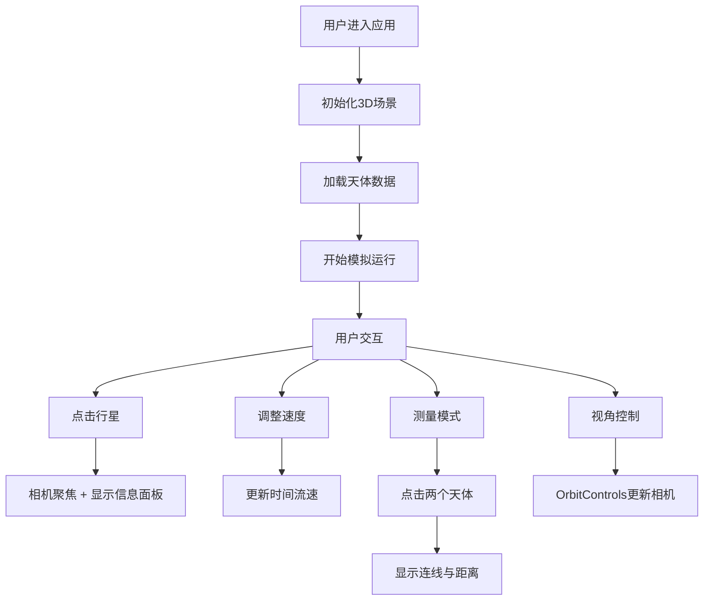

## 1. 产品概述

太阳系3D探索器是一款面向天文学爱好者的交互式Web应用，通过沉浸式三维可视化技术解决传统2D星图软件无法准确呈现行星轨道倾角、近日点/远日点差异以及实时相对运动关系的问题。

- 核心价值：让用户直观理解太阳系天体的真实三维运动规律，提供可交互、可测量、可调控的行星轨道探索体验
- 目标用户：天文学爱好者、学生、科普教育工作者

## 2. 核心特性

### 2.1 功能模块

1. **三维太阳系模拟**：太阳与八大行星的真实比例3D模型，椭圆轨道可视化，独立计时器驱动位置更新
2. **星空背景与光照系统**：5000颗粒子恒星背景，动态光照效果，太阳脉冲发光动画
3. **交互浏览与测量**：鼠标视角控制、快捷键操作、天体间距离测量工具
4. **时间与速度调控**：模拟时间流逝控制，多档位速度调节，时间方向切换
5. **天体信息展示**：悬浮信息标签，可折叠详细信息面板

### 2.2 页面详情

| 页面名称 | 模块名称 | 功能描述 |
|---------|---------|---------|
| 主探索页面 | 3D场景渲染区 | Three.js渲染太阳系，占屏幕上2/3区域 |
| 主探索页面 | 时间控制面板 | 左上角日期显示、速度滑块、预设按钮、时间方向切换 |
| 主探索页面 | 天体信息面板 | 右下角可折叠侧边面板，展示选中天体详细参数 |
| 主探索页面 | 测量状态显示 | 屏幕顶部显示测量模式状态与距离结果 |
| 主探索页面 | 控制说明区 | 屏幕底部1/3区域，展示快捷键说明与操作指南 |

## 3. 核心流程

用户进入应用后，默认看到太阳系全景视角，行星按真实轨道参数运动。用户可：
- 拖拽旋转视角、滚轮缩放
- 点击行星聚焦查看详情
- 调整时间速度观察轨道运动
- 进入测量模式计算天体距离
- 使用快捷键暂停、重置视角

## 4. 用户界面设计

### 4.1 设计风格

**深空科技风格**
- 主色调：深空蓝渐变（顶部#010212 → 底部#0B0D17）
- 强调色：科技青#00D4FF（用于数值高亮、激活状态）
- 辅助色：金色#FFD700（测量连线）、暖白#FFF4E0（太阳光）
- 文字色：浅蓝#A8B2D1，标签色#8892B0
- 控件风格：半透明毛玻璃效果（blur 8px），圆角设计，悬停微动效

**字体系统**
- 主字体：'Inter', 'Segoe UI', sans-serif
- 数值字体：等宽字体（14px #00D4FF）
- 字号：正文14px，重要数值16px，标签12px粗体

### 4.2 页面设计概览

| 页面区域 | 模块名称 | UI元素与风格 |
|---------|---------|-------------|
| 上2/3区域 | 3D场景 | 全屏深空渐变背景，Three.js Canvas，天体悬浮标签，轨道半透明白色环线 |
| 左上角 | 时间控制面板 | 半透明面板，日期时间显示（YYYY-MM-DD HH:MM），对数速度滑块，预设按钮（1x/10x/100x/1000x），方向切换按钮 |
| 右下角 | 信息面板 | 默认折叠，展开宽度320px，毛玻璃背景（#0B0D1790），等宽字体显示天体参数 |
| 顶部 | 测量状态 | 全屏宽度顶部条，显示当前测量模式与距离数值 |
| 下1/3区域 | 控制说明 | 背景#12142B，向上渐变模糊过渡，快捷键说明与操作指南 |

### 4.3 响应式设计

- 桌面优先设计，适配1920x1080与1440x900分辨率
- 屏幕宽度<1200px时，天体信息面板变为底部浮层（高度自适应，圆角12px）
- 触控设备优化：支持双指缩放、单指拖拽旋转

### 4.4 3D场景设计指引

**环境与氛围**
- 背景：5000颗粒子恒星（随机位置，亮度0.3-1.0），深空蓝渐变底色
- 光照：太阳作为点光源（强度1.5，颜色#FFF4E0）+ 微弱环境光（强度0.1，颜色#404060）
- 特效：太阳脉冲发光动画（周期2s，强度1.0↔1.5）

**相机与交互**
- 初始相机位置：(0, 80, 150)，看向原点
- 相机控制：OrbitControls，启用阻尼效果
- 行星聚焦：0.5秒平滑过渡动画

**性能优化**
- 粒子系统使用BufferGeometry合并，减少draw calls
- 行星位置更新计算<2ms
- 目标帧率稳定45FPS以上

## 5. 技术约束

- 所有模块通过事件总线松散耦合，不得直接依赖
- 天体数据、时间控制、用户交互、3D渲染、UI层完全分离
- 必须遵循指定的文件结构与模块划分
