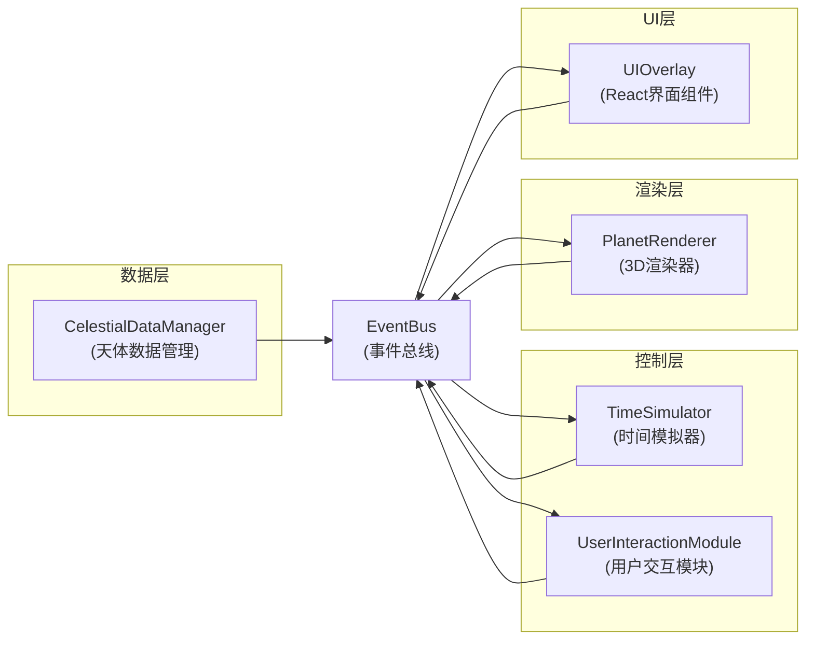

## 1. 架构设计

采用模块化、事件驱动的架构设计，各模块通过事件总线松散耦合，确保关注点分离与可维护性。



## 2. 技术选型

| 层级 | 技术选择 | 版本 | 用途 |
|-----|---------|------|------|
| 前端框架 | React | ^18.2.0 | UI组件化开发 |
| 语言 | TypeScript | ^5.3.0 | 类型安全的JavaScript |
| 构建工具 | Vite | ^5.0.0 | 快速开发与构建 |
| 3D引擎 | Three.js | ^0.160.0 | 三维场景渲染与物理动画 |
| 类型定义 | @types/three | ^0.160.0 | Three.js类型支持 |
| Vite插件 | @vitejs/plugin-react | ^4.2.0 | React JSX支持 |

## 3. 核心模块说明

### 3.1 EventBus 事件总线

**职责**：实现发布/订阅模式，作为模块间唯一通信渠道

**支持事件**：
- `timeUpdated` - 时间更新（参数：currentTime, deltaTime）
- `planetSelected` - 行星被选中（参数：planetId）
- `startMeasurement` - 开始测量模式
- `measurementResult` - 测量结果（参数：fromId, toId, distance）
- `measurementPointSelected` - 测量点选中（参数：bodyId, pointIndex）
- `speedChanged` - 速度变更（参数：speed）
- `directionChanged` - 时间方向变更（参数：direction）
- `resetView` - 重置视角
- `togglePause` - 暂停/恢复
- `viewFocusPlanet` - 聚焦行星（参数：planetId, position）
- `bodyPositionUpdate` - 天体位置更新（参数：bodyId, position）

### 3.2 CelestialDataManager 天体数据管理

**职责**：管理所有天体的静态物理参数与轨道数据

**数据结构**：
```typescript
interface CelestialBody {
  id: string;
  name: string;
  englishName: string;
  type: 'sun' | 'planet';
  radius: number;           // 赤道半径(km)
  color: number;            // 材质颜色
  orbit: {
    semiMajorAxis: number;  // 半长轴(AU)
    eccentricity: number;   // 偏心率
    inclination: number;    // 轨道倾角(度)
    ascendingNode: number;  // 升交点经度
    perihelion: number;     // 近日点幅角
    period: number;         // 公转周期(地球日)
  };
  rotation: {
    period: number;         // 自转周期(小时)
  };
  physical: {
    mass: number;           // 质量(kg)
    density: number;        // 平均密度(g/cm³)
    temperature: [number, number]; // 表面温度范围(K)
    moons: number;          // 卫星数量
  };
}
```

**核心方法**：
- `getBody(id: string): CelestialBody | undefined`
- `getAllBodies(): CelestialBody[]`
- `getPlanets(): CelestialBody[]`
- `calculatePosition(bodyId: string, time: number): THREE.Vector3`

### 3.3 TimeSimulator 时间模拟器

**职责**：管理模拟时间的流逝，驱动整个系统的动画更新

**核心属性**：
- `currentTime: Date` - 当前模拟时间
- `speed: number` - 时间流速（0.1x ~ 1000x）
- `direction: 1 | -1` - 时间流动方向
- `isPaused: boolean` - 暂停状态

**核心方法**：
- `start()` - 启动模拟循环（requestAnimationFrame驱动）
- `stop()` - 停止模拟
- `setSpeed(speed: number)` - 设置时间流速
- `toggleDirection()` - 切换时间方向
- `togglePause()` - 暂停/恢复
- `setTime(date: Date)` - 跳转到指定时间

### 3.4 UserInteractionModule 用户交互模块

**职责**：统一处理所有用户输入，解析为业务事件

**输入处理**：
- 鼠标点击：Raycaster拾取天体，触发选中或测量点选择
- 鼠标拖拽：OrbitControls视角旋转
- 滚轮：视角缩放
- 键盘：
  - `Space` - 暂停/恢复
  - `R` - 重置视角
  - `M` - 切换测量模式

### 3.5 PlanetRenderer 3D渲染器

**职责**：基于Three.js的三维场景管理与渲染

**核心组件**：
- `createSun()` - 创建太阳模型与光源
- `createPlanet(data: CelestialBody)` - 创建行星模型
- `createOrbitLine(data: CelestialBody)` - 创建轨道线
- `createStarfield()` - 创建5000颗恒星粒子背景
- `updatePlanetPositions(time: number)` - 更新所有行星位置
- `focusOnPlanet(planetId: string, duration: number)` - 相机平滑聚焦行星
- `createMeasurementLine(fromId, toId)` - 创建测量连线
- `updateMeasurementLine()` - 更新测量线位置

**性能优化**：
- 使用BufferGeometry创建粒子系统，合并draw call
- 天体位置计算使用数学公式而非物理引擎
- 轨道线使用LineSegments，单次绘制

### 3.6 UIOverlay React界面组件

**职责**：渲染所有2D UI元素，响应事件更新界面

**子组件**：
- `TimeControlPanel` - 时间控制面板（左上）
- `CelestialInfoPanel` - 天体信息面板（右下）
- `MeasurementDisplay` - 测量状态显示（顶部）
- `ControlGuide` - 操作说明区域（底部）

## 4. 文件结构

```
project-root/
├── package.json
├── vite.config.js
├── tsconfig.json
├── index.html
└── src/
    ├── main.tsx              # React入口
    ├── App.tsx               # 主应用组件
    ├── EventBus.ts           # 事件总线
    ├── CelestialDataManager.ts  # 天体数据管理
    ├── TimeSimulator.ts      # 时间模拟器
    ├── UserInteractionModule.ts  # 用户交互模块
    ├── PlanetRenderer.ts     # 3D渲染器
    ├── UIOverlay.tsx         # UI组件
    └── types.ts              # 共享类型定义
```

## 5. 性能指标

| 指标 | 目标值 | 实现方式 |
|-----|-------|---------|
| 稳定帧率 | ≥45 FPS | 优化渲染循环，减少重绘 |
| 位置更新耗时 | <2ms | 数学公式直接计算，缓存结果 |
| Draw Call 数量 | ≤20 | BufferGeometry合并，实例化渲染 |
| 内存占用 | <200MB | 纹理压缩，资源复用 |

## 6. 坐标系统与缩放比例

**坐标缩放**：
- 1 AU（天文单位）= 20 三维单位
- 太阳半径：3 单位（实际放大便于观察）
- 行星半径：按真实比例 × 2 放大（避免过小不可见）

**轨道计算**：
使用开普勒方程求解椭圆轨道位置：
1. 计算平近点角 M = 2π × (t / period)
2. 迭代求解偏近点角 E（牛顿-拉夫逊法）
3. 计算真近点角 ν
4. 转换为三维坐标（考虑倾角、升交点、近日点幅角）
