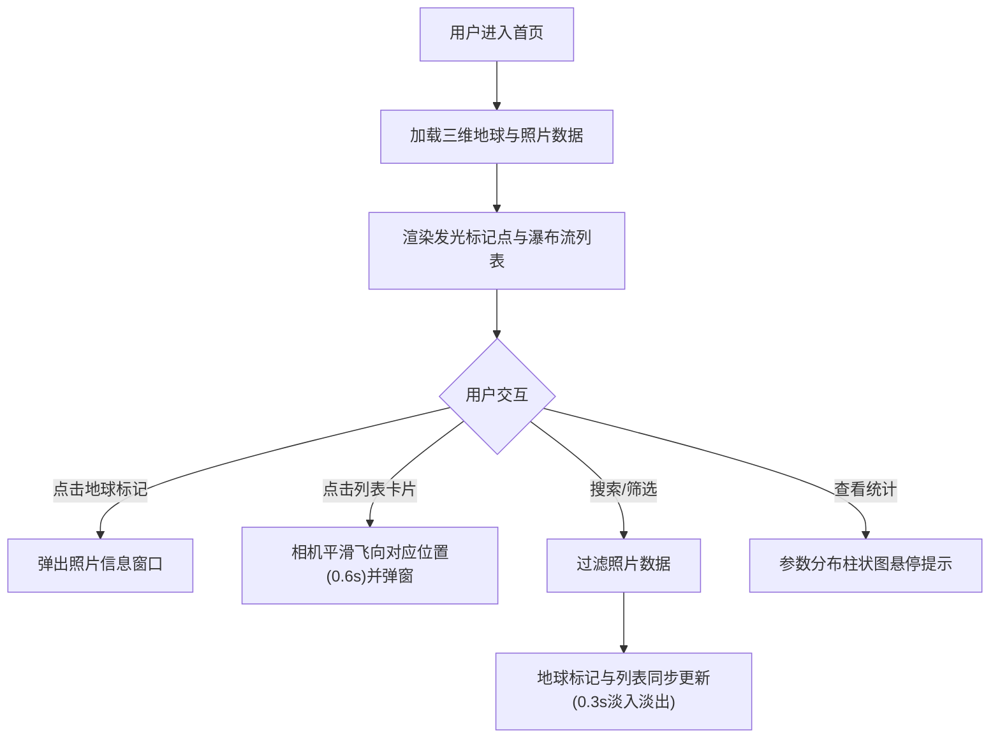

## 1. 产品概述
街头摄影在线影集是一款面向街头摄影师的三维可视化作品展示平台，通过三维地球模型呈现全球拍摄足迹，支持按参数与地点筛选，帮助摄影师管理与展示作品。
- 目标用户：街头摄影师、摄影爱好者、视觉创作者
- 核心价值：以沉浸式三维方式呈现摄影作品的地理分布与拍摄参数信息

## 2. 核心功能

### 2.1 功能模块
1. **首页三维地球场景**：全屏Three.js地球渲染、发光标记点、脉冲动画、信息弹窗
2. **右侧瀑布流照片列表**：可折叠列表、卡片悬浮动效、与地球视角联动
3. **搜索过滤栏**：地点关键词搜索、光圈/快门/ISO参数范围筛选、同步更新
4. **统计面板**：总照片数、覆盖城市数、参数分布柱状图、悬停提示

### 2.2 页面详情
| 页面名称 | 模块名称 | 功能描述 |
|---------|---------|---------|
| 首页 | 三维地球场景 | 球体半径250px、深蓝太空纹理、半透明白色网格线、拖拽旋转、滚轮缩放、#FFD700发光标记点、脉冲动画、点击弹出半透明深色信息窗（#000000CC圆角12px） |
| 首页 | 瀑布流列表 | 列宽240px、卡片#2A2D3A背景、圆角8px、#3E4155边框、悬浮上移3px加深阴影、可折叠、点击联动地球视角 |
| 首页 | 搜索过滤栏 | 地点关键词输入、光圈/快门/ISO范围筛选、0.3秒淡入淡出过渡 |
| 首页 | 统计面板 | 总照片数、覆盖城市数、#4A90D9→#50E3C2渐变柱状图、悬停显示数值 |

## 3. 核心流程

## 4. 用户界面设计
### 4.1 设计风格
- 主色调：#1B1E2F（深色背景）、#60A5FA（亮蓝强调色）
- 文字颜色：#D1D5DB（浅灰）
- 标记颜色：#FFD700（金色发光）
- 按钮/卡片：圆角设计，半透明叠加层
- 字体：现代无衬线字体，突出科技感与摄影艺术感
- 动画：所有交互0.2-0.4秒缓动过渡，镜头飞行0.6秒

### 4.2 页面设计概览
| 页面名称 | 模块名称 | UI元素 |
|---------|---------|---------|
| 首页 | 三维地球 | 居中全屏、深蓝球体纹理、金色发光脉冲标记、拖拽手感流畅 |
| 首页 | 瀑布流列表 | 右侧固定、可折叠按钮、多列自适应、卡片悬浮微交互 |
| 首页 | 搜索过滤栏 | 左上角、输入框+下拉筛选器、收缩展开平滑过渡 |
| 首页 | 统计面板 | 右上角、数字统计+迷你柱状图、渐变填充 |

### 4.3 响应式设计
- 桌面端（≥1200px）：完整布局，右侧列表宽度320-400px
- 平板端（768-1199px）：列表宽度可调整为280px
- 移动端（<768px）：列表改为底部抽屉式、统计面板可折叠
- 3D场景始终自适应容器尺寸

### 4.4 3D场景指引
- 环境：深蓝太空背景，营造宇宙俯瞰感
- 光照：环境光+方向光，突出地球网格线的通透感
- 相机：PerspectiveCamera，初始距离500px，fov 45°
- 交互：OrbitControls拖拽旋转、滚轮缩放、阻尼效果
- 标记点：Sprite + Canvas纹理实现发光+脉冲动画，每帧更新缩放
- 信息窗：HTML Overlay方式，2D层叠加在3D之上
