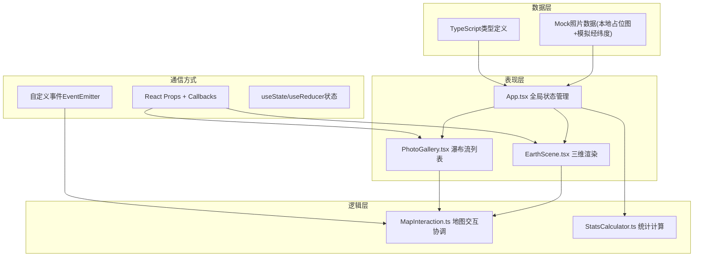

## 1. 架构设计



## 2. 技术说明
- 前端框架：React@18 + TypeScript@5
- 构建工具：Vite@5 + @vitejs/plugin-react
- 三维渲染：three@0.160 + @types/three
- 唯一ID：uuid@9
- 初始数据：内置Mock数据（200-300张模拟照片）
- 样式方案：CSS Modules / 内联样式，CSS变量管理主题色

## 3. 文件结构
```
src/
├── App.tsx              # 主应用，全局过滤状态，窗口自适应
├── EarthScene.tsx       # Three.js地球场景、标记点、脉冲动画、flyTo回调
├── PhotoGallery.tsx     # 瀑布流列表、搜索过滤、卡片点击回调
├── MapInteraction.ts    # 标记-照片映射、弹窗逻辑、flyTo动画协调
├── StatsCalculator.ts   # 统计计算、柱状图数据生成
├── types.ts             # (可选) Photo等类型定义
└── main.tsx             # 入口
```

## 4. 数据模型

### 4.1 Photo 接口定义
```typescript
interface Photo {
  id: string;
  title: string;
  thumbnail: string;      // 本地占位图URL
  location: {
    lat: number;          // 纬度 -90~90
    lng: number;          // 经度 -180~180
    name: string;         // 城市/地点名
    city: string;         // 城市（用于统计覆盖数）
  };
  params: {
    aperture: number;     // 光圈 f值，如 1.4, 2.8, 5.6
    shutter: string;      // 快门 如 "1/125", "1/500"
    iso: number;          // ISO感光度 100~6400
  };
  uploadedAt: string;
}
```

### 4.2 FilterState 接口
```typescript
interface FilterState {
  keyword: string;        // 地点关键词
  apertureRange: [number, number];  // [min, max]
  shutterMin: string;     // 最慢快门
  shutterMax: string;     // 最快快门
  isoRange: [number, number];
}
```

## 5. 性能优化
- Three.js：使用InstancedMesh替代多个Mesh（标记点多时），减少draw call
- 列表：CSS columns实现瀑布流，避免JS布局计算；使用容器高度懒加载
- 动画：rAF节流，相机lerp插值避免逐帧大计算
- 事件：防抖搜索输入（300ms），避免过度重渲染
- 帧率目标：≥55FPS（三维场景），列表300张滚动无卡顿
