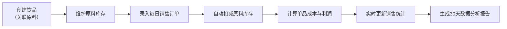

## 1. 产品概述

咖啡馆饮品管理系统是一款专为小型独立咖啡馆店主设计的全栈应用，帮助店主高效管理季节性饮品菜单、追踪原料库存、自动生成每日销售与成本分析报告。解决店主在更换季节菜单时手动调整原料关联、饮品定价与利润核算容易出错，以及无法快速了解每日盈利情况的痛点。

- 核心用户：小型独立咖啡馆店主/经营者
- 核心价值：简化菜单管理流程，实时掌握库存状态，智能分析经营数据，提升运营效率

## 2. 核心功能

### 2.1 用户角色

| 角色 | 注册方式 | 核心权限 |
|------|----------|----------|
| 咖啡馆店主 | 无需注册，本地使用 | 全部功能：饮品管理、库存管理、销售录入、报告查看 |

### 2.2 功能模块

1. **饮品管理页面**：饮品卡片列表展示、新建/编辑饮品、分类标签（季节限定/经典）、原料关联配置
2. **库存管理页面**：原料表格列表、库存预警提醒、补货状态标识、库存扣减自动记录
3. **销售面板页面**：快速录入销售订单、批量录入、实时统计当日销售额与利润、自动计算单品利润率
4. **报告页面**：30天销售趋势折线图、原料消耗排名柱状图、可视化数据分析

### 2.3 页面详情

| 页面名称 | 模块名称 | 功能描述 |
|---------|---------|---------|
| 饮品管理 | 饮品卡片列表 | 卡片宽260px，圆角12px，背景#FDF3E7，显示名称、定价、分类标签、原料列表 |
| 饮品管理 | 新建/编辑模态框 | 录入饮品信息：名称、描述、分类、定价、成本价、关联原料（名称、用量、单位） |
| 库存管理 | 原料表格 | 表头固定，行背景交替，低于预警阈值显示红色竖条标记，补货提醒徽章 |
| 库存管理 | 新建/编辑原料 | 录入原料信息：名称、库存量、单位、采购单价、预警阈值 |
| 销售面板 | 销售录入 | 选择饮品、录入数量、批量添加，支持删除订单条目 |
| 销售面板 | 实时统计 | 顶部显示当日总销售额、总成本、总利润，动态更新 |
| 报告页面 | 销售趋势图 | 30天每日总销售额曲线，填充区域#F4A26120，曲线#B5835A |
| 报告页面 | 原料消耗柱状图 | 按使用量降序排列，柱体渐变#E76F51到#F4A261 |

## 3. 核心流程

## 4. 用户界面设计

### 4.1 设计风格

- **整体风格**：暖色调田园风格，营造温馨舒适的咖啡馆氛围
- **主背景色**：#FFF8F0（奶油白）
- **主色调**：#D4A373（焦糖色）用于侧边栏、#8C7853（深棕色）用于按钮
- **辅助色**：#7C9A73（鼠尾草绿）用于经典标签、#E76F51（珊瑚红）用于预警
- **字体**：主标题使用有衬线字体增强温暖感，正文使用清晰易读的无衬线字体
- **圆角设计**：卡片12px、按钮8px、报告卡片16px，整体圆润柔和
- **按钮样式**：背景#8C7853，白色文字，圆角8px，悬浮#A4936B，点击缩放0.95

### 4.2 页面设计概述

| 页面名称 | 模块名称 | UI元素 |
|---------|---------|--------|
| 饮品管理 | 卡片列表 | 260px宽卡片，#FDF3E7背景，分类标签（季节限定#D4A373/经典#7C9A73），悬浮上升4px加深阴影 |
| 库存管理 | 预警表格 | 固定表头，交替行背景#FAF5EE/FFFFFF，低库存行左侧#E76F51红条，红色圆形补货徽章 |
| 销售面板 | 统计头部 | 醒目的销售额、利润数字展示，动态更新动画 |
| 销售面板 | 录入表单 | 饮品选择下拉框，数量输入框，添加按钮，条目列表 |
| 报告页面 | 双图表卡片 | #FAEDCD背景，圆角16px，内外边距24px，图表并排显示 |

### 4.3 响应式

- **桌面端（>768px）**：两栏布局，左侧饮品/原料管理（约45%），右侧销售/报告（约55%）
- **移动端（≤768px）**：单栏堆叠，所有卡片宽度100%，字体缩小至14px
- **侧边栏**：宽240px，背景#D4A373，文字白色，仅右上角圆角，导航项高48px，悬浮#B5835A左移2px
- **交互优化**：所有按钮和可点击区域最小高度44px，确保移动端触控友好

### 4.4 交互动画

- **模态框**：中心放大弹出0.3s，背景遮罩#00000060，点击遮罩关闭
- **卡片悬浮**：上升4px，阴影加深，过渡0.2s
- **按钮点击**：缩放0.95，过渡0.15s
- **数字更新**：平滑过渡动画，增强数据变化感知
- **性能要求**：交互过程帧率不低于50fps
