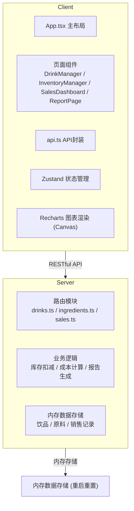
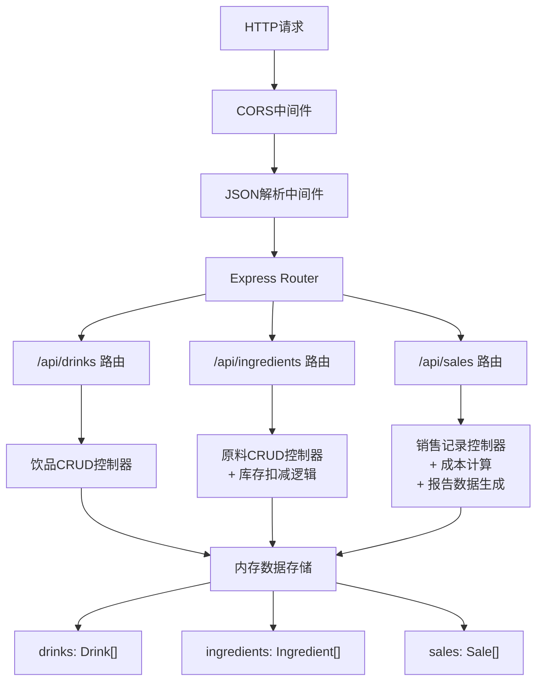
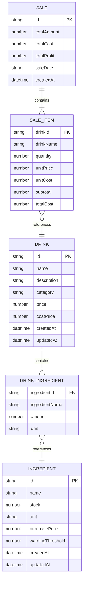

## 1. 架构设计



## 2. 技术描述

- **前端**：React@18 + TypeScript + Vite
- **状态管理**：Zustand（轻量状态管理）
- **图表渲染**：Recharts（使用Canvas渲染，非SVG，高性能）
- **图标库**：lucide-react
- **后端**：Express@4 + TypeScript + ts-node
- **中间件**：CORS、JSON解析
- **数据存储**：后端内存存储（重启后重置，但接口完整）
- **构建工具**：Vite（前端）、ts-node（后端运行时编译）

**项目初始化**：使用 `react-express-ts` 模板，包含React、TypeScript、Express、Vite等基础配置。

## 3. 路由定义

| 路由 (前端) | 页面 | 功能 |
|------------|------|------|
| /drinks | DrinkManager | 饮品管理页面 |
| /inventory | InventoryManager | 库存管理页面 |
| /sales | SalesDashboard | 销售面板页面 |
| /reports | ReportPage | 报告页面 |

| API路由 (后端) | 方法 | 功能 |
|---------------|------|------|
| /api/drinks | GET | 获取所有饮品列表 |
| /api/drinks | POST | 新建饮品 |
| /api/drinks/:id | GET | 获取单个饮品详情 |
| /api/drinks/:id | PUT | 更新饮品信息 |
| /api/drinks/:id | DELETE | 删除饮品 |
| /api/ingredients | GET | 获取所有原料列表 |
| /api/ingredients | POST | 新建原料 |
| /api/ingredients/:id | GET | 获取单个原料详情 |
| /api/ingredients/:id | PUT | 更新原料信息 |
| /api/ingredients/:id | DELETE | 删除原料 |
| /api/ingredients/deduct | POST | 批量扣减原料库存 |
| /api/sales | GET | 获取销售记录列表 |
| /api/sales | POST | 新增销售记录（自动扣减库存、计算成本） |
| /api/sales/today | GET | 获取当日销售统计 |
| /api/sales/report/30days | GET | 获取30天报告数据 |

## 4. API 定义

### 统一响应格式

```typescript
interface ApiResponse<T> {
  success: boolean;
  data?: T;
  error?: string;
}
```

### 数据模型类型定义

```typescript
// 饮品分类
type DrinkCategory = 'seasonal' | 'classic';

// 原料关联项
interface DrinkIngredient {
  ingredientId: string;
  ingredientName: string;
  amount: number;
  unit: string;
}

// 饮品
interface Drink {
  id: string;
  name: string;
  description: string;
  category: DrinkCategory;
  price: number;
  costPrice: number;
  ingredients: DrinkIngredient[];
  createdAt: string;
  updatedAt: string;
}

// 原料
interface Ingredient {
  id: string;
  name: string;
  stock: number;
  unit: string;
  purchasePrice: number;
  warningThreshold: number;
  createdAt: string;
  updatedAt: string;
}

// 销售条目
interface SaleItem {
  drinkId: string;
  drinkName: string;
  quantity: number;
  unitPrice: number;
  unitCost: number;
  subtotal: number;
  totalCost: number;
}

// 销售记录
interface Sale {
  id: string;
  items: SaleItem[];
  totalAmount: number;
  totalCost: number;
  totalProfit: number;
  saleDate: string;
  createdAt: string;
}

// 日销售统计
interface DailySalesData {
  date: string;
  totalSales: number;
  totalCost: number;
  totalProfit: number;
  orderCount: number;
}

// 原料消耗统计
interface IngredientConsumption {
  ingredientId: string;
  ingredientName: string;
  totalUsed: number;
  unit: string;
}

// 报告数据
interface ReportData {
  salesTrend: DailySalesData[];
  ingredientRanking: IngredientConsumption[];
}
```

## 5. 服务器架构图



## 6. 数据模型

### 6.1 数据模型定义



### 6.2 初始化数据

系统启动时自动注入示例数据，便于演示：

```typescript
// 示例原料
const defaultIngredients = [
  { name: '浓缩咖啡', stock: 5000, unit: 'ml', purchasePrice: 0.002, warningThreshold: 500 },
  { name: '牛奶', stock: 20000, unit: 'ml', purchasePrice: 0.001, warningThreshold: 2000 },
  { name: '南瓜泥', stock: 3000, unit: 'g', purchasePrice: 0.008, warningThreshold: 300 },
  { name: '肉桂粉', stock: 500, unit: 'g', purchasePrice: 0.015, warningThreshold: 50 },
  // ...更多原料
];

// 示例饮品
const defaultDrinks = [
  {
    name: '秋日南瓜拿铁',
    description: '融合南瓜泥与肉桂香的季节特调',
    category: 'seasonal',
    price: 38,
    costPrice: 12,
    ingredients: [
      { ingredientName: '浓缩咖啡', amount: 30, unit: 'ml' },
      { ingredientName: '牛奶', amount: 200, unit: 'ml' },
      { ingredientName: '南瓜泥', amount: 30, unit: 'g' },
      { ingredientName: '肉桂粉', amount: 2, unit: 'g' },
    ],
  },
  // ...更多饮品
];
```
