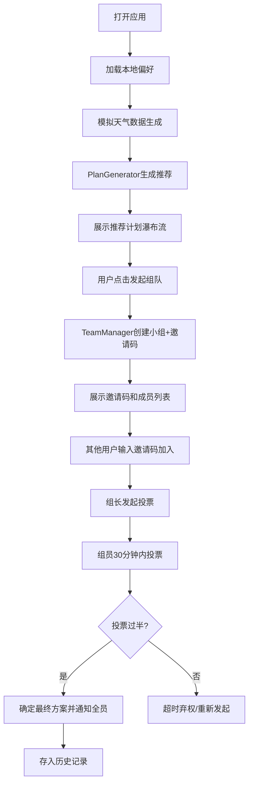

## 1. 产品概述
周末运动计划推荐与团队匹配应用，为办公室职员提供个性化户外运动计划推荐与快速组队功能。综合用户体能水平、天气数据和运动偏好生成动态建议，解决现有工具无法综合多维度数据生成个性化计划的痛点。目标用户为关注健康的办公室职员，核心价值是高效匹配合适的运动项目与志同道合的伙伴。

## 2. 核心功能

### 2.1 用户角色
| 角色 | 注册方式 | 核心权限 |
|------|----------|----------|
| 普通用户 | 匿名/本地存储 | 设置个人偏好、查看推荐计划、发起/加入组队、参与投票、查看历史记录 |
| 小组组长 | 发起组队自动成为 | 管理小组成员、发起投票、确认最终方案 |

### 2.2 功能模块
1. **用户偏好设置**：体能等级选择、运动偏好多选、位置范围设置
2. **天气过滤推荐**：模拟天气数据生成、运动项目智能过滤、综合评分排序
3. **快速组队**：邀请码生成、小组成员管理、头像颜色区分
4. **投票决定**：投票发起、倒计时统计、结果弹窗通知
5. **计划历史**：历史记录列表、详情展开、成员头像拼图

### 2.3 页面详情
| 页面名称 | 模块名称 | 功能描述 |
|-----------|-------------|---------------------|
| 主界面 | 左侧用户面板 | 用户头像展示、体能等级单选、运动偏好多选、位置范围输入、设置自动保存 |
| 主界面 | 中间推荐区域 | 瀑布流布局展示3-5条推荐计划、计划卡片详情（名称/时长/难度/天气匹配度）、发起组队按钮 |
| 主界面 | 右侧小组动态 | 组队邀请码显示、成员头像列表、投票状态、加入小组输入框 |
| 主界面 | 顶部导航栏 | Logo展示、当前用户名、历史记录入口 |
| 弹窗 | 邀请码弹窗 | 6位邀请码展示、复制按钮、关闭功能 |
| 弹窗 | 投票弹窗 | 3个投票选项（时间/路线/取消）、30分钟倒计时、投票结果展示 |
| 侧边栏 | 历史记录 | 倒序列表、成员头像拼图、详情展开 |

## 3. 核心流程

用户打开应用 → 自动加载本地偏好设置 → 模拟生成周末天气数据 → PlanGenerator根据偏好+天气生成推荐计划 → 用户浏览推荐卡片 → 点击"发起组队" → TeamManager生成邀请码并创建小组 → 分享邀请码给其他用户 → 其他用户输入邀请码加入 → 组长发起投票 → 组员在30分钟内投票 → 投票过半确定方案 → 所有组员收到结果通知 → 计划完成后存入历史记录

## 4. 用户界面设计

### 4.1 设计风格
- **主色调**：清爽健康绿色调，主背景#F0FFF0（极淡绿），内容区白色，顶部导航#2E7D32（深绿）
- **强调色**：进度条渐变从#FFEB3B（黄）到#4CAF50（绿），Naive UI primary色按钮
- **预设头像色**：红#FF4757、蓝#1E90FF、绿#2ED573、橙#FFA502、紫#A55EEA
- **卡片样式**：圆角12px，轻微阴影，底部渐变遮罩（透明→#00000040）
- **按钮样式**：Naive UI风格，点击涟漪动画，圆角8px
- **字体**：系统无衬线字体，标题加粗，正文常规，邀请码等宽字体
- **布局风格**：三栏固定布局 + 顶部导航，卡片悬浮上升6px过渡动画
- **图标风格**：Naive UI内置图标，运动相关图标（自行车/徒步/跑步/登山）

### 4.2 页面设计概述
| 页面名称 | 模块名称 | UI元素 |
|-----------|-------------|-------------|
| 主界面 | 左侧面板 | 固定宽度280px，用户头像（60px圆形，2px绿色边框），体能等级单选组，运动偏好多选组，位置范围数字输入框 |
| 主界面 | 中间区域 | 瀑布流布局（min-width:300px, gap:16px），推荐卡片（高200px），天气匹配度进度条，发起组队按钮 |
| 主界面 | 右侧面板 | 固定宽度260px，不滚动，邀请码展示区，成员彩色头像圆圈，投票状态，加入小组输入框 |
| 主界面 | 顶部导航 | 高度56px，深绿背景，白色Logo"WeekendPlan"，右侧用户名 |
| 弹窗 | 邀请码弹窗 | 居中，宽360px，白色背景，圆角16px，等宽字体24px邀请码，灰色背景块，复制按钮 |
| 弹窗 | 投票结果弹窗 | 背景#2D3436，圆角12px，白色文字，Naive UI primary色按钮 |
| 组件 | 骨架屏 | 灰白条纹动画，持续1秒，数据加载时显示 |

### 4.3 响应式
- **桌面优先**：三栏布局（左280px + 中间自适应 + 右260px）
- **平板（<1200px）**：右侧面板可折叠，右侧滑出
- **移动端（<768px）**：左侧和右侧面板折叠为顶部和底部横条，主区域瀑布流改为单列，触摸交互优化

### 4.4 动画与交互
- 页面加载：骨架屏→内容渐入（1秒）
- 卡片悬浮：上升6px，阴影加深（transition 0.3s ease）
- 按钮点击：涟漪动画（Naive UI自带）
- 投票倒计时：数字跳动动画
- 投票结果：弹窗缩放进入动画
- 成员加入：头像弹跳出现动画

## 5. 性能约束
- 推荐计划加载并渲染 ≤ 500ms（本地数据处理）
- 投票状态实时同步延迟 ≤ 200ms
- 页面首次加载包大小 < 300KB
- 内存占用：小组状态存储在客户端内存，定期清理过期数据
