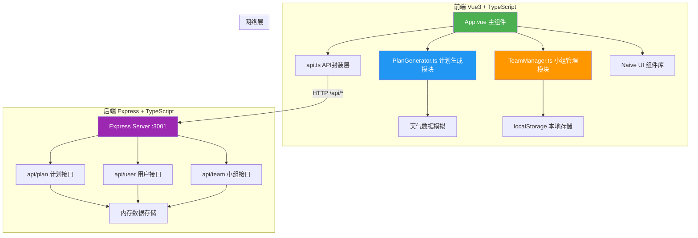
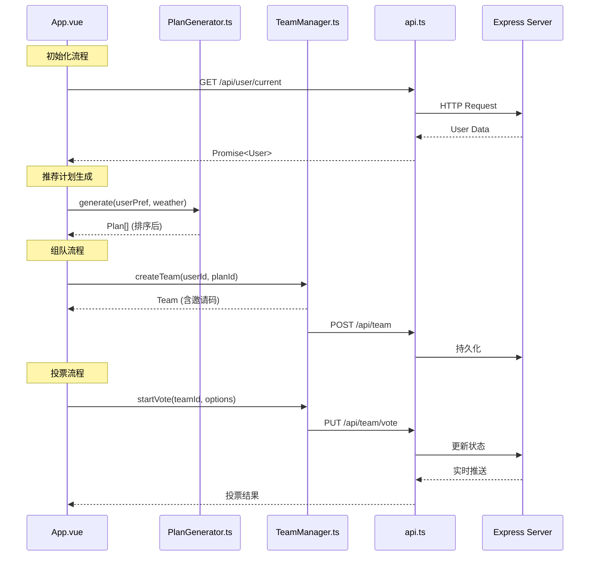
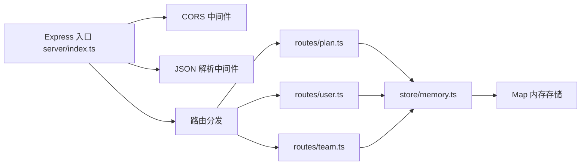

## 1. 架构设计

整体采用前后端分离架构，前端Vue3负责UI交互与业务逻辑编排，后端Express提供数据持久化与RESTful API服务。核心业务逻辑由独立模块PlanGenerator和TeamManager封装，实现关注点分离。



**数据流向说明：**
1. 组件 → api.ts → 后端Express → api.ts → 组件（用户/计划数据）
2. 组件调用PlanGenerator（传入用户偏好+天气）→ 返回推荐列表 → 组件渲染
3. 用户发起组队 → TeamManager处理 → 状态存内存 → api.ts同步到后端

## 2. 技术描述

### 2.1 技术栈选型

| 层级 | 技术 | 版本 | 说明 |
|------|------|------|------|
| 前端框架 | Vue | ^3.4.0 | Composition API + `<script setup>` |
| 类型系统 | TypeScript | ^5.3.0 | strict模式，target ES2020 |
| 构建工具 | Vite | ^5.0.0 | 极速开发体验 |
| UI组件库 | Naive UI | ^2.38.0 | Vue3组件库，支持涟漪动画 |
| 后端框架 | Express | ^4.18.0 | 轻量级RESTful API服务 |
| 跨域中间件 | cors | ^2.8.5 | 处理前后端跨域 |
| ID生成 | uuid | ^9.0.0 | 生成唯一用户ID和小组ID |

### 2.2 项目初始化

使用 `vue-express-ts` 模板初始化项目，包含完整的前后端结构。

```bash
# Windows 环境初始化命令
npm init vite-init@latest -y . "--" --template vue-express-ts --force
```

### 2.3 关键依赖
- **vue**: 核心框架
- **naive-ui**: UI组件库（含Button、Card、Modal、Radio、Checkbox、Input等）
- **@vitejs/plugin-vue**: Vite的Vue3插件
- **express**: 后端Web框架
- **cors**: 跨域资源共享中间件
- **uuid**: 唯一ID生成器

## 3. 文件结构与职责

```
auto256/
├── package.json              # 项目依赖与脚本
├── vite.config.js            # Vite构建配置（代理/api到3001端口）
├── tsconfig.json             # TypeScript配置（strict模式，ES2020）
├── index.html                # 入口HTML
├── src/
│   ├── main.ts               # Vue应用入口
│   ├── App.vue               # 主界面组件（三栏布局核心）
│   ├── api.ts                # API封装模块（fetch调用后端接口）
│   ├── PlanGenerator.ts      # 计划生成逻辑模块
│   ├── TeamManager.ts        # 小组管理模块
│   ├── types/
│   │   └── index.ts          # 全局TypeScript类型定义
│   ├── components/
│   │   ├── PlanCard.vue      # 推荐计划卡片组件
│   │   ├── UserPanel.vue     # 左侧用户偏好面板
│   │   ├── TeamPanel.vue     # 右侧小组动态面板
│   │   ├── InviteModal.vue   # 邀请码弹窗
│   │   ├── VoteModal.vue     # 投票弹窗
│   │   ├── HistoryPanel.vue  # 历史记录侧边栏
│   │   └── SkeletonCard.vue  # 骨架屏组件
│   └── utils/
│       └── weather.ts        # 天气数据模拟工具
└── server/
    ├── index.ts              # Express服务入口
    ├── routes/
    │   ├── plan.ts           # 计划相关API路由
    │   ├── user.ts           # 用户相关API路由
    │   └── team.ts           # 小组相关API路由
    └── store/
        └── memory.ts         # 内存数据存储
```

### 模块调用关系



## 4. 类型定义

```typescript
// 用户相关类型
export interface User {
  id: string;
  name: string;
  avatarColor: string;
  fitnessLevel: 'beginner' | 'intermediate' | 'advanced';
  preferences: SportType[];
  locationRadius: number;
}

// 运动类型
export type SportType = 'cycling' | 'hiking' | 'running' | 'climbing';

// 天气数据
export interface WeatherData {
  date: string;       // 'saturday' | 'sunday'
  timeSlot: string;   // 'morning' | 'afternoon' | 'evening'
  temperature: number; // 15-35°C
  precipitation: number; // 0-100%
  windLevel: number;  // 1-5级
}

// 运动项目
export interface SportItem {
  id: string;
  name: string;
  type: SportType;
  duration: number;   // 分钟
  difficulty: 1 | 2 | 3 | 4 | 5;
  suitableFitness: ('beginner' | 'intermediate' | 'advanced')[];
  weatherConstraints: {
    maxPrecipitation: number;
    minTemperature: number;
    maxTemperature: number;
    maxWindLevel: number;
  };
}

// 推荐计划
export interface RecommendedPlan {
  id: string;
  sport: SportItem;
  weather: WeatherData;
  score: number;      // 综合评分
  weatherMatch: number; // 天气匹配度 0-100
}

// 小组
export interface Team {
  id: string;
  planId: string;
  inviteCode: string; // 6位字母
  leaderId: string;
  members: TeamMember[];
  maxMembers: number;
  status: 'recruiting' | 'voting' | 'confirmed' | 'cancelled';
  vote?: Vote;
  createdAt: number;
}

export interface TeamMember {
  userId: string;
  userName: string;
  avatarColor: string;
  joinedAt: number;
}

// 投票
export interface Vote {
  id: string;
  teamId: string;
  options: VoteOption[];
  startTime: number;
  endTime: number;   // startTime + 30分钟
  votes: { [optionId: string]: string[] }; // optionId -> userIds
  result?: VoteOption;
}

export interface VoteOption {
  id: string;
  type: 'time' | 'route' | 'cancel';
  label: string;
  value: string;
}

// 历史记录
export interface PlanHistory {
  id: string;
  userId: string;
  plan: RecommendedPlan;
  team: Team;
  finalRoute?: string;
  finalTime?: string;
  completedAt: number;
}
```

## 5. API 定义

### 5.1 用户接口

| 方法 | 路径 | 说明 | 请求体 | 响应 |
|------|------|------|--------|------|
| GET | `/api/user/current` | 获取当前用户 | - | `{ user: User }` |
| PUT | `/api/user/preferences` | 更新用户偏好 | `{ fitnessLevel, preferences, locationRadius }` | `{ user: User }` |
| GET | `/api/user/history` | 获取用户历史记录 | - | `{ history: PlanHistory[] }` |

### 5.2 计划接口

| 方法 | 路径 | 说明 | 请求体 | 响应 |
|------|------|------|--------|------|
| GET | `/api/plan/recommendations` | 获取推荐计划 | `?userId=xxx` | `{ plans: RecommendedPlan[], weather: WeatherData[] }` |
| GET | `/api/plan/sports` | 获取所有运动项目 | - | `{ sports: SportItem[] }` |

### 5.3 小组接口

| 方法 | 路径 | 说明 | 请求体 | 响应 |
|------|------|------|--------|------|
| POST | `/api/team` | 创建小组 | `{ userId, planId }` | `{ team: Team }` |
| POST | `/api/team/join` | 加入小组 | `{ userId, inviteCode }` | `{ team: Team }` |
| GET | `/api/team/:id` | 获取小组详情 | - | `{ team: Team }` |
| PUT | `/api/team/:id/vote/start` | 发起投票 | `{ leaderId, options }` | `{ vote: Vote }` |
| PUT | `/api/team/:id/vote` | 提交投票 | `{ userId, optionId }` | `{ vote: Vote }` |
| GET | `/api/team/:id/vote` | 轮询投票状态 | - | `{ vote: Vote }` |

## 6. 核心模块说明

### 6.1 PlanGenerator.ts 核心算法

```typescript
class PlanGenerator {
  // 过滤不适合天气的运动
  filterByWeather(sport: SportItem, weather: WeatherData): boolean
  
  // 过滤不适合体能的运动
  filterByFitness(sport: SportItem, fitnessLevel: string): boolean
  
  // 过滤不符合偏好的运动
  filterByPreference(sport: SportItem, preferences: SportType[]): boolean
  
  // 计算综合评分（天气匹配度+体能匹配+偏好匹配）
  calculateScore(sport: SportItem, weather: WeatherData, user: User): number
  
  // 计算天气匹配度百分比
  calculateWeatherMatch(sport: SportItem, weather: WeatherData): number
  
  // 主入口：生成推荐列表
  generate(user: User, weatherList: WeatherData[]): RecommendedPlan[]
}
```

### 6.2 TeamManager.ts 核心逻辑

```typescript
class TeamManager {
  private teams: Map<string, Team> = new Map()
  
  // 生成6位字母邀请码
  generateInviteCode(): string
  
  // 创建小组
  createTeam(userId: string, planId: string): Team
  
  // 加入小组（检查人数≤5）
  joinTeam(userId: string, inviteCode: string): Team | null
  
  // 获取小组成员列表
  getMembers(teamId: string): TeamMember[]
  
  // 发起投票（仅组长）
  startVote(teamId: string, leaderId: string, options: VoteOption[]): Vote
  
  // 提交投票
  submitVote(teamId: string, userId: string, optionId: string): Vote
  
  // 检查投票结果（过半即确定）
  checkVoteResult(vote: Vote): VoteOption | null
  
  // 同步到后端
  syncToServer(teamId: string): Promise<void>
}
```

## 7. 后端服务架构



### 7.1 服务启动配置
- 端口：3001
- CORS：允许所有来源（开发环境）
- 数据存储：内存Map（模拟数据库）
- 实时更新：前端轮询 `/api/team/:id/vote` 实现200ms延迟同步

## 8. Vite 代理配置

```javascript
// vite.config.js
export default {
  plugins: [vue()],
  server: {
    proxy: {
      '/api': {
        target: 'http://localhost:3001',
        changeOrigin: true
      }
    }
  }
}
```

## 9. 性能优化策略

1. **本地计算优先**：PlanGenerator在前端执行，避免网络延迟，保证≤500ms渲染
2. **内存状态管理**：TeamManager状态存客户端内存，减少后端请求
3. **按需加载**：非核心组件使用Vue异步组件
4. **轮询优化**：投票状态使用200ms间隔短轮询，非活跃时暂停
5. **Tree Shaking**：仅导入Naive UI使用的组件，减小包体积
6. **骨架屏**：数据加载时显示骨架屏，提升感知性能

## 10. 构建脚本

```json
{
  "scripts": {
    "dev": "concurrently \"npm run server\" \"npm run client\"",
    "client": "vite",
    "server": "ts-node server/index.ts",
    "build": "vue-tsc --noEmit && vite build",
    "check": "vue-tsc --noEmit"
  }
}
```
