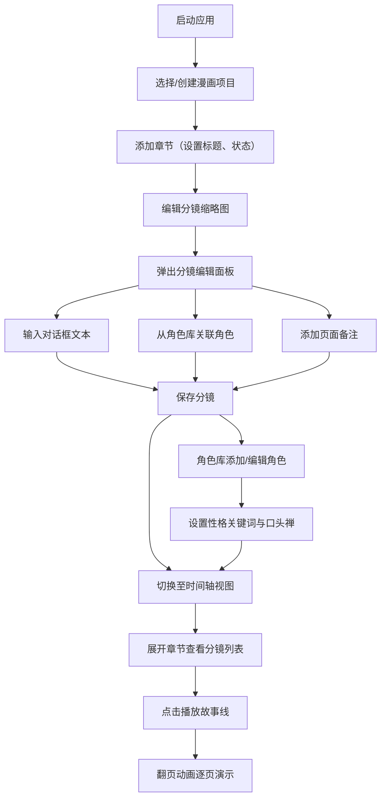

## 1. 产品概述

漫画叙事故事板与角色管理应用是一款面向独立漫画创作者的专业创作辅助工具，解决传统零散文件夹和笔记软件管理漫画素材效率低下的痛点。

- 核心目标：提供项目、章节、分镜、角色一体化管理，支持故事线时间轴预览与翻页动画演示
- 目标用户：独立漫画创作者、漫画工作室、故事板艺术家
- 产品价值：提升漫画创作的叙事连贯性与素材管理效率

## 2. 核心功能

### 2.1 用户角色

| 角色 | 注册方式 | 核心权限 |
|------|----------|----------|
| 创作者 | 无需注册（本地应用） | 全部功能使用权限 |

### 2.2 功能模块

1. **章节管理视图**：项目创建、章节增删改查、分镜网格展示与编辑
2. **角色库视图**：角色画廊、角色详情编辑、性格标签与口头禅管理
3. **时间轴视图**：章节折叠卡片、分镜水平滚动预览、故事线播放与翻页动画

### 2.3 页面详情

| 页面名称 | 模块名称 | 功能描述 |
|----------|----------|----------|
| 章节管理视图 | 项目切换顶栏 | 下拉切换不同漫画项目 |
| 章节管理视图 | 左侧章节卡片列表 | 展示章节卡片（含状态色标），点击选择章节 |
| 章节管理视图 | 分镜缩略图网格 | 6x6网格展示分镜，点击弹出编辑面板 |
| 章节管理视图 | 分镜编辑面板 | 设置对话框文本、关联角色、添加页面备注 |
| 角色库视图 | 角色画廊网格 | 圆形头像色块+名称的角色卡片展示 |
| 角色库视图 | 角色详情编辑 | 性格关键词标签输入、口头禅编辑、颜色选择器 |
| 时间轴视图 | 章节折叠卡片 | 按创建顺序垂直排列，展开显示分镜缩略图 |
| 时间轴视图 | 故事线播放器 | 逐页翻页动画展示，对话框淡入效果 |

## 3. 核心流程

主用户流程：创建项目 → 添加章节 → 编辑分镜内容（关联角色、添加对话）→ 在时间轴预览故事线 → 使用翻页动画演示

## 4. 用户界面设计

### 4.1 设计风格

- **主色调**：暖棕色系（深棕#5C4B3A / #4A3728，米色#F2EFEA / #F5F0EB）
- **按钮样式**：圆角8px，深棕实心填充（#5C4B3A背景 + #FFFFFF文字）
- **字体**：系统优雅无衬线字体，标题18-22px粗体，正文14px常规
- **布局风格**：左侧280px导航栏 + 右侧主内容区的双栏布局，顶部固定56px顶栏
- **卡片交互**：悬停上升4px + 阴影#0000000D
- **图标风格**：简洁线性图标（lucide-react）

### 4.2 页面设计概述

| 页面名称 | 模块名称 | UI元素 |
|----------|----------|----------|
| 章节管理视图 | 章节卡片 | 240px宽、圆角10px、背景#F5F0EB、状态色标 |
| 章节管理视图 | 分镜缩略图 | 80x80px、淡灰#EAE5DE、虚线边框、角色色块+对话角标 |
| 章节管理视图 | 编辑面板 | 500px宽、圆角12px、阴影#0000001A、textarea+下拉选择 |
| 角色库视图 | 角色卡片 | 200px宽、圆形头像50px直径、颜色选择器 |
| 角色库视图 | 标签输入 | 最多5个标签、标签删除、回车键新增 |
| 时间轴视图 | 折叠卡片 | 700px宽、背景#F8F5F0、分镜水平滚动100x100px+12px间距 |
| 时间轴视图 | 翻页动画 | CSS 3D翻转0.3s ease-in-out、对话框淡入0.2s |

### 4.3 响应式

- 桌面优先设计（≥768px）：完整双栏布局
- 移动端适配（<768px）：左侧导航折叠为汉堡菜单，卡片改为单列布局
- 触控优化：增大点击热区，支持滑动翻页

### 4.4 性能指标

- 应用初始化加载时间：≤2秒
- 分镜翻页动画帧率：≥30fps
- 50个角色列表渲染时间：≤300ms
