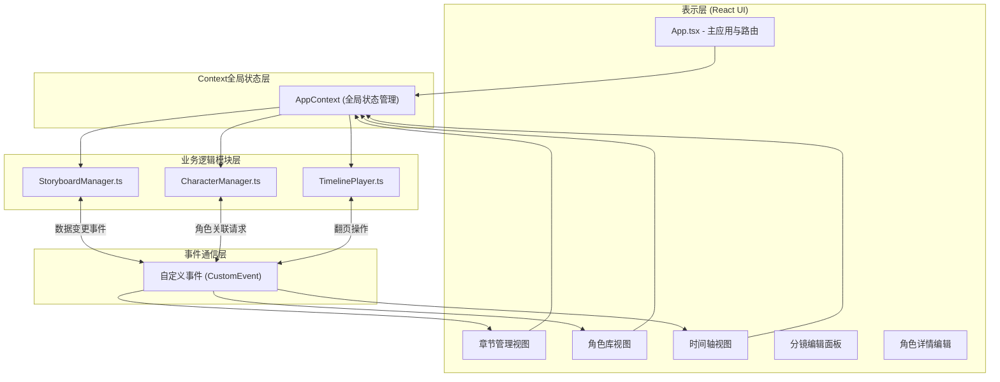
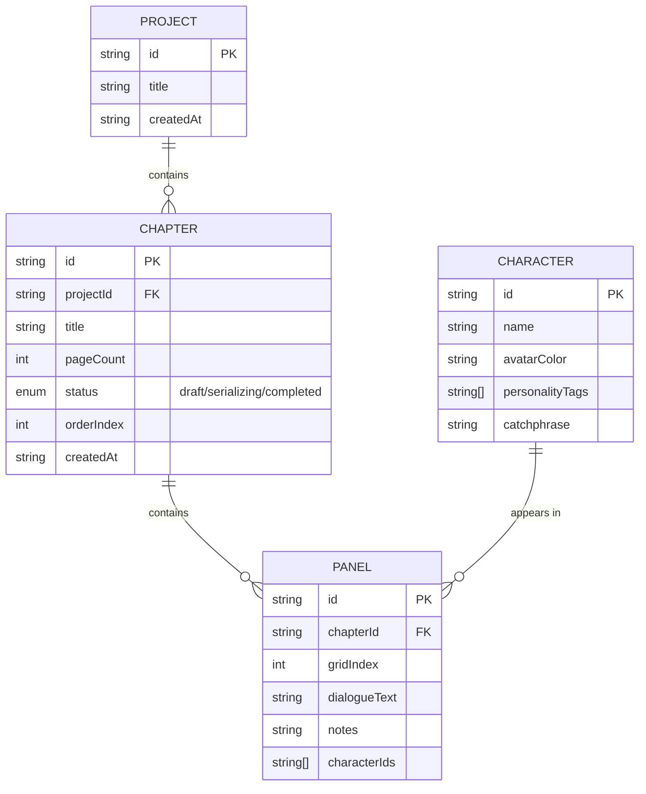

## 1. 架构设计



## 2. 技术描述

- **前端框架**：React@18 + TypeScript@5
- **构建工具**：Vite@5 + @vitejs/plugin-react
- **状态管理**：React Context API + 自定义事件（CustomEvent）
- **唯一ID生成**：uuid
- **样式方案**：纯CSS（styles.css全局样式 + CSS变量）
- **图标库**：lucide-react
- **后端**：无（纯前端单页应用，数据存储于内存/localStorage）

## 3. 模块定义（非路由式视图切换）

应用采用单页应用架构，通过App.tsx内部状态进行视图切换，不使用react-router：

| 视图标识 | 视图名称 | 模块职责 |
|----------|----------|----------|
| chapters | 章节管理视图 | 管理项目章节、分镜网格展示与编辑 |
| characters | 角色库视图 | 角色画廊展示、角色详情与编辑 |
| timeline | 时间轴视图 | 章节时间轴、故事线播放与翻页动画 |

## 4. 核心模块数据流定义

### 4.1 StoryboardManager 数据流

```
接收UI组件事件
    ↓
调用内部CRUD方法（addProject/removeChapter/updatePanel等）
    ↓
更新内部状态（Map数据结构存储项目、章节、分镜）
    ↓
派发自定义事件 'storyboard:changed'
    ↓
UI组件监听事件并刷新视图
```

### 4.2 CharacterManager 数据流

```
接收StoryboardManager的角色关联请求
    ↓
查询角色数据库返回角色数据
    ↓
监听'storyboard:changed'事件校验关联有效性
    ↓
自身数据变更时派发 'character:changed' 事件
```

### 4.3 TimelinePlayer 数据流

```
从StoryboardManager获取有序章节列表
    ↓
按创建顺序渲染折叠卡片
    ↓
响应用户展开/翻页操作
    ↓
使用CSS 3D transform执行翻页动画
    ↓
更新当前播放分镜索引并触发对话淡入
```

## 5. 数据模型

### 5.1 数据模型定义



### 5.2 类型定义（TypeScript）

```typescript
type ChapterStatus = 'draft' | 'serializing' | 'completed';

interface Project {
  id: string;
  title: string;
  createdAt: string;
}

interface Chapter {
  id: string;
  projectId: string;
  title: string;
  pageCount: number;
  status: ChapterStatus;
  orderIndex: number;
  createdAt: string;
}

interface Panel {
  id: string;
  chapterId: string;
  gridIndex: number;
  dialogueText: string;
  notes: string;
  characterIds: string[];
}

interface Character {
  id: string;
  name: string;
  avatarColor: string;
  personalityTags: string[];
  catchphrase: string;
}
```

### 5.3 初始数据（Mock Data）

应用初始化时内置示例数据，确保首次启动即有可交互内容：
- 1个示例漫画项目
- 3个示例章节（不同状态各1个）
- 6个示例分镜
- 4个示例角色（含不同性格标签与颜色）

## 6. 文件结构清单

```
package.json           依赖配置与启动脚本
vite.config.js         Vite构建配置
tsconfig.json          TypeScript严格模式配置
index.html             入口HTML
src/
├── App.tsx            主应用组件、Context、视图路由
├── styles.css         全局样式与动画定义
├── StoryboardManager.ts  项目/章节/分镜CRUD管理
├── CharacterManager.ts   角色库管理
└── TimelinePlayer.ts     时间轴渲染与翻页动画
```
