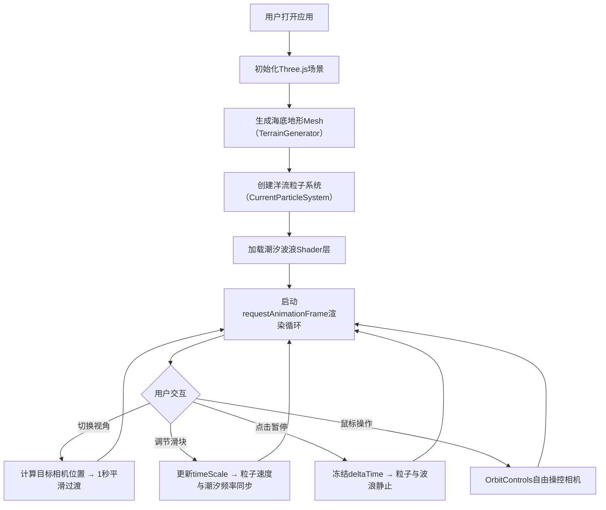

## 1. 产品概述

交互式三维海底地形与洋流动态可视化应用，通过Three.js实现沉浸式海洋探索体验。用户可从多视角探索海底地貌（海山、海沟、大陆坡），观察动态洋流粒子模拟，并调节时间流速观察潮汐演变。

- 目标用户：海洋科研人员、教育工作者、海洋爱好者
- 产品价值：直观展示海底地形与洋流运动规律，提供交互式教学与研究工具

## 2. 核心功能

### 2.1 功能模块

1. **三维海底地形渲染**：Perlin噪声生成高度图，多色渐变海拔着色
2. **洋流粒子动态模拟**：5000+粒子沿地形表面运动，速度影响颜色渐变
3. **时间流速与潮汐系统**：滑块控制时间流速（0.1x-10x），正弦波模拟潮汐海面
4. **多视角探索控制**：俯视、侧视、自由视角切换，平滑镜头过渡动画
5. **交互控制面板**：悬浮UI，视角切换、时间滑块、暂停/继续按钮

### 2.2 页面详情

| 页面名称 | 模块名称 | 功能描述 |
|-----------|-------------|---------------------|
| 主场景 | 海底地形Mesh | Perlin噪声生成128x128分段网格，海拔颜色渐变着色 |
| 主场景 | 洋流粒子系统 | 5000个粒子沿地形表面运动，速度颜色映射 |
| 主场景 | 潮汐波浪层 | Shader实现半透明正弦波，随时间流速变化 |
| 控制面板 | 视角切换 | 下拉菜单切换俯视/侧视/自由视角，1秒平滑过渡 |
| 控制面板 | 时间流速滑块 | 0.1x-10x范围，步长0.1，实时控制粒子速度与潮汐频率 |
| 控制面板 | 暂停/继续 | 冻结/恢复粒子动画与波浪运动 |

## 3. 核心流程

用户进入应用 → 加载海底地形与洋流粒子系统 → 默认自由视角 → 用户可：
- 切换预设视角（俯视/侧视）→ 镜头平滑过渡
- 拖拽鼠标自由旋转/缩放/平移场景
- 调节时间流速滑块 → 粒子速度与潮汐频率同步变化
- 点击暂停 → 所有动态效果冻结

## 4. 用户界面设计

### 4.1 设计风格
- 主色调：深蓝黑#0A0B1A背景，亮蓝#00BFFF作为主强调色
- 辅助色：深蓝#0B3D6B、中蓝#1E90FF、青绿#3CB371、沙黄#F5DEB3（地形渐变色）
- 粒子色阶：#1E90FF（慢速）→ #00BFFF（中速）→ #00FFFF（快速）
- 字体：标签使用monospace等宽字体，14px
- 按钮样式：圆角4px，深色背景#1A1B35，边框1px半透明白色
- 布局：全屏沉浸式3D场景，左上角悬浮控制面板

### 4.2 页面设计概览

| 页面名称 | 模块名称 | UI元素 |
|-----------|-------------|-------------|
| 主场景 | 3D视口 | 全屏渲染，深蓝黑背景，海底地形+粒子+波浪层 |
| 控制面板 | 容器 | 220px宽，#00000080半透明背景，圆角8px，内边距16px，左上角固定 |
| 控制面板 | 视角下拉 | #1A1B35背景，1px #00BFFF40边框，选项悬浮#00BFFF20高亮 |
| 控制面板 | 时间滑块 | 200px宽，轨道4px高#FFFFFF20，圆形手柄16px#00BFFF，悬浮亮度+20% |
| 控制面板 | 暂停按钮 | 45x30px，#1A1B35背景，暂停后文字变"继续"，背景#00BFFF20 |

### 4.3 响应性
- Desktop-first设计，全屏场景自适应窗口尺寸
- 控制面板固定左上角，不随窗口缩放改变布局
- 触控设备支持：单指旋转、双指缩放

### 4.4 3D场景指引
- 环境：深海氛围，深蓝色雾效，方向光模拟海面透射光
- 光照：AmbientLight(0x404060, 0.5) + DirectionalLight(0x88CCFF, 0.8) 从斜上方照射
- 相机：PerspectiveCamera(fov=60, near=0.1, far=1000)，初始自由视角
- 动画：相机切换使用lerp插值1秒过渡，粒子每帧更新位置与颜色
- 性能：使用BufferGeometry + Points批量渲染，目标帧率≥45fps
