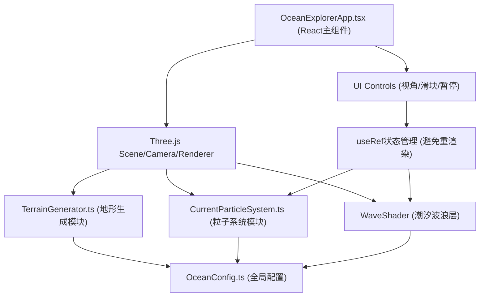

## 1. 架构设计



## 2. 技术描述

- 前端框架：React 18 + TypeScript
- 构建工具：Vite 5
- 3D渲染：Three.js r160+
- 状态管理：React useRef（场景相关状态），不引入额外状态库
- 样式方案：纯CSS + 内联样式，无CSS框架依赖

## 3. 文件结构定义

```
project-root/
├── package.json
├── vite.config.js
├── tsconfig.json
├── index.html
└── src/
    ├── main.tsx (入口)
    ├── OceanConfig.ts (配置常量)
    ├── TerrainGenerator.ts (地形生成)
    ├── CurrentParticleSystem.ts (粒子系统)
    └── OceanExplorerApp.tsx (主组件)
```

## 4. 模块职责与接口定义

### 4.1 OceanConfig.ts
```typescript
export const OceanConfig = {
  GRID_SIZE: 200,           // 地形网格尺寸（单位）
  SEGMENTS: 128,            // 分段数 NxN
  NOISE_SEED: 42,           // Perlin噪声种子
  PARTICLE_COUNT: 5000,     // 粒子数量
  PARTICLE_SIZE: 3,         // 粒子大小（px）
  TIME_SCALE_MIN: 0.1,      // 最小时间流速
  TIME_SCALE_MAX: 10,       // 最大时间流速
  TIME_SCALE_DEFAULT: 1.0,  // 默认时间流速
  CAMERA_ANIM_DURATION: 1.0 // 相机过渡动画时长（秒）
} as const;

export type ViewMode = 'top' | 'side' | 'free';
```

### 4.2 TerrainGenerator.ts
```typescript
export class TerrainGenerator {
  constructor(config: { size: number; segments: number; seed: number });
  generate(): THREE.Mesh;  // 返回带顶点颜色的地形Mesh
  getHeightAt(x: number, z: number): number;  // 查询指定坐标海拔
  getSlopeAt(x: number, z: number): number;   // 查询指定坐标坡度
}
```

核心逻辑：
- PlaneBufferGeometry(NxN分段)沿Y轴置换
- 多层Perlin噪声叠加：基础地形+海沟凹陷+海山凸起
- 顶点颜色按海拔区间渐变映射
- computeVertexNormals()实现平滑着色

### 4.3 CurrentParticleSystem.ts
```typescript
export class CurrentParticleSystem {
  constructor(terrain: THREE.Mesh, config: { count: number; size: number });
  getPoints(): THREE.Points;  // 返回粒子系统对象
  update(deltaTime: number, timeScale: number): void;  // 每帧更新粒子位置/颜色
}
```

核心逻辑：
- BufferGeometry存储5000粒子位置与颜色
- 初始位置：随机分布在地形表面（采样getHeightAt）
- 运动方向：经线方向为主叠加随机扰动，坡度影响速度（上坡减速、下坡加速）
- 速度范围1-5单位/秒，颜色三档映射
- 超出边界后从对侧重新进入（环绕效果）

### 4.4 OceanExplorerApp.tsx
```typescript
export default function OceanExplorerApp(): JSX.Element
```

核心职责：
- 初始化THREE.Scene、PerspectiveCamera、WebGLRenderer
- 加载TerrainGenerator地形、CurrentParticleSystem粒子、波浪Shader Mesh
- requestAnimationFrame驱动的渲染循环
- OrbitControls实现自由视角操控
- 相机视角切换lerp插值动画
- UI控件事件绑定：useRef存储状态避免React重渲染
- 窗口resize自适应

### 4.5 波浪Shader层
- ShaderMaterial：vertexShader正弦波位移，fragmentShader半透明蓝色
- uniform：uTime、uAmplitude、uFrequency，随timeScale动态调整
- 位于地形上方少量单位，透明混合模式

## 5. 性能优化策略

1. **几何批处理**：地形使用单个BufferGeometry，粒子使用Points而非多个Mesh
2. **状态管理**：场景对象用useRef引用，UI控件值变更不触发React重渲染
3. **渲染优化**：WebGLRenderer开启antialias=false、powerPreference='high-performance'
4. **动画优化**：粒子更新在单个循环内批量修改BufferAttribute数组，统一needsUpdate=true
5. **内存管理**：组件卸载时dispose所有Geometry、Material、Renderer

## 6. UI样式实现要点

所有控件使用纯CSS实现，样式写在组件内：
- 控制面板：position:fixed; top:16px; left:16px; width:220px; padding:16px; background:#00000080; border-radius:8px; backdrop-filter: blur(4px)
- 控件垂直排列：display:flex; flex-direction:column; gap:12px
- 标签：font-family:monospace; font-size:14px; color:#CCCCCC
- 滑块自定义：appearance:none; width:200px; height:4px; background:#FFFFFF20; border-radius:2px
- 滑块手柄：::-webkit-slider-thumb { appearance:none; width:16px; height:16px; border-radius:50%; background:#00BFFF; cursor:pointer; transition: filter 0.2s; } :hover { filter: brightness(1.2); }
- 下拉/按钮：统一深色背景#1A1B35，悬停高亮过渡
