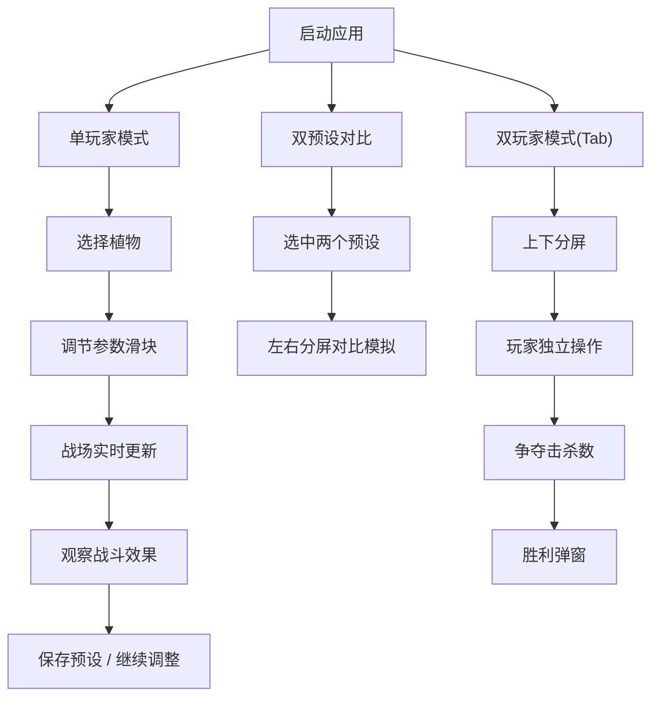

## 1. 产品概述

植物生长曲线模拟器是一款面向独立游戏开发者的关卡机制测试工具，用于快速构建、调整和对比策略塔防游戏中植物类防御单位的生长曲线参数。通过可视化沙盒和实时战斗模拟，开发者无需修改代码和重新编译即可完成平衡性调优，大幅提升迭代效率。

### 核心价值
- 解决传统硬编码方式导致的平衡性调整迭代效率低下问题
- 提供实时参数编辑与可视化反馈的闭环工作流
- 支持多预设方案对比，加速数值调优决策

---

## 2. 核心功能

### 2.1 功能模块

1. **植物属性实时编辑沙盒**：选择植物种类，通过滑块调整生长曲线参数，实时预览属性变化
2. **实时战斗力模拟**：2D网格战场模拟敌人沿路径移动、植物自动攻击、击杀奖励等完整战斗流程
3. **多曲线预设与对比**：保存/加载预设方案，支持双预设并排对比模拟
4. **数据导出与日志**：导出所有预设为JSON格式，记录参数调整历史日志
5. **双玩家协作模式**：同屏双人对战模式，各自独立放置植物和调整参数

### 2.2 页面详情

| 页面名称 | 模块名称 | 功能描述 |
|-----------|-------------|---------------------|
| 主应用页 | 左侧参数控制面板 | 植物选择器、参数滑块分组调节、实时数值显示 |
| 主应用页 | 中央战场画布 | 12×8网格、植物/敌人/弹丸渲染、游戏时间显示、得分统计 |
| 主应用页 | 右侧预设与日志面板 | 预设保存/加载/对比、JSON导出、参数调整历史日志 |
| 主应用页 | 双玩家模式 | Tab键切换上下分屏、双人独立控制、击杀数争夺、胜利弹窗 |

---

## 3. 核心流程

### 3.1 单玩家参数调优流程
开发者选择植物 → 调节滑块参数 → 战场实时生成示例植物 → 敌人刷新并沿路径移动 → 植物自动攻击 → 观察伤害/射程/攻击频率 → 调整参数直至满意 → 保存为预设方案

### 3.2 双预设对比流程
保存两个预设方案 → 选中两个预设进行对比 → 战场水平分割为左右半区 → 两侧同时刷新敌人 → 独立运行模拟 → 直观对比战斗力差异

### 3.3 双玩家对战流程
按Tab切换双玩家模式 → 战场垂直分割为上下半区 → 玩家1用WASD+空格、玩家2用方向键+回车选择并放置植物 → 敌人从中间同时向两侧移动 → 争夺击杀数 → 游戏结束弹出胜利公告



---

## 4. 用户界面设计

### 4.1 设计风格
- **整体风格**：暗色赛博朋克风格
- **主背景**：#0B1121
- **面板背景**：#111827
- **字体**：Inter 无衬线字体
- **标题**：16px 加粗 #F9FAFB
- **正文**：12px #D1D5DB

### 4.2 色彩系统
| 用途 | 颜色 |
|------|------|
| 攻击型植物指示器 | #EF4444 |
| 防御型植物指示器 | #3B82F6 |
| 支援型植物指示器 | #10B981 |
| 滑块轨道 | #4B5563 |
| 滑块按钮 | #10B981 |
| 战场背景 | #1A3A1A |
| 网格线 | #2D552D |
| 敌人单位 | #EF4444 红色方块 |
| 攻击弹丸 | #22C55E |
| 玩家1得分 | #3B82F6 |
| 玩家2得分 | #EF4444 |
| 导出按钮 | #2563EB / hover #1D4ED8 |

### 4.3 布局结构
```
┌─────────────────────────────────────────────────────────────────────┐
│  ┌──────────┐  ┌──────────────────────────┐  ┌───────────────────┐  │
│  │ 左侧面板  │  │      中央战场区域        │  │   右侧面板        │  │
│  │ 320px    │  │     自适应(最小800px)     │  │   280px           │  │
│  │          │  │                          │  │                   │  │
│  │ 植物选择  │  │   12×8 网格战场          │  │  预设管理区       │  │
│  │ 参数滑块  │  │   植物/敌人/弹丸渲染      │  │  预设卡片列表     │  │
│  │          │  │   游戏时间(左上)          │  │  对比功能         │  │
│  │          │  │                          │  │  导出按钮         │  │
│  │          │  │                          │  ├───────────────────┤  │
│  │          │  │                          │  │  日志区域         │  │
│  │          │  │                          │  │  滚动历史记录     │  │
│  └──────────┘  └──────────────────────────┘  └───────────────────┘  │
└─────────────────────────────────────────────────────────────────────┘
```

### 4.4 交互细节
- 所有交互元素hover时0.2秒亮度提升或边框颜色变化过渡
- 点击时0.1秒缩放压下效果（scale从1到0.98）
- 滑块宽200px，数值实时显示在右侧
- 属性面板：圆形气泡160px宽，圆角8px，#111827半透明80%，边框1px #374151
- 预设卡片：宽200px，圆角8px，#1F2937，边框1px #374151
- 日志区域：垂直滚动，宽220px，最大高度300px，monospace字体12px #D1D5DB

### 4.5 性能要求
- 整体60FPS流畅度
- 战场模拟帧率≥30FPS
- 参数调整属性更新延迟≤100ms

### 4.6 响应式
桌面端优先设计，中央战场最小宽度800px，确保操作区域完整可用。
