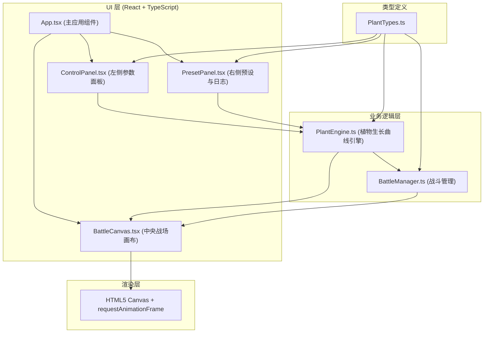

## 1. 架构设计



## 2. 技术描述

- **前端框架**：React 18 + TypeScript
- **构建工具**：Vite 5
- **渲染技术**：HTML5 Canvas (战场渲染) + React DOM (UI面板)
- **状态管理**：React useState/useRef + 事件驱动的引擎间通信
- **字体**：Inter (通过Google Fonts引入)
- **样式方案**：原生CSS + CSS变量

## 3. 项目结构

```
d:\Pro\tasks\auto263/
├── package.json
├── index.html
├── tsconfig.json
├── vite.config.js
└── src/
    ├── main.tsx
    ├── App.tsx
    └── modules/
        ├── PlantSimulator/
        │   ├── PlantTypes.ts
        │   ├── PlantEngine.ts
        │   └── BattleManager.ts
        └── UIManager/
            ├── ControlPanel.tsx
            ├── PresetPanel.tsx
            └── BattleCanvas.tsx
```

## 4. 核心数据模型

### 4.1 PlantTypes.ts 类型定义

```typescript
// 植物类别
enum PlantCategory {
  ATTACK = 'attack',      // 攻击型
  DEFENSE = 'defense',    // 防御型
  SUPPORT = 'support',    // 支援型
}

// 植物种类
enum PlantType {
  PEA_SHOOTER = 'pea_shooter',       // 豌豆射手
  CHERRY_BOMB = 'cherry_bomb',       // 樱桃炸弹
  ICE_SHOOTER = 'ice_shooter',       // 寒冰射手
  SUNFLOWER = 'sunflower',           // 向日葵
}

// 生长曲线参数
interface GrowthParams {
  initialAttack: number;     // 初始攻击力
  attackGrowth: number;      // 攻击力增速
  initialRange: number;      // 初始射程(格子数)
  rangeGrowth: number;       // 射程增速
  growthDuration: number;    // 生长耗时(秒)
}

// 植物实例
interface PlantInstance {
  id: string;
  type: PlantType;
  category: PlantCategory;
  gridX: number;
  gridY: number;
  params: GrowthParams;
  currentAttack: number;
  currentRange: number;
  growthProgress: number;    // 0-1
  lastAttackTime: number;
  attackCooldown: number;    // 毫秒
}

// 预设方案
interface Preset {
  id: string;
  name: string;
  createdAt: number;
  plantConfigs: Record<PlantType, GrowthParams>;
}

// 敌人
interface Enemy {
  id: string;
  x: number;
  y: number;
  hp: number;
  maxHp: number;
  speed: number;            // px/s
  pathIndex: number;
  pathPointIndex: number;
}

// 弹丸
interface Projectile {
  id: string;
  x: number;
  y: number;
  targetId: string;
  damage: number;
  speed: number;
  color: string;
}

// 浮动文字
interface FloatingText {
  id: string;
  x: number;
  y: number;
  text: string;
  color: string;
  createdAt: number;
  duration: number;
}

// 游戏模式
enum GameMode {
  SINGLE = 'single',
  COMPARE = 'compare',
  DUEL = 'duel',
}

// 全局游戏状态
interface GameState {
  mode: GameMode;
  gameTime: number;          // 秒
  isRunning: boolean;
  plants: PlantInstance[];
  enemies: Enemy[];
  projectiles: Projectile[];
  floatingTexts: FloatingText[];
  presets: Preset[];
  logs: LogEntry[];
  selectedPlantType: PlantType;
  comparePresetIds: string[];
  duelScores: { player1: number; player2: number };
  currentPlantConfigs: Record<PlantType, GrowthParams>;
}

// 日志条目
interface LogEntry {
  timestamp: string;
  message: string;
}

// 双玩家模式下的玩家选择状态
interface PlayerSelection {
  selectedPlantType: PlantType;
  selectedGridX: number;
  selectedGridY: number;
}
```

## 5. 核心模块职责

### 5.1 PlantEngine.ts
- 计算植物生长曲线：根据时间进度实时推导当前攻击力和射程
- 属性线性增长公式：`current = initial + growthRate * min(progress, 1)`
- 生长进度计算：`progress = elapsedTime / growthDuration`
- 管理植物实例创建、属性更新
- 事件输出：植物属性变更事件、战场状态变更事件
- 预设方案的序列化与反序列化

### 5.2 BattleManager.ts
- 敌人波次管理：按时间间隔刷新敌人
- 路径规划：预定义敌人移动路径点
- 碰撞检测：植物射程范围内的敌人检测
- 击杀判定：HP归零时触发击杀事件、金币浮动文字
- 弹丸管理：创建、移动、命中检测

### 5.3 ControlPanel.tsx
- 植物种类选择器
- 参数滑块渲染（5组滑块）
- 实时数值显示
- 参数变更事件触发
- 植物类别颜色指示器

### 5.4 BattleCanvas.tsx
- Canvas渲染循环（requestAnimationFrame，目标60FPS）
- 12×8网格绘制
- 植物、敌人、弹丸渲染
- 属性气泡面板渲染
- 攻击动画（弹丸飞行0.15s）
- 浮动文字（金币+1，0.6s消失）
- 游戏时间显示
- 玩家得分显示
- 双模式分屏渲染
- 双玩家模式选择高亮

### 5.5 PresetPanel.tsx
- 预设保存（命名输入框）
- 预设卡片列表渲染
- 预设加载、删除
- 双预设对比选择
- JSON导出功能
- 历史日志渲染（垂直滚动）

### 5.6 App.tsx
- 全局游戏状态管理
- 三面板布局组合
- PlantEngine与BattleManager初始化与事件订阅
- 键盘事件监听（Tab切换模式、WASD/方向键双玩家控制）
- 胜利弹窗逻辑
- CSS变量注入

## 6. 事件通信机制

模块间采用事件驱动通信：
- PlantEngine → BattleCanvas：植物属性更新、植物创建/删除
- BattleManager → BattleCanvas：敌人位置更新、击杀事件
- ControlPanel → PlantEngine：参数变更事件
- PresetPanel → PlantEngine：预设加载/保存事件
- App → 所有模块：模式切换事件

使用简单的发布订阅模式实现，避免深层props传递。

## 7. 性能优化策略

1. **Canvas渲染优化**：
   - 每帧仅重绘变化区域
   - 静态网格背景使用离屏Canvas缓存
   - requestAnimationFrame驱动，使用deltaTime计算

2. **计算优化**：
   - 植物属性计算限频（参数变更后立即计算，否则每帧只更新生长进度）
   - 碰撞检测使用空间分区（按列分组植物）

3. **React渲染优化**：
   - 使用useMemo/useCallback避免不必要重渲染
   - 状态更新批处理
   - Canvas作为独立渲染层，与React DOM解耦

## 8. 战场坐标系统

- 网格：12列 × 8行，每格50×50px
- 战场像素尺寸：600px × 400px（单模式）
- 坐标原点：战场左上角
- 网格坐标 → 像素坐标：`pixelX = gridX * 50 + 25, pixelY = gridY * 50 + 25`
- 敌人路径：从右侧(x=600)沿固定行向左移动至x=0
