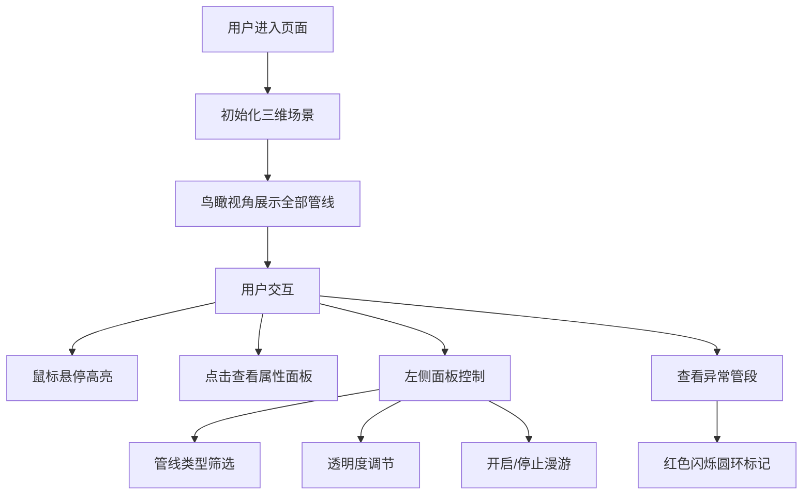

## 1. 产品概述

交互式三维地下管线与管道网络可视化查看器，让用户在三维场景中查看市政地下管线（给水、排水、燃气、电力、通信）的走向、埋深、管径和连接节点，支持沿管线漫游、点击查看属性、调节透明度及标记异常段。

- 目标用户：市政工程人员、管线规划设计师、运维管理人员
- 产品价值：通过直观的三维可视化方式呈现地下管线网络，提升管线巡检、规划和异常排查效率

## 2. 核心功能

### 2.1 用户角色
| 角色 | 注册方式 | 核心权限 |
|------|----------|----------|
| 普通用户 | 无需注册 | 浏览三维场景、查看管线属性、控制视角与显示 |

### 2.2 功能模块
1. **三维场景模块**：地下管线3D渲染、地面网格、光照效果
2. **交互控制模块**：鼠标悬停高亮、点击选中、Raycaster检测
3. **管线管理模块**：管线类型筛选、透明度调节、可见性切换
4. **相机漫游模块**：鸟瞰视角、沿管线自动漫游、节点间飞行过渡
5. **信息面板模块**：属性展示、异常状态高亮、淡入动画
6. **异常标记模块**：闪烁红色圆环标记异常管段

### 2.3 页面详情
| 页面名称 | 模块名称 | 功能描述 |
|---------|---------|----------|
| 主场景页 | 三维场景 | 展示所有管线与节点，支持鼠标交互，背景深灰色 |
| 主场景页 | 左侧控制面板 | 管线类型勾选、透明度滑块、漫游开关按钮 |
| 主场景页 | 信息面板 | 显示选中管线/节点的详细属性，异常段标红 |

## 3. 核心流程

用户进入页面 → 看到鸟瞰视角的三维管线场景 → 可通过鼠标旋转/缩放视角 → 点击管线或节点查看属性 → 通过左侧面板筛选管线类型/调节透明度 → 点击漫游按钮沿管线自动巡游 → 点击异常管段查看异常详情

## 4. 用户界面设计

### 4.1 设计风格
- **主色调**：深色科技风，背景色#1E1E2E，UI背景半透明#0D0D1AE6
- **管线颜色**：给水#4A90D9（蓝）、燃气#E67E22（橙）、电力#F1C40F（黄）、通信#2ECC71（绿）、排水#9B59B6（紫）
- **按钮/控件**：圆角设计，过渡动画0.15秒
- **字体**：无衬线字体，字号14px，颜色#CCCCCC
- **图标风格**：简洁线条风格

### 4.2 页面设计概览
| 页面名称 | 模块名称 | UI元素 |
|---------|---------|--------|
| 主场景页 | 三维场景 | 管线几何体、节点球体、地面网格、异常标记圆环 |
| 主场景页 | 左侧控制面板 | 标题、类型勾选列表、透明度滑块、漫游按钮 |
| 主场景页 | 信息面板 | 属性标签、值、异常状态红色高亮 |

### 4.3 响应式设计
- 桌面端（>1200px）：左侧面板260px宽固定展开
- 平板端（768px-1200px）：左侧面板保持展开，宽度适当缩小
- 移动端（<768px）：左侧面板折叠为顶部汉堡菜单

### 4.4 3D场景指引
- **环境**：深灰色背景#1E1E2E，半透明网格地面辅助定位
- **光照**：环境光 + 方向光，确保管线有立体感
- **相机**：初始45度鸟瞰，可通过OrbitControls交互
- **动画**：悬停高亮、异常段闪烁、漫游相机平滑移动
- **性能**：BufferGeometry复用，Raycaster限制检测距离100单位
