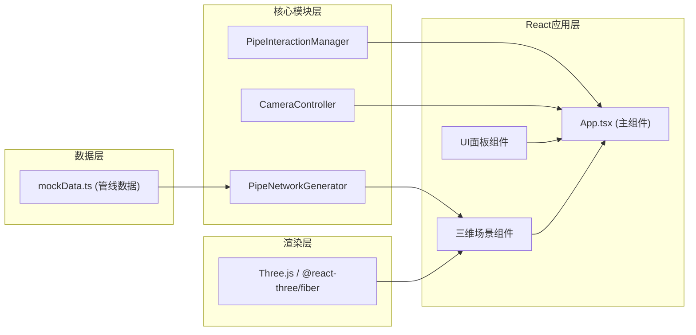

## 1. 架构设计



## 2. 技术说明

- **前端框架**：React 18 + TypeScript
- **构建工具**：Vite
- **3D渲染**：Three.js + @react-three/fiber + @react-three/drei
- **样式方案**：CSS Modules / 内联样式（无额外UI框架）
- **数据来源**：Mock数据（3条管线，每条5-8个节点，2个异常段）

## 3. 模块定义

### 3.1 PipeNetworkGenerator (管线生成器)
- 位置：`src/pipeline/PipeNetworkGenerator.ts`
- 职责：根据管线数据生成Three.js几何体
- 核心方法：`generateNetwork(pipelineData)` 返回场景对象数组
- 管段使用TubeGeometry，节点使用SphereGeometry

### 3.2 PipeInteractionManager (交互管理器)
- 位置：`src/interaction/PipeInteractionManager.ts`
- 职责：管理点击、悬停检测，使用Raycaster
- 核心方法：`getIntersectedObject(raycaster, objects)` 返回选中对象id和属性

### 3.3 CameraController (相机控制器)
- 位置：`src/camera/CameraController.ts`
- 职责：管理相机位置与目标，漫游控制
- 核心方法：`flyToNode()`、`startTour()`、`stopTour()`

## 4. 数据模型

### 4.1 管线数据类型

```typescript
interface PipelineNode {
  id: string;
  x: number;
  y: number; // 埋深（负值表示地下）
  z: number;
  name: string;
}

interface PipelineSegment {
  id: string;
  fromNode: string;
  toNode: string;
  diameter: number;
  material: string;
  isAbnormal: boolean;
  status: string;
}

interface Pipeline {
  id: string;
  name: string;
  type: 'water' | 'gas' | 'power' | 'communication' | 'drainage';
  color: string;
  nodes: PipelineNode[];
  segments: PipelineSegment[];
}
```

### 4.2 Mock数据
- 3条管线：给水、燃气、电力
- 每条管线5-8个节点
- 共2个异常管段标记

## 5. 文件结构

```
project/
├── package.json
├── vite.config.js
├── tsconfig.json
├── index.html
└── src/
    ├── main.tsx              # React入口
    ├── App.tsx               # 主组件
    ├── pipeline/
    │   └── PipeNetworkGenerator.ts
    ├── interaction/
    │   └── PipeInteractionManager.ts
    ├── camera/
    │   └── CameraController.ts
    ├── ui/
    │   ├── ControlPanel.tsx  # 左侧控制面板
    │   └── InfoPanel.tsx     # 信息面板
    └── data/
        └── mockData.ts
```

## 6. 性能优化

- 使用BufferGeometry复用几何体
- Raycaster检测限制距离为100单位
- 场景对象数量控制在50个管段 + 30个节点以内
- requestAnimationFrame中进行交互检测
- 使用实例化渲染减少Draw Call（如需要）
