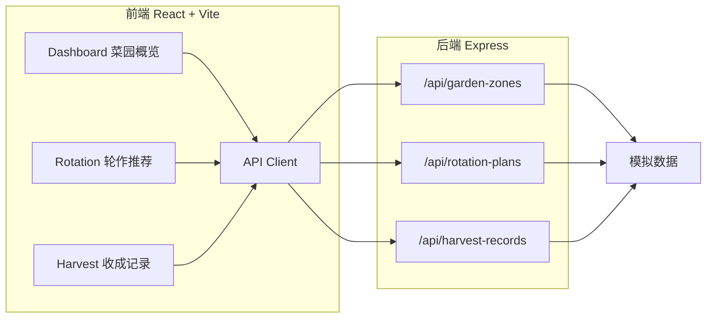
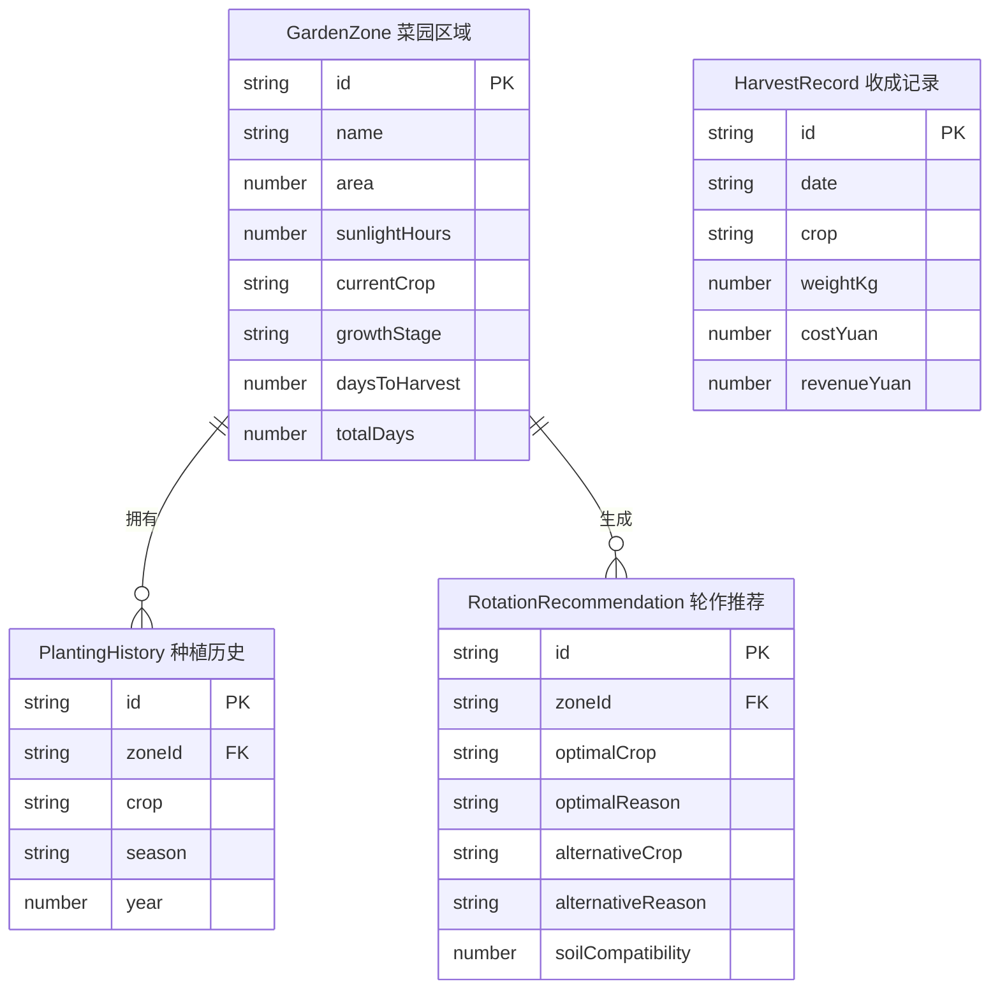

## 1. 架构设计



## 2. 技术说明
- 前端：React@18 + TypeScript + Tailwind CSS + Vite
- 初始化工具：vite-init（react-express-ts模板）
- 后端：Express@4 + CORS
- 数据库：无，使用模拟数据
- 状态管理：Zustand
- 图表：Chart.js（柱状图）
- 拖拽：HTML5 Drag and Drop API

## 3. 路由定义
| 路由 | 用途 |
|------|------|
| / | 菜园概览面板，展示所有区域卡片及生长进度 |
| /rotation | 轮作推荐页，展示最优与备选方案对比及拖拽确认 |
| /harvest | 收成记录页，展示表格与月度柱状图 |

## 4. API定义

### 4.1 获取菜园区域
- **GET** `/api/garden-zones`
- Response:
```typescript
interface GardenZone {
  id: string;
  name: string;
  area: number;
  sunlightHours: number;
  currentCrop: string;
  growthStage: 'seedling' | 'growing' | 'harvest';
  daysToHarvest: number;
  totalDays: number;
  history: { crop: string; season: string; year: number }[];
}

type GetGardenZonesResponse = GardenZone[];
```

### 4.2 获取轮作推荐方案
- **GET** `/api/rotation-plans?zoneId=xxx`
- Response:
```typescript
interface RotationPlan {
  optimal: {
    crop: string;
    reason: string;
    soilCompatibility: number;
  };
  alternative: {
    crop: string;
    reason: string;
    soilCompatibility: number;
  };
}

type GetRotationPlansResponse = RotationPlan;
```

### 4.3 获取收成记录
- **GET** `/api/harvest-records`
- Response:
```typescript
interface HarvestRecord {
  id: string;
  date: string;
  crop: string;
  weightKg: number;
  costYuan: number;
  revenueYuan: number;
}

type GetHarvestRecordsResponse = HarvestRecord[];
```

## 5. 服务端架构图

```mermaid
flowchart TD
    "Router 路由层" --> "Controller 控制层"
    "Controller 控制层" --> "Service 业务层"
    "Service 业务层" --> "MockData 模拟数据层"
```

## 6. 数据模型

### 6.1 数据模型定义



### 6.2 数据定义语言
使用内存模拟数据，无DDL语句。模拟数据在 `server/index.js` 中以JavaScript对象数组形式定义。
