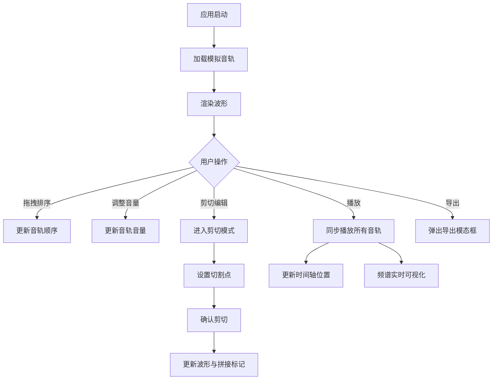

## 1. 产品概述

交互式音视频播客剪辑与波形可视化应用，面向播客创作者和音频编辑人员，提供多音轨导入、拖拽排列、剪切拼接、音量调整及实时波形/频谱分析功能，以深色主题打造专业级音频编辑体验。

- 目标用户：播客创作者、音频编辑爱好者
- 核心价值：提供轻量级浏览器端音频剪辑工具，降低播客制作门槛

## 2. 核心功能

### 2.1 功能模块

1. **编辑器主页**：时间轴、播放控制、音轨列表、频谱分析、导出功能

### 2.2 页面详情

| 页面名称 | 模块名称 | 功能描述 |
|---------|---------|---------|
| 编辑器主页 | 音轨导入与列表管理 | 默认加载两条模拟音轨（人声+背景音乐），每条含波形预览、音量滑块、删除按钮，支持上下拖拽排序 |
| 编辑器主页 | 时间轴与播放控制 | 全局时间轴（800×40px），1秒刻度/5秒标注，红色播放指示线，播放/暂停按钮，时间显示 |
| 编辑器主页 | 剪切与拼接 | 剪切模式下波形出现两个可拖动蓝色切割点，确认后删除区段并显示拼接阴影 |
| 编辑器主页 | 频谱分析可视化 | 底部32柱频谱柱状图，紫→粉渐变，60fps实时更新 |
| 编辑器主页 | 导出功能 | 导出按钮弹出模态框，模拟混流导出 |

## 3. 核心流程

1. 用户启动应用，自动加载两条模拟音轨并渲染波形
2. 用户可拖拽调整音轨顺序、调整音量、进入剪切模式编辑
3. 点击播放按钮，所有音轨同步播放，时间轴实时更新，频谱动态显示
4. 编辑完成后点击导出，模拟混流输出

## 4. 用户界面设计

### 4.1 设计风格

- 主题：深色专业音频编辑器风格
- 主色：背景 #1C1C1C，正文 #EAEAEA，次要文字 #9CA3AF
- 强调色：波形#FF6B6B / #4ECDC4，播放指示 #FF4444，按钮 #3B82F6
- 字体：系统无衬线字体，UI用14px，标题16px
- 布局：上中下三段式，固定高度顶底区域+可滚动中间区域
- 图标：使用 lucide-react 图标库

### 4.2 页面设计概览

| 页面名称 | 模块名称 | UI元素 |
|---------|---------|--------|
| 编辑器主页 | 顶部工具栏 | 导出按钮（蓝色圆角），背景#2D2D2D |
| 编辑器主页 | 时间轴区域 | 800×40px深色条，刻度线，红色播放位置线 |
| 编辑器主页 | 播放控制 | 绿色/红色圆形按钮(40px)，时间文字显示 |
| 编辑器主页 | 音轨列表 | 每行120px，波形+音量滑块+操作按钮，1px #333分割线 |
| 编辑器主页 | 频谱分析 | 150px高#1E1E1E背景，32柱紫粉渐变柱状图 |

### 4.3 响应式

- 桌面优先，默认1200px全宽显示
- 小于768px时音轨列表变为单列，波形宽度自适应缩小
- 所有交互元素悬停有0.2s ease过渡动画

### 4.4 3D场景指导

不适用
