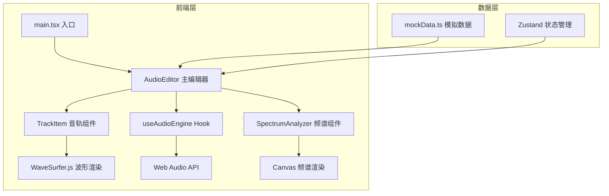
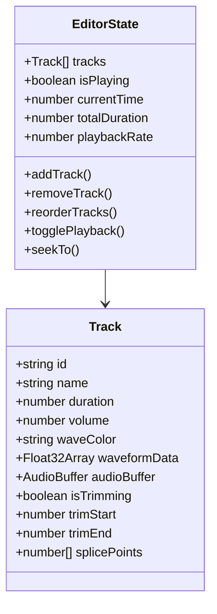

## 1. 架构设计

## 2. 技术说明

- 前端：React 18 + TypeScript + Vite
- 初始化工具：vite-init（react-ts模板）
- 状态管理：Zustand
- 波形渲染：wavesurfer.js
- 频谱渲染：Canvas 2D API + requestAnimationFrame
- 音频引擎：Web Audio API（AnalyserNode获取频域数据）
- 后端：无
- 数据库：无，使用模拟数据

## 3. 路由定义

| 路由 | 用途 |
|------|------|
| / | 主编辑器页面（单页应用） |

## 4. API定义

不适用（纯前端，无后端API）

## 5. 服务端架构图

不适用

## 6. 数据模型

### 6.1 数据模型定义

### 6.2 数据定义语言

不适用（无数据库）
