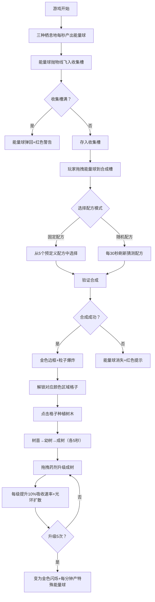

## 1. 产品概述
一款以古老森林精华为主题的模拟经营沙盒模拟器，玩家通过收集精灵能量、合成魔法药剂、解锁森林区域、种植魔法树木，体验完整的能量循环与成长反馈系统。

- 目标用户：独立游戏策划、模拟经营游戏爱好者
- 核心价值：直观展示精灵能量收集、药剂合成和区域解锁之间的连锁反馈关系

## 2. 核心功能

### 2.1 用户角色
| 角色 | 注册方式 | 核心权限 |
|------|----------|----------|
| 玩家 | 无需注册 | 全部游戏功能 |

### 2.2 功能模块
1. **能量收集模块**：三种精灵栖息地自动产出能量球，抛物线动画飞入收集槽
2. **药剂合成模块**：拖拽能量球到合成槽，支持固定配方和随机配方模式
3. **森林建设模块**：6x6网格地图，区域解锁、树木种植、三阶段生长
4. **树木升级系统**：药剂升级树木，提升能量吸收速率，满级产特殊能量球
5. **数据统计面板**：顶部导航栏展示核心数据与分项详情

### 2.3 页面详情
| 页面名称 | 模块名称 | 功能描述 |
|----------|----------|----------|
| 主界面 | 顶部导航栏 | 深色#1B2838背景，显示总合成药剂数、已解锁区域数、能量总收集量，悬停显示分项 |
| 主界面 | 左侧能量收集区 | 三个栖息地横向排列（火焰红、寒冰蓝、自然绿），每秒自动生成能量球，抛物线动画 |
| 主界面 | 左侧药剂合成区 | 固定/随机配方模式切换，2-3个合成槽位，拖拽合成，成功震动光效/失败红闪提示 |
| 主界面 | 右侧森林地图 | 6x6网格，中央2x2初始可用，其余灰色锁图标，药剂解锁对应颜色区域 |
| 主界面 | 树木交互 | 点击已解锁格子种树，三阶段生长（各5秒），拖拽药剂升级成树，升级光环扩散 |

## 3. 核心流程

玩家进入游戏后，三种精灵栖息地开始自动产出对应颜色能量球，能量球以抛物线动画飞入收集槽（上限20个，超上限弹回警告）。玩家从收集槽拖拽能量球到合成槽：

## 4. 用户界面设计

### 4.1 设计风格
- **主色调**：深色星空渐变背景（#0F1A2E → #1A2A3C）
- **栖息地颜色**：火焰#FF5722→#FF8A65、寒冰#2196F3→#64B5F6、自然#4CAF50→#81C784
- **区域解锁色**：紫色#7B1FA2（填充#E1BEE7）、黄色、青色、白色、橙色对应药剂
- **导航栏**：#1B2838深色
- **磨砂玻璃效果**：背景rgba(255,255,255,0.08)，边框1px solid rgba(255,255,255,0.15)
- **圆角统一**：8px
- **字体方向**：现代无衬线字体，标题加粗，正文清晰

### 4.2 页面设计概览
| 页面 | 模块 | UI元素 |
|------|------|---------|
| 主界面 | 顶部导航栏 | 深色横条，三个统计卡片带小图标（药剂瓶/地图/能量球），悬停弹出分项Tooltip |
| 主界面 | 左侧栖息地 | 三张120x150px卡片横向排列，彩色渐变背景，内部发光圆球呼吸动画，数字显示产出计数 |
| 主界面 | 收集槽 | 横向排列的能量球堆叠展示，颜色圆点+数量标签，悬停显示颜色名称 |
| 主界面 | 合成区 | 模式切换Tab，配方卡片列表，圆形合成槽（60x60px圆角50%），合成按钮 |
| 主界面 | 森林地图 | 6x6网格，格子80x80px间距4px，灰色带锁/彩色解锁，锁图标🔒 |
| 主界面 | 树木粒子 | 三阶段用不同大小半透明粒子云表示，点击弹出数值面板 |

### 4.3 响应式
- **桌面端（≥768px）**：左右两栏布局，左侧45%右侧55%
- **移动端（<768px）**：上下布局，栖息地改为垂直排列，地图格子缩小为60x60px
- **触控优化**：拖拽支持touch事件，点击区域≥44px

### 4.4 动效与反馈
| 交互 | 视觉反馈 | 声音/动画模拟 |
|------|----------|----------------|
| 能量球生成 | 发光圆球+抛物线轨迹 | requestAnimationFrame驱动 |
| 合成成功 | 屏幕震动+光效闪烁+金色边框 | 0.3秒内CSS transform + opacity动画 |
| 合成失败 | 红色提示弹出 | 抖动+褪色消失 |
| 区域解锁 | 格子波纹扩散 | CSS keyframes涟漪 |
| 树木生长 | 像素抖动+粒子云放大 | 三阶段各5秒transition |
| 树木升级 | 彩色光环扩散（30→60px消失） | CSS animation |
| 按钮点击 | 缩小回弹 | transform: scale(0.95→1) |
| 满级树木 | 金色闪烁效果 | opacity + box-shadow脉动 |
