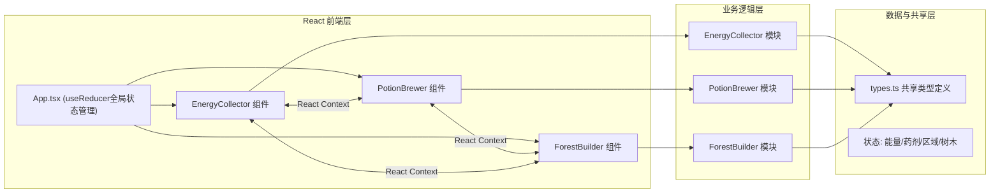

## 1. 架构设计



## 2. 技术描述

- **前端框架**: React 18 + TypeScript
- **构建工具**: Vite 5
- **状态管理**: React useReducer + Context API（不使用第三方库，满足需求中指定方案）
- **样式方案**: 原生CSS + CSS Modules，CSS变量统一设计系统
- **粒子动画**: requestAnimationFrame + Canvas（超过50粒子自动切换Canvas渲染）
- **初始化工具**: vite-init react-ts模板
- **后端**: None（纯前端沙盒模拟器）

## 3. 项目结构

| 路径 | 职责 |
|------|------|
| `/` | 项目根目录 |
| `/package.json` | 依赖管理：react, react-dom, typescript, vite, @vitejs/plugin-react |
| `/vite.config.js` | Vite配置，启用react插件 |
| `/tsconfig.json` | TypeScript严格模式，jsx: preserve |
| `/index.html` | 入口HTML，挂载点#root |
| `/src/` | 前端源码目录 |
| `/src/types.ts` | 核心类型定义 |
| `/src/EnergyCollector.tsx` | 精灵能量收集模块组件 |
| `/src/PotionBrewer.tsx` | 药剂配方合成模块组件 |
| `/src/ForestBuilder.tsx` | 森林地图与树木管理模块组件 |
| `/src/App.tsx` | 主容器，useReducer全局状态，三模块组合 |
| `/src/GameContext.tsx` | React Context跨模块通信 |
| `/src/styles/` | 样式文件目录（全局+各模块样式 |
| `/src/hooks/` | 自定义hooks：useAnimationFrame等 |

## 4. 状态架构

### 4.1 全局 State 结构

```typescript
// types.ts

// 能量类型
type EnergyColor = 'red' | 'blue' | 'green' | 'special';

// 药剂类型
type PotionColor = 'purple' | 'yellow' | 'cyan' | 'white' | 'orange' | 'random';

// 树木生长阶段
enum TreeGrowthStage = 0 | 1 | 2;

// 单个能量球（飞行中或库存中）
interface EnergyOrb {
  id: string;
  color: EnergyColor;
  // 飞行动画状态 {x, y, progress}
}

// 配方定义
interface PotionRecipe {
  id: string;
  name: string;
  ingredients: EnergyColor[];
  result: PotionColor;
  regionColor: string;
  isRandom?: boolean;
  discovered?: boolean;
}

// 地图格子
interface MapCell {
  row: number;
  col: number;
  unlocked: boolean;
  regionColor: PotionColor | 'initial';
  tree: Tree | null;
}

// 魔法树木
interface Tree {
  id: string;
  stage: TreeGrowthStage;
  plantedAt: number;
  stageProgress: number;
  upgrades: number;
  absorbedEnergy: number;
  color: PotionColor | 'initial';
}

// 全局游戏状态
interface GameState {
  energyInventory: Record<EnergyColor, number>;
  totalEnergyCollected: number;
  energyOrbsInFlight: EnergyOrb[];
  potions: Record<PotionColor, number>;
  totalPotionsBrewed: number;
  recipes: PotionRecipe[];
  brewingSlots: (EnergyColor | null)[];
  map: MapCell[][];
  unlockedRegions: Set<PotionColor>;
  recipeMode: 'fixed' | 'random';
  randomRecipeRefreshAt: number;
  notifications: Notification[];
}
```

### 4.2 Action Types
```typescript
type Action =
  | { type: 'SPAWN_ENERGY; habitat: EnergyColor }
  | { type: 'COLLECT_ENERGY; orbId: string; success: boolean }
  | { type: 'PLACE_IN_SLOT'; slotIndex: number; color: EnergyColor }
  | { type: 'CLEAR_SLOT'; slotIndex: number }
  | { type: 'BREW_POTION' }
  | { type: 'TOGGLE_RECIPE_MODE' }
  | { type: 'REFRESH_RANDOM_RECIPE' }
  | { type: 'UNLOCK_REGION'; color: PotionColor }
  | { type: 'PLANT_TREE'; row: number; col: number }
  | { type: 'GROW_TREE'; treeId: string }
  | { type: 'UPGRADE_TREE'; treeId: string; potion: PotionColor }
  | { type: 'NOTIFY'; message: string; variant: 'success' | 'error' | 'info' }
  | { type: 'TICK'; delta: number };
```

## 5. 性能优化方案

| 问题 | 解决方案 |
|------|----------|
| 能量球飞行 | requestAnimationFrame驱动抛物线运动，DOM/Canvas双模式切换（≥50粒子时切换Canvas |
| 药剂合成动画 | CSS transform + will-change，避免触发reflow，0.3秒内完成 |
| 树木生长粒子 | CSS transition + transform，GPU加速合成层 |
| 频繁状态更新 | useReducer批量处理（dispatch合并、useMemo/useCallback避免重渲染 |
| 地图格子渲染 | React.memo包装格子组件，仅unlocked/state变化时重渲染 |
| 帧率保障 | requestIdleCallback处理非关键动画，IntersectionObserver可视区渲染 |

## 6. 核心算法

### 6.1 抛物线计算
```
x(t) = startX + (endX - startX) * t
y(t) = startY + (endY - startY) * t - height * t * (1-t) * 4
```
t∈[0,1]，height为抛物线峰值高度

### 6.2 配方匹配算法
- 输入：brewingSlots数组（已排序）
- 遍历recipes表，比较ingredients排序后全等匹配
- 随机模式：隐藏配方每30秒生成新组合

### 6.3 区域颜色映射
- 紫色药剂 → 紫色区域
- 黄色药剂 → 黄色区域
- 青色药剂 → 青色区域
- 白色药剂 → 白色区域
- 橙色药剂 → 橙色区域

初始2x2区域淡绿色#C8E6C9

## 7. 拖拽实现
- HTML5 Drag and Drop API
- 能量球draggable=true，合成槽/树木为dropzone
- 药剂拖拽至成树触发生效
