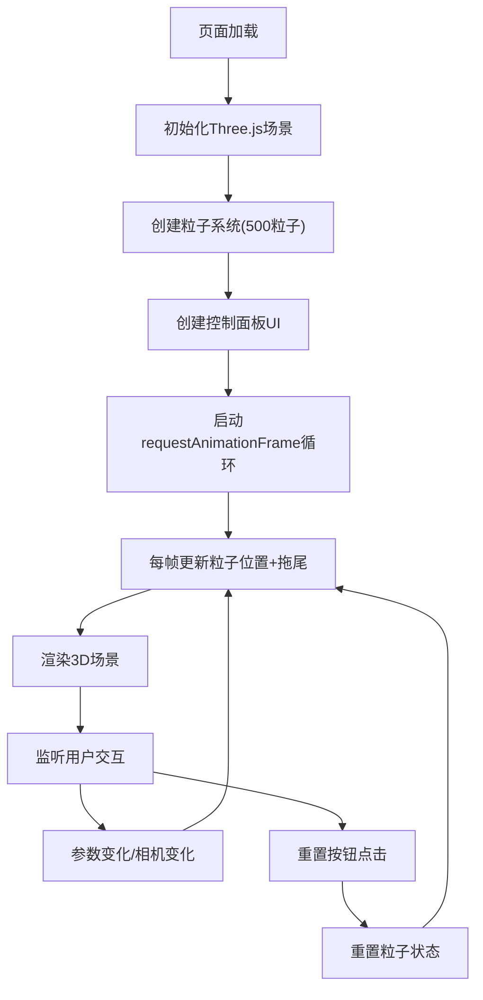

## 1. 产品概述
基于Three.js的三维粒子系统可视化应用，模拟微风中细小物体（花粉、蒲公英种子）在气流作用下的物理运动，用于气象可视化或自然景观演示。

- 核心目的：真实呈现气流作用于细小物体的物理运动，包括湍流影响的随机轨迹和聚集离散效果
- 目标用户：气象研究人员、可视化设计师、教育工作者
- 市场价值：提供可交互的气流物理现象演示工具，支持科研教学和艺术创作

## 2. 核心功能

### 2.1 功能模块
1. **3D粒子系统核心**：500+粒子物理模拟，支持力场和湍流
2. **交互控制面板**：实时参数调节（湍流强度、粒子寿命、力场方向）
3. **可视化效果**：发光粒子、拖尾淡出、深空背景、FPS监控
4. **相机交互**：鼠标拖拽旋转、滚轮缩放

### 2.3 页面详情
| 页面名称 | 模块名称 | 功能描述 |
|-----------|-------------|---------------------|
| 主场景页面 | 3D粒子系统 | 500个粒子在100x100x100立方体内随机分布，受三维力场和湍流影响运动，大小2-6px，颜色白到淡黄渐变，透明度0.3-0.8 |
| 主场景页面 | 控制面板 | 右下角悬浮面板，包含湍流强度滑块(0.1-5.0)、粒子寿命滑块(2-10秒)、力场方向三维输入(-10到10)、重置按钮 |
| 主场景页面 | FPS计数器 | 左上角显示实时帧率，绿色monospace字体 |
| 主场景页面 | 相机控制 | 鼠标拖拽围绕原点旋转(速度0.5)，滚轮缩放(0.5-3.0)，初始45度俯视 |

## 3. 核心流程
用户打开页面 → 场景初始化（相机、渲染器、粒子系统）→ 动画循环启动（粒子位置更新、拖尾效果、渲染）→ 用户调节控制面板参数 → 粒子系统实时响应 → 用户拖拽/缩放调整视角 → 点击重置按钮恢复初始状态

## 4. 用户界面设计

### 4.1 设计风格
- 主色调：深空渐变背景(#0F0C29→#302B63→#24243E)
- 强调色：粒子发光(白到淡黄#FFF9E6渐变)，滑块按钮(#7C7CFF)，FPS文本(#00FF88)
- 控制面板：半透明深灰#1A1A2ECC，圆角16px，内边距20px
- 滑块轨道：#4A4A6A，滑块悬停亮度提升10%
- 字体：FPS使用16px monospace
- 动效：UI元素CSS淡入动画(0.5秒)，粒子拖尾15帧淡出

### 4.2 页面设计概述
| 页面名称 | 模块名称 | UI元素 |
|-----------|-------------|-------------|
| 主场景页面 | 3D场景 | 全屏WebGL画布，渐变深空背景，雾效果，发光粒子 |
| 主场景页面 | 控制面板 | 右下角280px悬浮面板，滑块组，三维坐标输入，重置按钮 |
| 主场景页面 | FPS计数器 | 左上角绿色monospace文本，显示帧率 |

### 4.3 响应性
- 桌面端优先，全屏自适应
- 控制面板固定右下角，不随滚动移动
- 鼠标交互：左键拖拽旋转，滚轮缩放

### 4.4 3D场景指导
- 环境：深空渐变背景，雾化效果增强深度感
- 光照：粒子自发光，无需额外光源
- 相机：PerspectiveCamera，初始位置(70, 70, 70)，看向原点，45度俯视
- 交互：OrbitControls围绕原点旋转，旋转速度0.5，缩放范围0.5-3.0
- 后期：粒子使用AdditiveBlending混合模式实现发光效果
- 性能：500粒子稳定60FPS，使用BufferGeometry管理粒子数据
