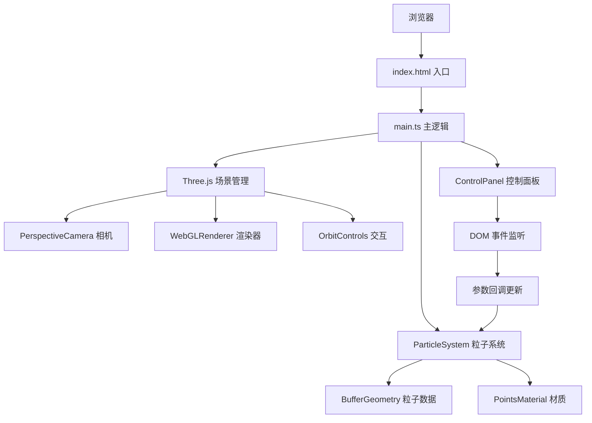

## 1. 架构设计


## 2. 技术描述
- 前端框架：原生 TypeScript + ES Modules
- 3D引擎：Three.js (直接通过ES模块引入)
- 构建工具：Vite
- 样式：Pure CSS (CSS-in-JS内联样式)
- 无后端、无数据库，纯前端应用

**核心依赖：**
- three: ^0.160.0
- @types/three: ^0.160.0
- typescript: ^5.3.0
- vite: ^5.0.0

## 3. 项目文件结构
```
auto272/
├── package.json              # 项目依赖和脚本
├── vite.config.js            # Vite基础配置
├── tsconfig.json             # TypeScript严格模式配置
├── index.html                # 入口HTML
└── src/
    ├── main.ts               # 主逻辑：场景初始化、动画循环、模块整合
    ├── ParticleSystem.ts     # 粒子系统模块：位置/颜色/透明度缓冲区管理
    └── ControlPanel.ts       # 控制面板模块：DOM元素创建、事件绑定
```

## 4. 核心模块设计

### 4.1 ParticleSystem 类
**职责：** 管理500个粒子的创建、物理更新和渲染数据
- 构造参数：`particleCount: number`, `boundarySize: number`
- 属性：
  - `points: THREE.Points` - Three.js点对象
  - `positions: Float32Array` - 粒子位置缓冲区 (x,y,z * count)
  - `colors: Float32Array` - 粒子颜色缓冲区 (r,g,b * count)
  - `velocities: THREE.Vector3[]` - 粒子速度数组
  - `lifetimes: number[]` - 粒子剩余寿命
  - `trailBuffer: Float32Array[][]` - 拖尾位置历史(15帧)
  - `trailIndex: number` - 当前拖尾写入索引
- 方法：
  - `update(forceVector: THREE.Vector3, turbulence: number, deltaTime: number)` - 每帧更新
  - `reset()` - 重置所有粒子状态
  - `dispose()` - 释放资源

**物理算法：**
```
对于每个粒子：
1. 生成湍流噪声：turbulence * (Math.random() - 0.5) * 2
2. 应用力场：velocity += forceVector * deltaTime
3. 应用湍流：velocity += turbulenceVector * deltaTime
4. 更新位置：position += velocity * deltaTime
5. 边界检测：超出立方体则从对面重新进入
6. 寿命递减：lifetime -= deltaTime，寿命结束则重生
7. 拖尾更新：写入当前位置到拖尾缓冲区
```

### 4.2 ControlPanel 类
**职责：** 创建控制面板UI，绑定事件，通过回调传递参数
- 构造参数：
  - `onTurbulenceChange: (value: number) => void`
  - `onLifetimeChange: (value: number) => void`
  - `onForceChange: (x: number, y: number, z: number) => void`
  - `onReset: () => void`
- 属性：
  - `container: HTMLDivElement` - 面板容器
  - `turbulenceSlider: HTMLInputElement`
  - `lifetimeSlider: HTMLInputElement`
  - `forceXInput: HTMLInputElement`
  - `forceYInput: HTMLInputElement`
  - `forceZInput: HTMLInputElement`
  - `resetButton: HTMLButtonElement`
- 方法：
  - `createSlider(label, min, max, defaultValue, onChange)` - 创建滑块
  - `createVector3Input(label, defaultX, defaultY, defaultZ, onChange)` - 创建三维输入
  - `createResetButton(onClick)` - 创建重置按钮
  - `mount()` - 挂载到DOM
  - `unmount()` - 卸载清理

### 4.3 main.ts 主逻辑
**职责：** 整合所有模块，管理动画循环
- 初始化流程：
  1. 创建Scene、PerspectiveCamera、WebGLRenderer
  2. 设置OrbitControls（旋转速度0.5，缩放0.5-3.0）
  3. 创建Fog雾化效果
  4. 实例化ParticleSystem(500, 100)
  5. 实例化ControlPanel，绑定回调
  6. 创建FPS计数器DOM元素
  7. 启动requestAnimationFrame循环
- 动画循环：
  1. 计算deltaTime
  2. 更新OrbitControls
  3. 调用particleSystem.update(forceVector, turbulence, deltaTime)
  4. 更新FPS显示
  5. 调用renderer.render(scene, camera)

## 5. 性能优化策略
1. **BufferGeometry**：使用Float32Array直接管理GPU缓冲区，避免每帧创建新对象
2. **单Points对象**：所有粒子共享一个Points对象和材质，减少Draw Call
3. **AdditiveBlending**：使用加法混合实现发光效果，无需后期处理
4. **拖尾缓冲区循环**：预分配15帧位置数组，循环写入而非动态创建
5. **requestAnimationFrame**：与显示器刷新率同步，稳定60FPS
6. **对象池模式**：粒子重用而非销毁创建，减少GC压力

## 6. 类型定义
```typescript
// 粒子数据结构
interface ParticleData {
  position: THREE.Vector3;
  velocity: THREE.Vector3;
  color: THREE.Color;
  size: number;
  opacity: number;
  lifetime: number;
  maxLifetime: number;
}

// 控制面板回调接口
interface ControlPanelCallbacks {
  onTurbulenceChange: (value: number) => void;
  onLifetimeChange: (value: number) => void;
  onForceChange: (x: number, y: number, z: number) => void;
  onReset: () => void;
}

// 粒子系统配置
interface ParticleSystemConfig {
  particleCount: number;
  boundarySize: number;
  minSize: number;
  maxSize: number;
  minOpacity: number;
  maxOpacity: number;
  trailLength: number;
}
```
