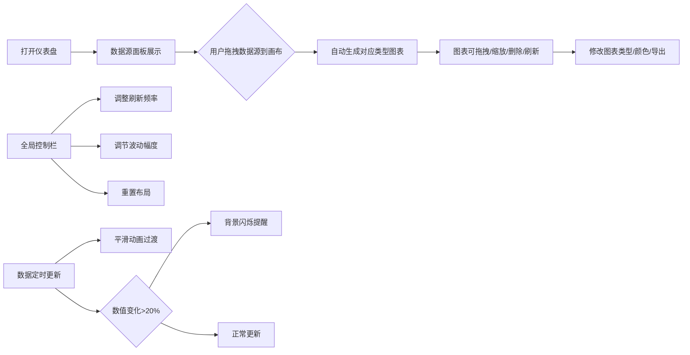

## 1. 产品概述

交互式动态数据仪表盘应用，让用户能够从多个模拟数据源实时拖拽生成自定义图表并自由布局。
- 主要目的：提供可视化数据监控平台，支持销售、用户增长、服务器日志等多维度数据的实时展示和分析
- 目标用户：数据分析师、运营人员、产品经理
- 产品价值：通过拖拽式的可视化配置，降低数据分析门槛，提升数据决策效率

## 2. 核心功能

### 2.1 功能模块
1. **数据源面板**：展示销售、用户增长、服务器日志三类模拟数据源卡片，支持拖拽到画布
2. **图表画布**：支持图表拖拽、缩放、自由排列，最多同时显示6个图表
3. **图表工厂**：根据数据类型渲染折线图、柱状图、饼图，支持图表类型切换
4. **全局控制栏**：数据刷新频率设置、数据波动幅度调节、重置布局

### 2.3 页面详情
| 页面名称 | 模块名称 | 功能描述 |
|-----------|-------------|---------------------|
| 仪表盘主页面 | 数据源面板 | 展示3类数据源卡片，显示最新值（数字滚动动画），拖拽手柄 |
| 仪表盘主页面 | 中央画布 | 支持拖入数据源生成图表，图表可拖动缩放，支持删除和刷新 |
| 仪表盘主页面 | 图表标题栏 | 显示图表类型，下拉菜单支持修改类型、编辑颜色、导出图片 |
| 仪表盘主页面 | 全局控制栏 | 刷新频率（1秒/5秒/10秒/手动）、波动幅度滑块（0.1-5.0）、重置布局按钮 |

## 3. 核心流程

用户从左侧数据源面板拖拽数据源卡片到中央画布 → 系统自动根据数据类型生成对应图表（销售→折线图、用户→柱状图、日志→饼图） → 用户可拖拽调整图表位置和缩放大小 → 用户通过图表标题栏菜单修改图表类型、颜色方案或导出 → 用户通过顶部控制栏调整数据刷新频率和波动幅度 → 数据定时自动更新，数值变化大于20%时触发背景闪烁提醒

## 4. 用户界面设计

### 4.1 设计风格
- 主色调：灰色系（#F1F3F5, #DEE2E6, #495057）
- 图表颜色预设10种高对比色板：#4C72B0, #DD8452, #55A868, #C44E52, #8172B3, #937860, #DA8BC3, #8C8C8C, #CCB974, #64B5CD
- 卡片/图表悬浮效果：translateY(-2px) + box-shadow 0 4px 12px rgba(0,0,0,0.1)
- 按钮：圆角设计，删除按钮为红色圆形×，刷新按钮为灰色旋转箭头
- 字体：现代无衬线字体，清晰层次

### 4.2 页面设计概述
| 页面名称 | 模块名称 | UI元素 |
|-----------|-------------|-------------|
| 仪表盘主页面 | 数据源面板 | 左栏280px宽，#F1F3F5背景，卡片宽240px圆角10px，悬停#E9ECEF，拖拽手柄图标 |
| 仪表盘主页面 | 中央画布 | #F8F9FA背景，react-grid-layout实现拖拽缩放，最小200x150px |
| 仪表盘主页面 | 图表标题栏 | 高36px，#E9ECEF背景，圆角顶部，下拉菜单按钮 |
| 仪表盘主页面 | 全局控制栏 | 高48px，#FFF背景，下边框#DEE2E6，下拉框+滑块+按钮 |

### 4.3 响应式设计
- 桌面端（≥1200px）：左右两栏固定比例布局，左栏280px
- 移动端（<1200px）：左栏变为顶部折叠式导航栏（高60px），点击展开数据源面板

### 4.4 动画效果
- 数字滚动更新动画
- 折线图0.3秒平滑过渡动画
- 柱状图0.2秒淡入动画
- 数值变化>20%时0.5秒背景闪烁（#FFF3CD）
- 图表类型切换0.4秒旋转缩放过渡
- 卡片/图表悬浮轻微提升效果
