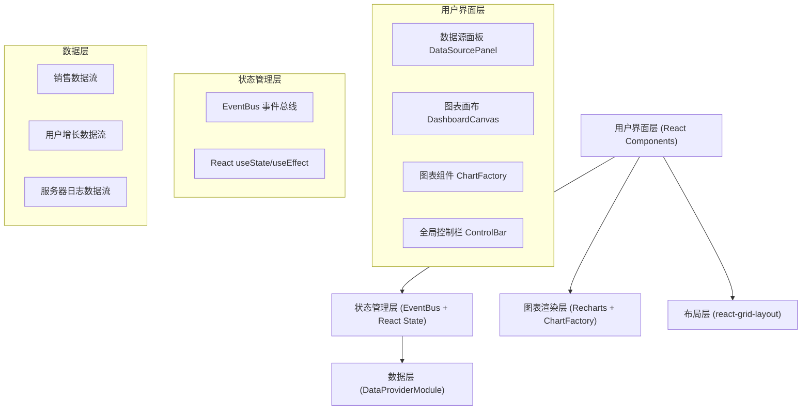

## 1. 架构设计



## 2. 技术描述

- 前端框架：React 18 + TypeScript 5
- 构建工具：Vite 5 + @vitejs/plugin-react
- 图表库：Recharts 2
- 布局库：react-grid-layout 1
- 状态通信：EventBus（发布订阅模式）
- 数据管理：DataProviderModule（定时生成模拟数据）
- 样式方案：原生CSS + CSS Variables

## 3. 文件结构

```
d:\Pro\tasks\auto273\
├── package.json
├── vite.config.js
├── tsconfig.json
├── index.html
└── src/
    ├── types.ts              # 共享类型定义
    ├── EventBus.ts           # 事件总线模块
    ├── DataProviderModule.ts # 模拟数据源管理
    ├── ChartFactory.tsx      # 图表工厂组件
    └── DashboardCanvas.tsx   # 主看板画布组件
```

## 4. 模块职责与接口定义

### 4.1 types.ts - 共享类型
- `DataSourceType`: 'sales' | 'users' | 'logs'
- `ChartType`: 'line' | 'bar' | 'pie'
- `DataSource`: 数据源配置接口
- `ChartConfig`: 图表配置接口
- `LayoutItem`: 布局项接口（继承react-grid-layout）
- `DataPoint`: 通用数据点接口

### 4.2 EventBus.ts - 事件总线
- `EventBus` 类
  - `on(event: string, callback: Function): void` 订阅
  - `off(event: string, callback: Function): void` 取消订阅
  - `emit(event: string, data?: any): void` 发布

事件列表：
- `data:update`: 数据更新事件
- `layout:change`: 布局变更事件
- `chart:add`: 新增图表事件
- `chart:remove`: 删除图表事件
- `chart:type-change`: 图表类型变更事件
- `config:refresh-rate`: 刷新频率变更
- `config:volatility`: 波动幅度变更

### 4.3 DataProviderModule.ts - 数据源模块
- `DataProvider` 类
  - 构造函数接收 EventBus 实例
  - `setRefreshRate(rate: number | 'manual'): void`
  - `setVolatility(volatility: number): void`
  - `start(): void` 启动定时数据生成
  - `stop(): void` 停止
  - `generateData(type: DataSourceType): DataPoint[]` 手动生成数据
  - 内部维护3个数据源的最新值和历史数据

### 4.4 ChartFactory.tsx - 图表工厂
- Props: `{ data: DataPoint[], type: ChartType, color: string, config: ChartConfig }`
- 根据 type 渲染 LineChart / BarChart / PieChart
- 支持动画过渡
- 响应数据更新和平滑动画

### 4.5 DashboardCanvas.tsx - 主看板
- 整合所有模块：数据源面板、画布、控制栏
- 管理图表列表和布局状态
- 处理拖拽、缩放、删除、刷新等交互
- 响应事件总线的数据更新

## 5. 性能优化策略

- 图表数据点上限：100个，超出时截断旧数据
- 同时图表数量上限：6个
- 使用 React.memo 避免不必要的重渲染
- 数据更新使用 requestAnimationFrame 确保60fps
- 拖拽操作使用 transform 而非 top/left 减少重排
- 事件总线回调使用 useCallback 缓存
