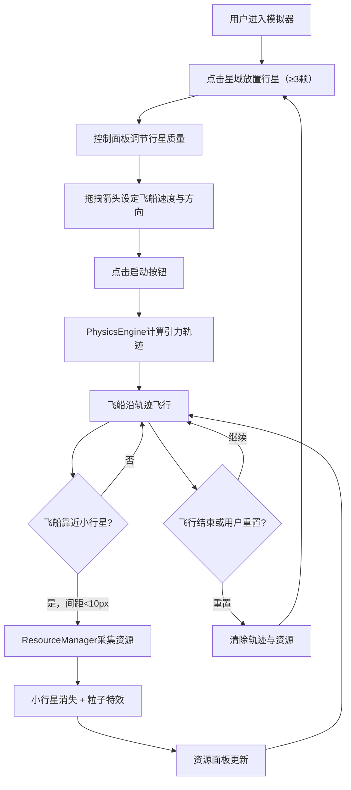

## 1. 产品概述

太空资源引力弹弓模拟器是一款面向独立游戏开发者的二维星域物理模拟工具，用于快速验证引力弹弓效应和资源循环机制的平衡性。用户可在星域中放置行星、设定飞船初始参数，实时观察引力影响下的飞行轨迹，并在飞越小行星带时采集矿物资源。

- 核心目标：为游戏设计者提供直观、交互式的物理与资源模拟环境
- 目标用户：独立游戏开发者、游戏设计爱好者、物理模拟爱好者

## 2. 核心功能

### 2.1 用户角色

| 角色 | 注册方式 | 核心权限 |
|------|----------|----------|
| 普通用户 | 无需注册 | 使用全部模拟功能 |

### 2.2 功能模块

1. **星域主场景**：深空背景、行星放置与渲染、飞船飞行轨迹、小行星带分布与采集粒子特效
2. **控制面板**：行星质量调节、飞船速度方向设定、启动/重置控制、轨迹显示开关
3. **资源统计面板**：已采集资源数量展示、采集次数统计、数字跳动动画

### 2.3 页面详情

| 页面名称 | 模块名称 | 功能描述 |
|----------|----------|----------|
| 星域模拟器 | 星域主场景 | 渲染深空渐变背景与闪烁星点，用户点击放置行星（≥3颗），行星根据质量显示渐变圆与外发光；飞船白色圆点沿引力弹弓轨迹飞行，轨迹为半透明青色虚线；小行星带随机分布50-80颗，飞船靠近触发采集并产生缩放粒子特效 |
| 星域模拟器 | 控制面板 | 左下角半透明面板：行星质量下拉框与滑块（1-50）、速度方向箭头控制器（360°拖拽，显示角度与速度）、启动按钮（#00FF88）、重置按钮（#FF4D4D）、轨迹显示开关 |
| 星域模拟器 | 资源统计面板 | 右下角半透明面板：总采集次数、三资源横排卡片（铁#A0522D、铜#B87333、钛#C0C0C0）、数字跳动动画 |

## 3. 核心流程

用户打开模拟器后，在星域中点击放置至少3颗行星，通过控制面板调节各行星质量，设定飞船初始速度和方向（拖拽箭头控制器），点击启动后飞船沿引力弹弓轨迹飞行。飞行过程中飞船经过小行星带时按概率采集资源，小行星消失并产生粒子特效，资源统计面板实时更新采集数据。用户可随时重置重新配置。

## 4. 用户界面设计

### 4.1 设计风格

- 主色调：深空蓝黑渐变（#0D0D2B → #1A1A3E）
- 强调色：金色（#FFD700，箭头/滑块/选中高亮）、青色（#00FFFF，轨迹线）、绿色（#00FF88，启动按钮）、红色（#FF4D4D，重置按钮）
- 按钮风格：圆角8px，悬浮亮度提升20%，0.2秒过渡动画
- 字体：等宽数字用于资源统计，无衬线字体用于UI标签
- 布局：全屏Canvas星域 + 左下角控制面板 + 右下角资源面板
- 视觉特效：行星外发光、飞船拖尾粒子、采集缩放粒子、星点闪烁

### 4.2 页面设计概览

| 页面名称 | 模块名称 | UI元素 |
|----------|----------|--------|
| 星域模拟器 | 星域主场景 | Canvas全屏渲染：深空渐变背景、闪烁白点、行星渐变圆+外发光、飞船白色圆点+拖尾、青色虚线轨迹、灰色/棕色/铜色/银色小行星、采集粒子特效 |
| 星域模拟器 | 控制面板 | 280px宽半透明面板、行星下拉框（选中#FFD700边框）、质量滑块（轨道#4B5563/按钮#FFD700）、圆形箭头控制器（半径40px）、启动/重置按钮、轨迹开关 |
| 星域模拟器 | 资源统计面板 | 220px宽半透明面板、总采集次数、三资源卡片（60px宽、圆角8px、资源色0.2透明度背景）、跳动数字动画 |

### 4.3 响应式

- 桌面优先设计，Canvas自适应窗口大小
- 控制面板与资源面板固定定位在左下/右下角
- 面板在小屏幕下可能部分遮挡Canvas，但不影响核心交互

### 4.4 2D场景指导

- 环境：深空蓝黑渐变背景，随机闪烁星点营造太空氛围
- 视觉层次：背景星点 → 小行星 → 轨迹线 → 行星 → 飞船 → UI面板
- 粒子系统：飞船拖尾（#FFD700，20粒子）、采集特效（资源色，8粒子，0.3秒）
- 性能约束：物理计算≥30FPS，轨迹≤200点/帧，粒子特效≤5个同时
