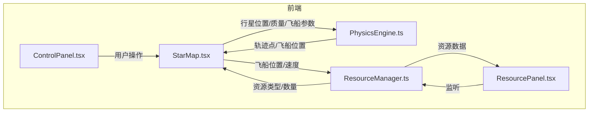
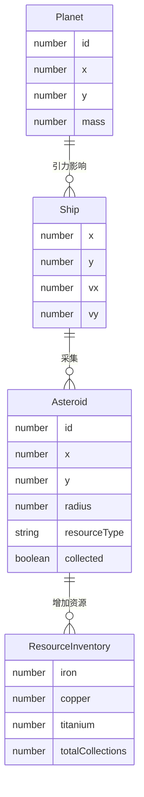

## 1. 架构设计



## 2. 技术说明

- 前端：React@18 + TypeScript + Vite
- 初始化工具：vite-init (react-ts模板)
- 状态管理：Zustand
- 后端：无
- 数据库：无
- 物理引擎：自研PhysicsEngine模块（引力计算、轨迹生成）
- 资源管理：自研ResourceManager模块（小行星分布、碰撞检测、采集逻辑）
- 渲染：HTML5 Canvas 2D（星域场景）、React组件（UI面板）

## 3. 路由定义

| 路由 | 用途 |
|------|------|
| / | 星域模拟器主页面，包含所有功能模块 |

## 4. API定义

无后端API，所有数据和逻辑在前端本地处理。

### 4.1 模块间数据流接口

**PhysicsEngine 输入：**
```typescript
interface PhysicsInput {
  planets: Array<{ x: number; y: number; mass: number }>;
  shipPosition: { x: number; y: number };
  shipVelocity: { x: number; y: number };
}
```

**PhysicsEngine 输出：**
```typescript
interface PhysicsOutput {
  trajectoryPoints: Array<{ x: number; y: number }>;
  shipPosition: { x: number; y: number };
  shipVelocity: { x: number; y: number };
}
```

**ResourceManager 输入：**
```typescript
interface ResourceInput {
  shipPosition: { x: number; y: number };
  shipVelocity: { x: number; y: number };
}
```

**ResourceManager 输出：**
```typescript
interface ResourceOutput {
  collectedResources: { iron: number; copper: number; titanium: number };
  totalCollections: number;
  activeParticles: Array<ParticleEffect>;
}
```

## 5. 服务器架构图

无后端服务器。

## 6. 数据模型

### 6.1 数据模型定义



### 6.2 数据定义

所有数据在前端内存中管理，使用Zustand store持久化状态：

- **Planet**: `{ id, x, y, mass }` — 行星位置与质量
- **Ship**: `{ x, y, vx, vy }` — 飞船位置与速度向量
- **Asteroid**: `{ id, x, y, radius, resourceType, collected }` — 小行星位置、大小、资源类型、是否已采集
- **ResourceInventory**: `{ iron, copper, titanium, totalCollections }` — 资源库存统计
