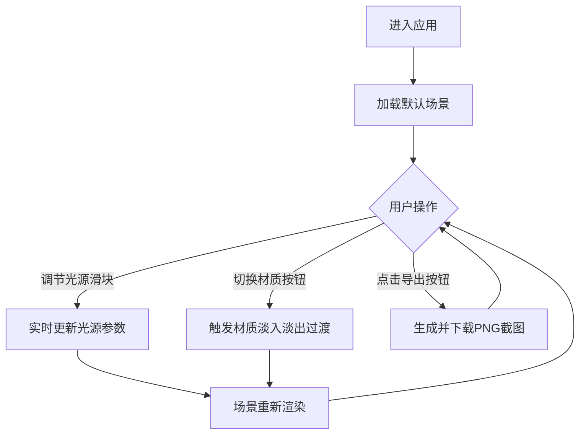

## 1. 产品概述
交互式三维光影雕塑生成器，用户可通过调整虚拟光源参数实时观察雕塑光影效果，支持多材质切换与场景导出。
- 面向数字艺术家、设计师和光影爱好者，提供沉浸式光影探索体验
- 核心价值：将复杂的光影物理效果可视化，帮助用户理解光线与材质的相互作用

## 2. 核心功能

### 2.1 用户角色
| 角色 | 注册方式 | 核心权限 |
|------|----------|----------|
| 访客用户 | 无需注册 | 完整使用所有光影调整、材质切换与截图导出功能 |

### 2.2 功能模块
1. **三维雕塑场景**：随机几何体堆叠构成的雕塑、半透明地面、渐变背景
2. **光源控制面板**：三光源独立控制（位置、颜色、强度），实时可视化光源位置
3. **材质切换系统**：金属、玻璃、粗糙石质三种材质，带淡入淡出过渡
4. **场景导出**：一键截图保存当前场景

### 2.3 页面详情
| 页面名称 | 模块名称 | 功能描述 |
|----------|----------|----------|
| 主界面 | 三维雕塑场景 | 20个随机几何体雕塑，缓慢自转动画，渐变背景，半透明圆盘地面 |
| 主界面 | 光源控制面板 | 左下角固定面板，三个光源的X/Y位置、颜色、强度滑块，实时数值显示 |
| 主界面 | 材质切换按钮组 | 右上角胶囊按钮，金属/玻璃/石质三种材质切换，0.5秒过渡效果 |
| 主界面 | 场景导出按钮 | 一键导出当前场景为PNG图片 |

## 3. 核心流程
用户打开应用后，首先看到默认光影下的随机雕塑场景。用户可以通过左下角控制面板调节三个光源的位置、颜色和强度，实时观察光影变化。通过右上角按钮切换不同材质，感受光线在不同表面的反射、折射差异。满意后点击导出按钮保存场景截图。

## 4. 用户界面设计

### 4.1 设计风格
- 主色调：深紫(#1a0a2e)到深蓝(#0a0a2e)渐变背景，金色(#ffcc66)作为强调色
- 辅助色：中性灰(#3a3a5a, #4a4a5a)用于UI元素
- 按钮风格：胶囊形圆角按钮，选中状态使用金色背景深色文字
- 滑块样式：6px高度圆角轨道，金色滑块按钮
- 字体：现代无衬线字体，清晰可读
- 整体风格：科技感、沉浸感、暗色调突出光影效果

### 4.2 页面设计概述
| 页面名称 | 模块名称 | UI元素 |
|----------|----------|--------|
| 主界面 | 三维场景 | 全屏Canvas，深紫到深蓝渐变背景，半透明灰紫色圆盘地面，中心多色几何雕塑 |
| 主界面 | 光源控制面板 | 左下角，宽300px，半透明深灰背景(30,30,40,0.85)，16px圆角，20px内边距，每个光源分组展示滑块与色轮 |
| 主界面 | 材质切换组 | 右上角，三个水平排列的胶囊按钮，默认灰底白字，选中金底深字 |
| 主界面 | 导出按钮 | 材质切换组下方或相邻位置，同风格胶囊按钮 |

### 4.3 响应式
- 桌面端优先设计，保证1920x1080及以上分辨率的完整体验
- 在较小屏幕上控制面板可适当缩小，但保持功能完整

### 4.4 3D场景指导
- 环境：深紫到深蓝的垂直渐变背景，营造深邃空间感
- 光照：主光(暖白)、辅光(冷蓝)、背光(紫粉)三点布光，支持全参数调节
- 相机：PerspectiveCamera，位置(0, 8, 15)，观察点(0, 2, 0)，OrbitControls支持用户旋转缩放视角
- 动画：每个几何体独立缓慢自转(0.01-0.03 rad/s)，随机初始旋转角度
- 后期：启用阴影映射，使用PCFSoftShadowMap获得柔和阴影
- 性能：20个简单几何体，使用instancing不强制，目标FPS 30+
