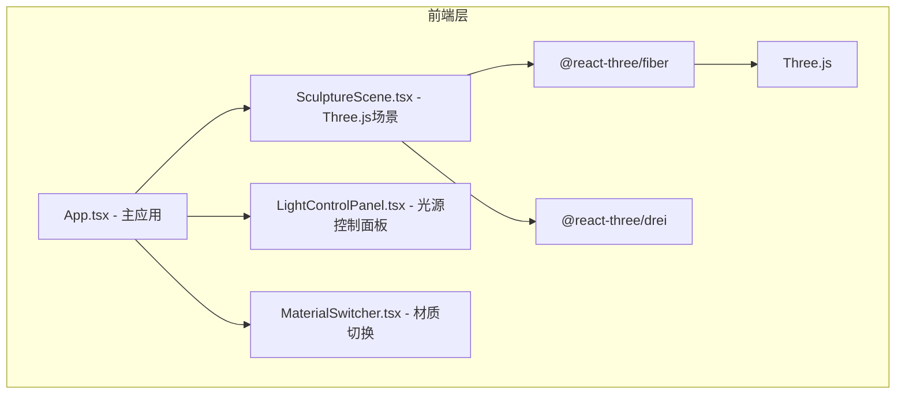

## 1. 架构设计


## 2. 技术描述
- 前端：React@18 + TypeScript + Vite
- 三维渲染：three + @react-three/fiber + @react-three/drei
- 状态管理：React useState/useCallback（简单场景，无需全局状态库）
- 样式：原生CSS（CSS-in-JS内联样式，避免额外依赖）
- 构建工具：Vite@latest + @vitejs/plugin-react

## 3. 路由定义
| 路由 | 用途 |
|------|------|
| / | 主界面 - 完整的光影雕塑生成器 |

## 4. 文件结构
```
src/
├── App.tsx                 # 主应用组件，状态管理与布局
├── main.tsx               # 应用入口
├── index.css              # 全局样式
├── components/
│   ├── SculptureScene.tsx    # Three.js 3D场景组件
│   ├── LightControlPanel.tsx # 光源控制面板UI
│   └── MaterialSwitcher.tsx  # 材质切换按钮组
```

## 5. 核心类型定义
```typescript
// 光源配置类型
interface LightConfig {
  x: number;      // X轴位置 (-20 ~ 20)
  y: number;      // Y轴位置 (0 ~ 20)
  color: string;  // 颜色 (hex)
  intensity: number; // 强度 (0.1 ~ 3)
}

// 材质类型
type MaterialType = 'metal' | 'glass' | 'stone';

// 单个几何体数据
interface GeometryItem {
  type: 'box' | 'sphere' | 'torus' | 'cone' | 'cylinder';
  position: [number, number, number];
  rotation: [number, number, number];
  scale: number;
  angularVelocity: [number, number, number];
}
```

## 6. 性能优化策略
1. 使用 Three.js 内置几何体，避免自定义几何体的计算开销
2. 光源数量控制在3个，使用 PCFSoftShadowMap 平衡质量与性能
3. 几何体的自转动画使用 useFrame hook，避免不必要的重渲染
4. UI组件使用 memo 优化，避免三维场景不必要的重新挂载
5. 材质切换使用过渡动画而非重建材质对象
