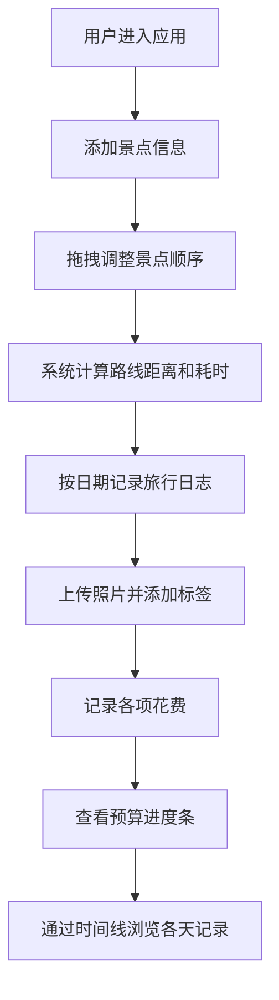

## 1. 产品概述

旅行规划与记录应用，帮助用户在旅行前规划景点路线与预算，在旅行后整理照片、地点标记和旅行日志。解决旅行信息分散管理的问题，提供一站式旅行规划与记录体验。

## 2. 核心功能

### 2.1 功能模块

1. **景点与路线规划**：左侧面板添加景点，地图上拖拽调整顺序，自动计算路线距离与耗时
2. **旅行日志与照片记录**：右侧面板按日期管理日志条目，支持文字、标签和模拟照片
3. **预算与花费追踪**：记录分类花费，进度条展示预算使用情况
4. **全局时间线视图**：底部水平时间轴展示旅行天数，支持快速跳转

### 2.3 页面详情

| 页面名称 | 模块名称 | 功能描述 |
|-----------|-------------|---------------------|
| 主页面 | 顶部导航栏 | 应用名称、全局预算概览进度条 |
| 主页面 | 左侧路线规划面板 | 景点卡片列表、拖拽排序、Leaflet地图、路线折线 |
| 主页面 | 右侧日志面板 | 按日期折叠的日志条目、文字内容、标签、照片拼接 |
| 主页面 | 底部时间线 | 可收缩水平时间轴、日期节点、当前日期动画 |

## 3. 核心流程

## 4. 用户界面设计

### 4.1 设计风格

- **主色调**：深蓝渐变 `#1E3A5F` 到 `#3B82F6`
- **辅助色**：紫色 `#8B5CF6`、橙色 `#F59E0B`、红色 `#EF4444`、绿色 `#10B981`
- **中性色**：背景灰白 `#F9FAFB`、白色 `#FFFFFF`、边框灰 `#D1D5DB`/`#E5E7EB`
- **字体**：采用现代无衬线字体，标题粗体深蓝 `#1E3A5F`
- **卡片样式**：圆角、细边框、0.3秒缓动过渡动画
- **按钮风格**：圆角按钮，悬停阴影加深效果

### 4.2 页面设计概览

| 页面名称 | 模块名称 | UI元素 |
|-----------|-------------|-------------|
| 主页面 | 顶部导航栏 | 固定高度60px，深蓝渐变背景，应用名称，预算进度条 |
| 主页面 | 景点卡片 | 宽220px，圆角10px，背景#F9FAFB，边框1px #D1D5DB，拖拽阴影加深，虚线插入指示符 |
| 主页面 | 日志条目 | 按日期折叠，日期粗体深蓝#1E3A5F，内容白色背景，12px内边距，边框1px #E5E7EB |
| 主页面 | 照片占位方块 | 80x80px，圆角4px，彩色方块，支持多图拼接，点击放大 |
| 主页面 | 预算进度条 | 高14px，圆角7px，轨道#E5E7EB，根据比例渐变填充色 |
| 主页面 | 时间线节点 | 直径30px圆形，已完成绿色#10B981，未完成灰色#9CA3AF，当前日期外发光动画 |
| 主页面 | 地图标记 | Leaflet圆形蓝色图标，半径8px，中心白色圆点 |

### 4.3 响应式

桌面优先设计，左右两栏布局（左侧300px固定，右侧自适应），底部时间线默认收起44px，展开160px。

### 4.4 动画与过渡

- 所有卡片和面板均配有0.3秒缓动过渡动画（transform和opacity）
- 当前日期节点带外发光动画
- 拖拽景点卡片时阴影加深效果
