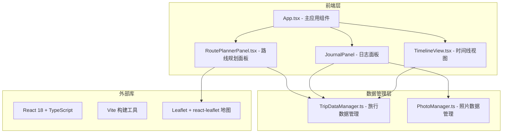

## 1. 架构设计



## 2. 技术描述

- **前端**：React 18 + TypeScript + Vite
- **地图**：Leaflet + react-leaflet
- **状态管理**：自定义 DataStore 类（TripDataManager、PhotoManager）
- **样式**：纯 CSS + CSS Modules，使用 CSS 变量管理主题色
- **构建工具**：Vite

## 3. 文件结构

```
.
├── package.json
├── vite.config.js
├── tsconfig.json
├── index.html
└── src/
    ├── modules/
    │   ├── data/
    │   │   ├── TripDataManager.ts
    │   │   └── PhotoManager.ts
    │   └── ui/
    │       ├── RoutePlannerPanel.tsx
    │       ├── JournalPanel.tsx
    │       └── TimelineView.tsx
    ├── App.tsx
    └── main.tsx
```

## 4. 数据模型

### 4.1 景点数据模型

```typescript
interface Attraction {
  id: string;
  name: string;
  duration: number; // 预估游览时长（分钟）
  lat: number;
  lng: number;
  budget: number;
  order: number;
}
```

### 4.2 日志数据模型

```typescript
interface JournalEntry {
  id: string;
  date: string;
  content: string;
  tags: string[];
  photoIds: string[];
}
```

### 4.3 花费数据模型

```typescript
interface Expense {
  id: string;
  date: string;
  category: 'transport' | 'food' | 'ticket' | 'accommodation';
  amount: number;
  description: string;
}
```

### 4.4 照片数据模型

```typescript
interface Photo {
  id: string;
  date: string;
  color: string;
  width: number;
  height: number;
}
```

### 4.5 数据模型关系图

```mermaid
erDiagram
    TRIP ||--o{ ATTRACTION : contains
    TRIP ||--o{ JOURNAL_ENTRY : contains
    TRIP ||--o{ EXPENSE : contains
    JOURNAL_ENTRY ||--o{ PHOTO : contains
    TRIP {
        string id
        string name
        number totalBudget
        string startDate
        string endDate
    }
    ATTRACTION {
        string id
        string name
        number duration
        number lat
        number lng
        number budget
        number order
    }
    JOURNAL_ENTRY {
        string id
        string date
        string content
        string[] tags
        string[] photoIds
    }
    EXPENSE {
        string id
        string date
        string category
        number amount
        string description
    }
    PHOTO {
        string id
        string date
        string color
        number width
        number height
    }
```


