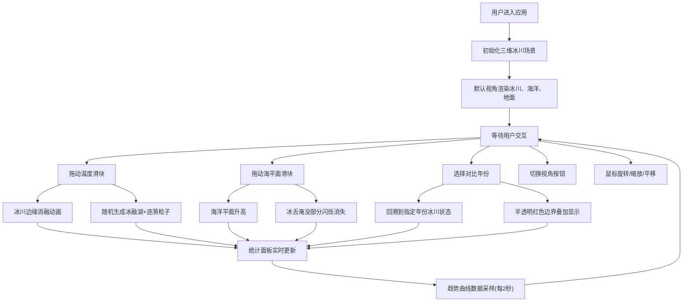

## 1. 产品概述
交互式三维冰川地形与气候变迁可视化应用，让用户通过沉浸式三维场景直观理解全球气候变化对冰川的影响。支持温度、海平面参数调节，实时展示冰川消融、冰融湖生成等气候效应，并提供历史数据对比分析功能。
- 面向教育、科普、气候研究等领域用户，帮助可视化理解气候变化与冰川动力学的关系
- 市场价值：填补交互式冰川气候可视化工具的空白，提供高质量、可交互的三维科普教学资源

## 2. 核心功能

### 2.1 功能模块
1. **三维冰川场景**：冰盖、冰裂隙、冰舌立体模型，支持自由旋转、缩放、平移视角
2. **气候控制面板**：温度滑块、海平面上升滑块，实时控制气候参数
3. **视角操作**：俯视/侧视/自由视角切换按钮，鼠标交互控制
4. **实时数据统计**：冰川面积、体积、海平面贡献量动态指标及趋势曲线
5. **历史数据对比**：1990/2000/2010/2020年份冰川状态回溯与对比展示

### 2.2 页面详情
| 页面名称 | 模块名称 | 功能描述 |
|-----------|-------------|---------------------|
| 主页面 | 三维场景Canvas | 渲染冰川地形、海洋、冰融湖、粒子效果，60FPS实时渲染 |
| 主页面 | 气候控制面板 | 温度滑块(-10°C~10°C)、海平面滑块(0~5米)、对比年份选择器 |
| 主页面 | 视角切换按钮 | 俯视、侧视、自由视角三种预设视角快速切换 |
| 主页面 | 底部统计面板 | 三个动态指标卡片，每个包含实时数值和迷你趋势图 |

## 3. 核心流程

用户打开应用 → 初始视角展示完整冰川场景 → 拖动温度/海平面滑块 → 冰川实时消融动画+冰融湖生成 → 统计面板数据更新 → 选择历史对比年份 → 冰川状态回溯+边界叠加 → 切换视角观察细节

## 4. 用户界面设计

### 4.1 设计风格
- **主色调**：深色科技风主题，主背景#0a0a1a，冰川蓝白#B0D4F1，强调色#4A90D9(蓝色)、#FF6B6B(温度红)、#48C774(海平面绿)
- **控件风格**：半透明毛玻璃效果(backdrop-filter: blur(8px))，圆角16px，滑块hover缩放1.05倍，0.3秒缓动过渡
- **字体**：'Inter', sans-serif，标题白色#FFFFFF，标签浅灰#A0AEC0，数值亮色（绿#68D391/蓝#63B3ED/橙#F6AD55）
- **布局**：右侧固定控制面板(320px宽)，底部固定统计条(100px高)，左下角视角切换按钮组，中央三维场景

### 4.2 页面设计概述
| 页面名称 | 模块名称 | UI元素 |
|-----------|-------------|-------------|
| 主页面 | 三维场景 | 渐变天空背景(浅蓝#87CEEB到白色#FFFFFF)，灰蓝色网格地面，半透明冰川主体，冰裂隙细线，正弦波动画海洋，冰融湖椭圆，涟漪粒子 |
| 主页面 | 控制面板 | 半透明白色#FFFFFFCC背景，圆角16px，内边距20px，滑块轨道蓝色#4A90D9，温度滑块按钮红色#FF6B6B圆形16px，海平面滑块按钮绿色#48C774，下拉选择器 |
| 主页面 | 视角按钮 | 三个圆形按钮直径40px，默认色#4A5568，选中时高亮#63B3ED圆环，位置左下角 |
| 主页面 | 统计面板 | 深色背景#1A202C，高100px，内边距12px，三个指标并列，每个含标签(16px白色)、数值(对应亮色)、迷你折线图(150x40px透明背景) |

### 4.3 响应式
- 桌面端(≥768px)：右侧控制面板，底部统计条，中央场景
- 移动端(<768px)：控制面板移至底部横向排列，统计面板可折叠，场景自适应屏幕

### 4.4 3D场景指导
- **环境**：天空渐变背景，灰蓝色网格地面提供空间参考
- **光照**：半球光模拟天空漫反射，方向光模拟太阳光产生阴影
- **相机**：初始俯视45度，轨道控制器支持旋转(灵敏度0.005)、缩放(5-50倍)、平移
- **构图**：冰川位于场景中心，冰舌向海洋延伸形成对角线构图，视觉焦点在冰川消融边缘
- **交互动画**：冰川消融时透明度从0.85渐变至0.2(5秒)，边缘以20px/秒收缩，冰融湖涟漪粒子持续3秒，淹没部分闪烁消失
- **后处理**：轻微抗锯齿，透明物体正确排序渲染
- **性能预算**：单帧计算≤12ms，粒子数≤500，稳定60FPS
