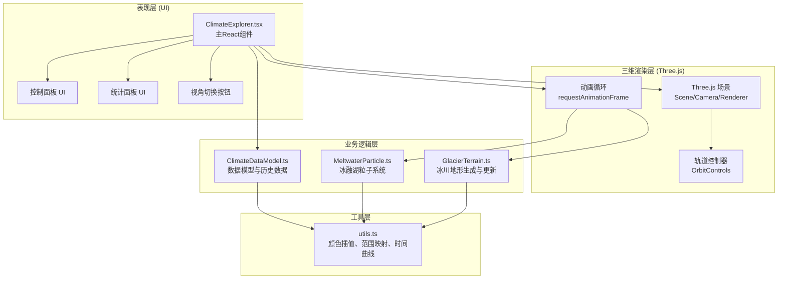
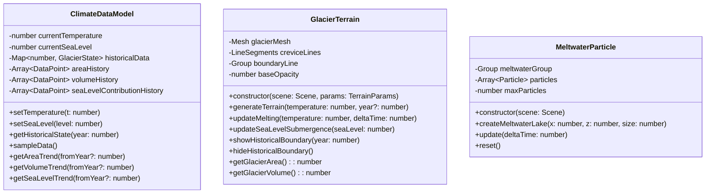

## 1. 架构设计

## 2. 技术描述
- **前端框架**：React 18 + TypeScript + Vite
- **三维引擎**：Three.js + @types/three
- **构建工具**：Vite 5.x + @vitejs/plugin-react
- **CSS方案**：内联样式 + CSS变量，毛玻璃效果使用backdrop-filter
- **状态管理**：React useState/useRef，无需额外状态管理库

## 3. 项目结构
| 文件 | 职责 |
|------|------|
| `package.json` | 依赖管理、启动脚本 |
| `vite.config.js` | Vite配置，React插件，esbuild目标es2020 |
| `tsconfig.json` | TypeScript配置，strict模式，jsx react-jsx |
| `index.html` | 入口HTML，标题、背景色 |
| `src/main.tsx` | React应用入口 |
| `src/ClimateExplorer.tsx` | 主组件，场景管理、UI、状态 |
| `src/GlacierTerrain.ts` | 冰川地形类，网格生成与更新 |
| `src/MeltwaterParticle.ts` | 冰融湖与粒子系统 |
| `src/ClimateDataModel.ts` | 数据模型、历史数据、统计计算 |
| `src/utils.ts` | 工具函数 |

## 4. 数据模型

### 4.1 预设历史数据
| 年份 | 温度(°C) | 海平面(m) | 冰川面积(km²) | 冰川体积(km³) |
|------|----------|-----------|---------------|---------------|
| 1990 | -5.0 | 0.0 | 12500 | 3200 |
| 2000 | -4.0 | 0.3 | 11800 | 2950 |
| 2010 | -3.0 | 0.7 | 10500 | 2600 |
| 2020 | -2.0 | 1.2 | 8900 | 2150 |

## 5. 核心算法

### 5.1 冰川消融算法
- 消融速度 = 20px/秒 × (当前温度 / 10)
- 边缘收缩通过修改顶点Y坐标实现
- 透明度插值：opacity = 0.85 - (0.65 × 消融进度)
- 消融进度 = min(1, 已消融时间 / 5000ms)

### 5.2 冰融湖生成
- 当温度 > 0°C时，每2秒在冰面随机位置生成冰融湖
- 湖大小：长轴10-25px，短轴8-18px
- 涟漪粒子：每个湖生成10-20个粒子，生命周期3秒
- 粒子透明度随时间从0.8线性衰减至0

### 5.3 海平面淹没
- 海平面升高直接映射为海洋平面Y坐标
- 检测冰川顶点Y坐标 < 海平面的部分
- 被淹没顶点颜色变为深蓝#003D5B并闪烁

### 5.4 统计趋势图
- 每2秒采样一次当前数据
- 最多保留120个数据点（4分钟历史）
- Canvas绘制折线图，数值归一化到40px高度

## 6. 性能优化
- **实例化渲染**：冰裂隙使用LineSegments批量渲染
- **粒子池**：预先分配500个粒子对象，避免频繁创建销毁
- **顶点更新优化**：仅更新边缘顶点，而非全部网格顶点
- **帧率控制**：requestAnimationFrame 60Hz，逻辑更新与渲染分离
- **内存管理**：历史对比边界线不再使用时及时dispose
