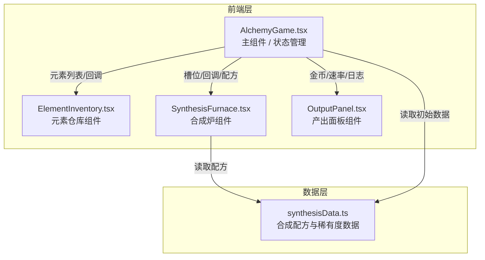

## 1. 架构设计



## 2. 技术说明

- **前端框架**：React@18 + TypeScript
- **构建工具**：Vite@5 + @vitejs/plugin-react
- **状态管理**：React Hooks (useState, useEffect, useRef) - 轻量级单页面应用无需额外状态库
- **样式方案**：CSS Modules / 内联样式 - 项目规模较小，组件级样式隔离
- **拖拽实现**：HTML5 Drag and Drop API（原生支持，性能优秀）
- **动画实现**：CSS transitions + CSS animations + keyframes
- **响应式**：CSS Media Queries + Flex/Grid布局

## 3. 项目文件结构

| 文件路径 | 职责说明 |
|----------|----------|
| `/package.json` | 项目依赖与脚本配置（react, react-dom, typescript, vite, @vitejs/plugin-react） |
| `/vite.config.js` | Vite配置，启用React插件 |
| `/tsconfig.json` | TypeScript配置（严格模式strict: true，jsx: "preserve"） |
| `/index.html` | 应用入口，标题"Alchemy Simulator"，挂载点div#root |
| `/src/main.tsx` | 应用启动入口，渲染AlchemyGame到root |
| `/src/App.tsx` | 根组件，包含全局样式与AlchemyGame |
| `/src/AlchemyGame.tsx` | 主组件：管理游戏状态（元素列表、金币、速率、日志、槽位） |
| `/src/ElementInventory.tsx` | 仓库组件：渲染元素卡片网格，处理拖拽开始事件 |
| `/src/SynthesisFurnace.tsx` | 合成炉组件：4个拖放槽位，实时配方检测，合成动画 |
| `/src/OutputPanel.tsx` | 面板组件：金币显示、速率显示、合成日志滚动列表 |
| `/src/synthesisData.ts` | 数据层：10+合成配方、元素稀有度权重、基础元素定义 |

## 4. 数据模型定义

### 4.1 核心类型

```typescript
// 元素类型定义
interface Element {
  id: string;           // 唯一标识
  name: string;         // 元素名称（火、水、陶器等）
  rarity: 1 | 2 | 3 | 4 | 5;  // 稀有度星级
  color: string;        // 卡片背景色
}

// 合成配方定义
interface Recipe {
  inputs: string[];     // 输入元素ID（长度2-4，顺序无关）
  output: string;       // 输出元素ID
}

// 合成日志条目
interface LogEntry {
  id: number;           // 唯一标识
  timestamp: Date;      // 合成时间
  inputs: string[];     // 输入元素名称
  output: Element;      // 输出元素
}

// 游戏状态
interface GameState {
  ownedElements: Element[];       // 已拥有的所有元素
  slots: (Element | null)[];      // 合成炉4个槽位
  gold: number;                   // 当前金币数
  goldPerSecond: number;          // 每秒产出速率
  logs: LogEntry[];               // 合成日志（最多100条）
  isSynthesizing: boolean;        // 是否正在播放合成动画
}
```

### 4.2 稀有度倍率表

| 稀有度（星） | 产出倍率 | 视觉标识 |
|-------------|----------|----------|
| 1 | x1 | ★ |
| 2 | x2 | ★★ |
| 3 | x4 | ★★★ |
| 4 | x8 | ★★★★ |
| 5 | x16 | ★★★★★ |

计算公式：新物质产出速率 = 基础值(1) × 稀有度倍率

### 4.3 合成配方表（至少10种）

| 配方ID | 输入元素 | 输出物质 | 稀有度 |
|--------|----------|----------|--------|
| 1 | 土 + 火 | 陶器 | 1★ |
| 2 | 水 + 气 | 云 | 1★ |
| 3 | 火 + 气 | 能量 | 2★ |
| 4 | 水 + 土 | 泥浆 | 1★ |
| 5 | 陶器 + 水 | 瓷器 | 2★ |
| 6 | 云 + 能量 | 闪电 | 3★ |
| 7 | 泥浆 + 火 | 砖头 | 1★ |
| 8 | 瓷器 + 闪电 | 魔法水晶 | 4★ |
| 9 | 砖头 + 能量 | 熔炉 | 3★ |
| 10 | 魔法水晶 + 熔炉 | 贤者之石 | 5★ |
| 11 | 水 + 火 | 蒸汽 | 1★ |
| 12 | 蒸汽 + 气 | 风暴 | 3★ |

## 5. 状态流向与核心逻辑

### 5.1 数据流向

```
用户拖拽元素卡片 → onDragStart (ElementInventory)
    ↓
元素进入槽位 → onDrop (SynthesisFurnace)
    ↓
更新slots状态 → checkRecipeMatch() 检测配方
    ↓ 匹配成功
触发合成动画 → 延迟500ms
    ↓
调用 onSynthesis 回调 (AlchemyGame)
    ↓
更新ownedElements / goldPerSecond / logs / 清空slots
    ↓
每秒定时器 → gold += goldPerSecond
    ↓
所有子组件重新渲染
```

### 5.2 核心算法：配方匹配

```
函数 checkRecipeMatch(slots, recipes):
    1. 过滤掉空槽位，得到非空元素列表 currentElements
    2. 若 currentElements.length < 2: 返回 null
    3. 对 currentElements 的 id 排序，生成规范化键 normalizedKey
    4. 遍历 recipes:
         - 对 recipe.inputs 排序得到 recipeKey
         - 若 normalizedKey === recipeKey: 返回 recipe.output
    5. 无匹配: 返回 null
```

时间复杂度：O(R × I log I)，其中R为配方数（~12），I为输入元素数（≤4），因此单次检测<1ms，远低于100ms性能要求。

## 6. 性能保障措施

1. **拖拽性能**：使用原生HTML5 DnD API（GPU加速），避免mousemove事件高频触发重绘；使用CSS transform而非top/left实现拖拽视觉跟随（不触发回流）
2. **合成检测**：配方数据预排序，匹配前先对输入排序，采用Map<normalizedKey, output>哈希表O(1)查找
3. **金币更新**：useRef缓存定时器，1s间隔setInterval，不使用requestAnimationFrame避免不必要的渲染
4. **日志渲染**：使用Array.slice(-100)限制列表长度，避免虚拟列表的过度工程化；CSS will-change: scroll-position优化滚动
5. **组件渲染**：使用React.memo包裹子组件（ElementInventory/SynthesisFurnace/OutputPanel），通过浅比较避免不必要的重渲染
6. **动画性能**：CSS动画优先使用transform和opacity属性（可被GPU合成层处理），避免触发layout/paint
