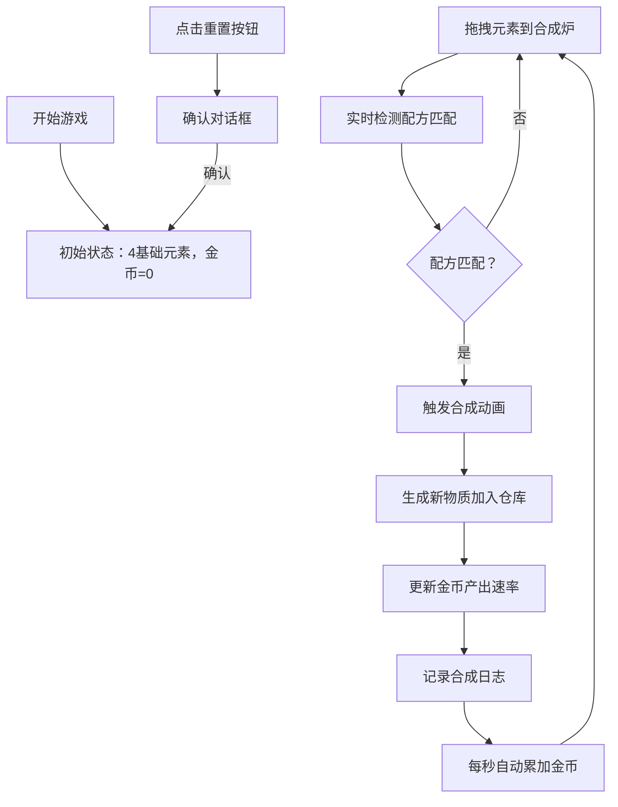

## 1. 产品概述

炼金术元素合成与自动产出模拟器是一款面向独立游戏策划和玩家的互动工具，通过拖拽元素到合成炉进行组合，解锁新物质并自动产生金币的放置类游戏原型。

- **主要目的**：直观展示元素组合与产出效率之间的连锁反馈关系，帮助游戏策划验证合成系统的平衡性
- **目标用户**：独立游戏策划、放置类游戏爱好者
- **市场价值**：提供可视化的合成系统原型工具，降低游戏设计的试错成本

## 2. 核心功能

### 2.1 用户角色
| 角色 | 注册方式 | 核心权限 |
|------|----------|----------|
| 普通用户 | 无需注册 | 体验完整游戏功能，进行元素合成 |

### 2.2 功能模块
1. **元素仓库区**：展示已解锁元素卡片，支持拖拽操作
2. **合成炉系统**：四槽位合成炉，实时检测配方并触发合成动画
3. **金币产出系统**：实时金币计数与产出速率显示
4. **合成日志系统**：滚动记录所有成功的合成历史
5. **重置功能**：一键恢复初始游戏状态

### 2.3 页面详情
| 页面名称 | 模块名称 | 功能描述 |
|----------|----------|----------|
| 主游戏页面 | 元素仓库区 | 2列网格布局展示元素卡片，支持HTML5拖拽，显示名称与稀有度星级 |
| 主游戏页面 | 合成炉区 | 4个并排槽位，虚线边框占位，放入后实线金色边框，匹配配方时闪烁动画 |
| 主游戏页面 | 产出面板 | 右上角大字显示金币数（28px金色），下方显示产出速率（14px灰色） |
| 主游戏页面 | 合成日志 | 底部400px高半透明黑色区域，滚动展示合成历史，最多100条 |
| 主游戏页面 | 重置按钮 | 左上角圆形红色按钮，点击弹出确认对话框 |

## 3. 核心流程

玩家从左侧仓库拖拽基础元素（火/水/土/气）到中央合成炉的四个槽位，系统实时检测当前组合是否匹配预设配方。匹配成功时触发金色闪烁动画，生成新物质并自动加入仓库，同时提升金币产出速率。所有合成操作记录在底部日志中。玩家可通过重置按钮随时恢复初始状态。

## 4. 用户界面设计

### 4.1 设计风格
- **主色调**：深色炼金术风格，径向渐变背景（中心#1A1A2E，边缘#0F0F1A）
- **面板背景**：#1E1E2E，圆角16px
- **强调色**：金色#FFD700（合成成功、金币）、红色#FF5252（重置按钮）
- **元素颜色**：火#FF5722、水#2196F3、土#8D6E63、气#9C27B0
- **字体**：无衬线字体，标题与金币数使用较大字号突出层级
- **交互效果**：卡片悬浮上移4px + 阴影加深，过渡动画0.2s

### 4.2 页面设计概述
| 页面名称 | 模块名称 | UI元素 |
|----------|----------|--------|
| 主游戏页面 | 布局容器 | Flex三列布局，20px内边距，最小高度100vh |
| 主游戏页面 | 元素卡片 | 100x100px圆角12px，背景按元素类型，中央显示名称+星级，拖拽时放大20% |
| 主游戏页面 | 合成槽位 | 120x120px圆角16px，#2A2A2A背景，虚线#5A5A5A边框，放入后实线#FFD700 |
| 主游戏页面 | 产出面板 | 右上角浮动，金币28px#FFD700，速率14px#AAAAAA |
| 主游戏页面 | 日志区域 | 400px高度，背景#00000066，滚动列表 |
| 主游戏页面 | 重置按钮 | 直径40px圆形，背景#FF5252，悬浮#D32F2F |

### 4.3 响应式
- **桌面端**：三列布局（左280px仓库 + 中央合成区flex:1 + 右250px统计）
- **移动端（<768px）**：垂直单列布局，仓库和统计面板折叠为抽屉式菜单，通过汉堡图标切换展开

### 4.4 动效设计
- **元素拖拽**：被拖拽卡片跟随光标移动并放大20%，松开后不在目标区域则回弹
- **合成成功**：四个槽位同时闪烁金色光效，持续0.5秒，新物质从炉上方飞入仓库
- **金币累加**：每秒平滑更新，数字变化时轻微放大效果
- **卡片悬浮**：上移4px + 阴影#00000033偏移10px，过渡0.2s
